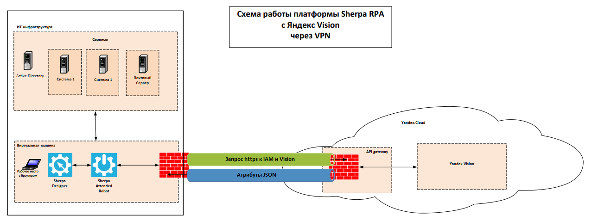

# Схема работы платформы Sherpa RPA c Yandex Vision через VPN

В случае, когда компании необходима настройки безопасного туннеля IPSec VPN для использования сервиса Yandex Vision в совместимости с платформой Sherpa RPA, следуйте приведенной инструкции и представленной схеме работы.

<figure><figcaption></figcaption></figure>


