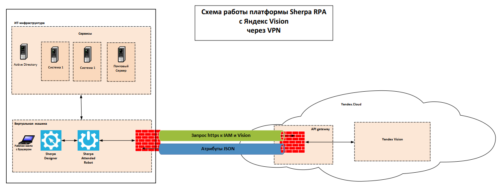

# Схема работы платформы Sherpa RPA c Yandex Vision через VPN

<figure><figcaption></figcaption></figure>



Описание обмена данными между инфраструктурой Заказчика и сервисом Yandex Vision: RPA робот отправляет преобразованные изображения base64 в Yandex Vision в зашифрованном виде по протоколу https.

Обработанные данные возвращаются RPA роботу в формате JSON по протоколу https.

Далее RPA Робот вносит обработанные данные в целевую систему заказчика.
