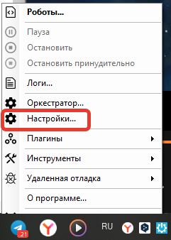

# Attended робот

## 1.       Процедура активации

Лицензия может быть активирована как локально, так и через Sherpa Orchestrator. В случае локальной активации лицензионный ключ сохраняется на конкретном рабочем месте, а для активации через Orchestrator — в централизованной системе.

1.1.    Локальная активация

Запустите Sherpa Assistant, если он не был запущен. Правой кнопкой мыши кликните на иконку Sherpa Assistant в трее: .png>).

В контекстном меню выберите “Настройки…”:

<figure><figcaption></figcaption></figure>

В открывшемся окне нажмите на вкладку “Регистрация”. Введите ключ продукта, который получили в поле “Введите лицензионный ключ продукта”:

<figure><figcaption></figcaption></figure>

Нажмите на кнопку Активация. Sherpa Assistant проверит ключ продукта и предоставит дату и время, до которого действует Лицензия зеленым шрифтом под полем “Введите лицензионный ключ продукта”.

1.2.    Автономная активация

Запустите Sherpa Assistant с помощью ярлыка на рабочем столе.

<figure><figcaption></figcaption></figure>

После этого в системном трее найдите значок Sherpa Assistant  .png>) , нажмите на него правой кнопкой мыши, откроется контекстное меню, в нем выберите пункт “Настройки…“.

<figure><figcaption></figcaption></figure>

Откроется окно настроек на вкладке Регистрация:

<figure><figcaption></figcaption></figure>

Откроется окно автономной активации. Введите Ваш серийный ключ и нажмите на ссылку “Автономная активация…“. Откроется окно автономной активации:

<figure><figcaption></figcaption></figure>

В окне есть два поля. Необходимо скопировать значение из верхнего поля “Код запроса“ и прислать нам на info@sherparpa.ru.

В ответ мы пришлем Вам “Ответный код“, который необходимо вставить в нижнее окно. После этого нажмите кнопку “Активация“.

1.3.    Активация через Sherpa Orchestrator

Экран “Лицензии” содержит таблицу “Лицензии”:

Для активации созданной Лицензии необходимо нажать кнопку “Активировать“ и в открывшемся окне выбрать один из двух типов активации:

<figure><figcaption></figcaption></figure>

1.3.1.       Автоматическая

При выборе автоматической активации нажать на кнопку ОК.

<figure><figcaption></figcaption></figure>

<table data-header-hidden><thead><tr><th width="72.316650390625" valign="top"></th><th width="633.9999389648438"></th></tr></thead><tbody><tr><td valign="top">
<figure><figcaption></figcaption></figure>
</td><td>Автоматическая активация возможна только в том случае, если Оркестратор имеет открытый доступ в Интернет.</td></tr></tbody></table>

1.3.2.       Ручная

При выборе ручной активации появляется код запроса, который нужно передать вендору для подтверждения ручной активации. В ответ на код запроса вам будет передан код ответа, его необходимо ввести в поле Код ответа и нажать на кнопку ОК:

<figure><figcaption></figcaption></figure>

Лицензия будет активирована, и в колонке “Истекает” изменится дата и время истечения Лицензии.

## 2.       Переактивация

Требуются обращение в техническую поддержку для переактивации или переноса между машинами и пользователями. Это обусловлено их локальным хранением и привязкой к конкретному ПК.

## 3.       Управление

Attended лицензии предназначены для разработки роботов и их запуска на рабочих местах пользователей. Они позволяют запускать роботов вручную или через Планировщик Windows, а также получать сценарии из Sherpa Orchestrator.

3.1. Запуск робота вручную пользователем двойным кликом по файлу робота

Откройте директорию, где сохранён файл с расширением .robot и дважды кликните по нему левой кнопкой мыши.

<figure><figcaption></figcaption></figure>

3.2. Запуск выбором из списка доступных роботов в Sherpa Assistant

Найдите в трее иконку ассистента .png>) и нажмите на неё правой кнопкой мыши. Во всплывающем меню выберите строку “Роботы“:

<figure><figcaption></figcaption></figure>

Для запуска программного робота нажмите на кнопку .png>) в строке робота, которого необходимо запустить:

<figure><figcaption></figcaption></figure>

Подтвердите запуск в диалоговом окне нажатием на кнопку “Да“:

<figure><figcaption></figcaption></figure>

Если в свойствах запускаемого робота указаны входные параметры, то откроется окно с полями для ввода значений.

3.3. Запуск по горячей клавише

Найдите в трее иконку ассистента .png>) и нажмите на неё правой кнопкой мыши. Во всплывающем меню выберите строку “Роботы“:

<figure><figcaption></figcaption></figure>

Выберите в списке нужного робота и введите в нижней части окна нужную последовательность в поле “Горячие клавиши“:

<figure><figcaption></figcaption></figure>

Нажмите на кнопку “Задать клавиши“. Теперь данная последовательность закреплена за роботом и при нажатии данных клавиш на клавиатуре робот будет запускаться.

<figure><figcaption></figcaption></figure>

3.4. Запуск из командной строки

Чтобы запустить командную строку в Windows, нажмите одновременно клавиши “Win“ и “R“, введите: “cmd“, и нажмите “Enter“. Откроется окно командной строки. Введите команду “cd“, которая используется для изменения текущего рабочего каталога, а также название каталога (например, “cd Desktop“, если робот находится на рабочем столе, или абсолютный путь: “cd /home/user/projects“, чтобы перейти в нужную папку, где находится робот).

<figure><figcaption></figcaption></figure>

_Примечание:_ Также командную строку можно запустить через строку поиска Windows. Для этого нажмите одновременно клавиши “Win“ и “S“, введите: “командная строка“, и нажмите “Enter“.

Далее введите команду “cd“ и наименование робота с расширением “.robot“ и нажмите “Enter“.

<figure><figcaption></figcaption></figure>

Робот запустится в отдельном окне.

3.5. Запуск из локального Планировщика Windows

Откройте диаграмму проекта в Sherpa Designer:

<figure><figcaption></figcaption></figure>

Опубликуйте проект (робота) на Рабочий стол:

<figure><figcaption></figcaption></figure>

Найдите “Средства администрирования Windows” через строку поиска Windows:

<figure><figcaption></figcaption></figure>

Откройте “Средства администрирования Windows” двойным кликом левой кнопкой мыши. Войдите в “Планировщик задач”:

<figure><figcaption></figcaption></figure>

Откроется следующее всплывающее окно:

<figure><figcaption></figcaption></figure>

Войдите в “Библиотеку планировщика Windows“. Для этого кликните правой кнопкой мыши на свободную часть в окне с файлами, состояниями и триггерами. Выберите строку “Создать простую задачу”:

<figure><figcaption></figcaption></figure>

Откроется окно “Мастер создания простой задачи”. Последовательно заполняйте поля во вкладках “Создание простой задачи”, “Триггер” и “Действие”, нажимая на кнопку “Далее”. В появившейся вкладке “Запуск программы” нажмите на кнопку “Обзор…”:

<figure><figcaption></figcaption></figure>

Найдите проект (робота), сохраненный на Рабочем столе, кликните на него левой кнопкой мыши и нажмите на кнопку “Открыть”.

Нажмите на кнопку “Далее”, проверьте описание задачи и затем нажмите на кнопку “Готово”.

<figure><figcaption></figcaption></figure>

В “Планировщике задач Windows“ появится строка с созданной задачей. Кликните правой кнопкой мыши на нужную строку и выберите во всплывающем меню строку “Выполнить”:

<figure><figcaption></figcaption></figure>

Во всплывающем окне “Каким образом вы хотите открыть этот файл?” нажмите на “Sherpa RPA Robot” и подтвердите свой выбор нажатием на кнопку “ОК”:

<figure><figcaption></figcaption></figure>

Настройка запуска робота через “Планировщик Windows“ завершена. Если требуется внести изменения настройки запуска, то необходимо во всплывающем меню перейти в раздел Свойства:

<figure><figcaption></figcaption></figure>

Например, чтобы изменить триггеры в задаче, можно открыть вкладку “Триггеры“ и нажать на кнопку “Изменить…”:

<figure><figcaption></figcaption></figure>

3.6. Запуск из Планировщика Windows по локальному расписанию

Для того, чтобы робот запускался автоматически по локальному расписанию и при его запуске не появлялось окно “Каким образом вы хотите открыть этот файл?”, необходимо перейти к расположению файла Sherpa Assistant:

<figure><figcaption></figcaption></figure>

Далее найти приложение “ProcessAgent.exe“:

<figure><figcaption></figcaption></figure>

И скопировать путь к данному приложению.

Перейти в “Планировщике задач“ в раздел “Свойства“:

<figure><figcaption></figcaption></figure>

Открыть вкладку “Действия“ и нажать на кнопку “Изменить…”:

<figure><figcaption></figcaption></figure>

Появится всплывающее окно “Изменение действия“:

<figure><figcaption></figcaption></figure>

В поле “Программа или сценарий“ вставьте скопированный ранее путь к приложению “ProcessAgent.exe“, а в поле “Добавить аргументы (необязательно)“ полный путь к запускаемому роботу в кавычках:

<figure><figcaption></figcaption></figure>

В конце нажмите на кнопку “ОК“. Теперь робот будет запускаться по локальному расписанию через “Планировщик Windows“. Если потребуется изменить расписание, то будет необходимо открыть вкладку “Триггеры“, нажать на кнопку “Изменить…” и внести изменения в расписание:

<figure><figcaption></figcaption></figure>
