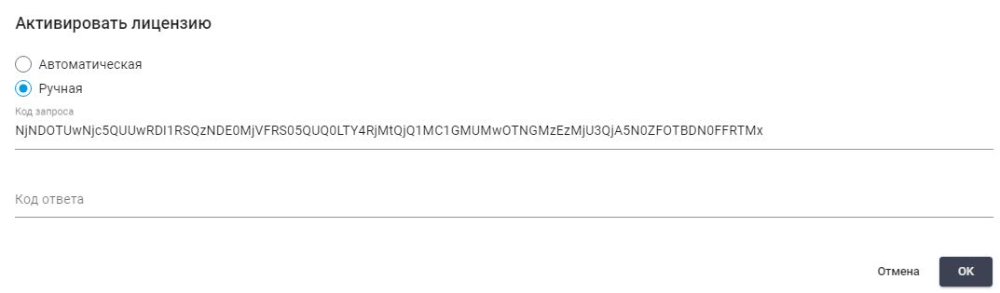

# Управление Лицензиями Sherpa RPA через Sherpa Orchestrator

Одна Лицензия на Sherpa Orchestrator запускается на одном сервере в одном экземпляре и поддерживает управление неограниченным количеством Роботов.

Роботы для запуска на рабочих местах Пользователей требуют активации соответствующих Лицензий (лицензионных ключей) для подтверждения законного использования ПО. Во время активации ПО или Sherpa Orchestrator передает сведения о машине вендору.

В Sherpa Orchestrator следует добавить все Лицензии, которыми требуется управлять. Sherpa Orchestrator позволяет хранить и использовать Лицензии для всех видов Роботов, а также Лицензию для самого Оркестратора.

Лицензии определяют количество и тип Роботов, а также Работы для которых может запускаться Sherpa Orchestrator. Экран “Лицензии” содержит таблицу “Лицензии”:

<figure><figcaption></figcaption></figure>

В ней содержится следующая информация о Лицензиях:

<table data-header-hidden><thead><tr><th width="137"></th><th></th><th></th></tr></thead><tbody><tr><td><strong>Колонка</strong></td><td><strong>Описание</strong></td><td><strong>Примечание</strong></td></tr><tr><td>Имя</td><td>Имя Лицензии</td><td> </td></tr><tr><td>Тип</td><td>
Тип лицензии. Возможные варианты:
<ul><li>Sherpa Orchestrator</li><li>Sherpa Attended Robot;</li><li>Sherpa Unattended Robot;</li><li>Sherpa Attended Floating.</li></ul></td><td>Sherpa Orchestrator - Лицензия для самого Оркестратора.</td></tr><tr><td>Емкость</td><td>Количество Роботов, которое может быть запущено одновременно под управлением этой Лицензия.</td><td>Количество назначенных Роботов может быть больше, чем количество в колонке “Емкость”. Данная колонка предназначена для Лицензий Unattended.</td></tr><tr><td>Назначено</td><td>Количество Роботов, которым была назначена эта Лицензия. </td><td>Количество назначенных Роботов может быть больше, чем количество в колонке “Емкость”. Данная колонка предназначена для Лицензий Unattended.</td></tr><tr><td>Используется</td><td>Количество Роботов, которые используют данную Лицензию в настоящий момент.</td><td>Количество Роботов, использующих Лицензию, не может превышать количество, указанное в колонке “Емкость”.</td></tr><tr><td>Истекает</td><td>Дата и время окончания действия Лицензии. </td><td>При добавлении новой Лицензии в колонке “Истекает” будет по умолчанию стоять аналогичная дата создания до того момента, когда Лицензия будет активирована.</td></tr><tr><td>Создано</td><td>Дата и время создания лицензии.</td><td> </td></tr></tbody></table>

Также на экране Лицензии представлены следующие кнопки:

<table data-header-hidden><thead><tr><th width="55"></th><th width="178"></th><th></th></tr></thead><tbody><tr><td><strong>№ п/п</strong></td><td><strong>Название</strong></td><td><strong>Описание</strong></td></tr><tr><td>1.</td><td>Создать</td><td>Инициирует процесс создания новой Лицензии. При нажатии открывается форма, где Пользователь может заполнить необходимые поля.</td></tr><tr><td>2.</td><td>Обновить</td><td>Используется для обновления списка Лицензий на экране. Это может быть полезно для получения актуальной информации о текущих изменениях.</td></tr><tr><td>3.</td><td>Активировать</td><td>Позволяет активировать созданную Лицензию. При нажатии открывается окно Активировать лицензию, где Пользователь может выбрать тип активации.</td></tr><tr><td>4.</td><td>Удалить выбранное</td><td>Удаляет выбранные Лицензии из системы. При нажатии на кнопку появляется диалоговое окно для подтверждения действия.</td></tr><tr><td>5.</td><td>Экспорт из CSV</td><td>Позволяет Пользователю экспортировать данные о существующих Лицензиях в файл формата CSV.</td></tr><tr><td>6.</td><td>Экспорт из XLSX</td><td>Позволяет Пользователю экспортировать данные о существующих Лицензиях в файл формата XLSX.</td></tr><tr><td>7.</td><td>Импорт из CSV</td><td>Позволяет Пользователю импортировать данные о Лицензиях из файла формата CSV.</td></tr></tbody></table>

### Создание новой Лицензии

Для создания новой Лицензии необходимо нажать на кнопку Создать и заполнить открывшуюся форму:

<figure><figcaption></figcaption></figure>

В форме Лицензия представлены следующие поля:

1. **Имя** - имя Лицензии. Служит только для информационных целей.
2. **Ключ** - ключ Лицензии, предоставленный вендором.

Также доступна активация одного из четырех чекбоксов:

1. чекбокс **“Запретить запуск из Sherpa Designer”**

Позволяет включить запрет на запуск Робота из Sherpa Designer. Данная функция доступна только для Лицензий Attended Floating.

2. чекбокс **“Запретить запуск локальных роботов в Sherpa Assistant”**

Позволяет включить запрет на запуск локальных Роботов в Sherpa Assistant. Данная функция доступна только для Лицензий Attended Floating.

3. чекбокс **“Запретить исполнение кода C#, VB, Python и PowerShell в сценариях”**

Позволяет включить запрет на исполнение кода C#, VB, Python и PowerShell в сценариях Роботов. Данная функция доступна только для Лицензий Attended Floating.

4. чекбокс **“Принудительно логировать все блоки”**

Позволяет включить принудительное логирование всех блоков сценария Робота. Данная функция доступна только для Лицензий Attended Floating.

<table data-header-hidden><thead><tr><th width="56"></th><th></th></tr></thead><tbody><tr><td></td><td>Допускается одновременное использование Робота в Attended и Unattended-режиме.</td></tr></tbody></table>

### Активация Лицензий

Для активации созданной Лицензии необходимо нажать кнопку Активировать и в открывшемся окне выбрать один из двух типов активации:&#x20;

<figure><figcaption></figcaption></figure>

* **Автоматическая**

При выборе автоматической активации нажать на кнопку ОК.

<table data-header-hidden><thead><tr><th width="52"></th><th></th></tr></thead><tbody><tr><td></td><td>Автоматическая активация возможна только в том случае, если Оркестратор имеет открытый доступ в Интернет.</td></tr></tbody></table>

* **Ручная**

При выборе ручной активации появляется код запроса, который нужно передать вендору для подтверждения ручной активации. В ответ на код запроса вам будет передан код ответа, его необходимо ввести в поле Код ответа и нажать на кнопку ОК:\

<figure><figcaption></figcaption></figure>

Лицензия будет активирована, и в колонке “Истекает” изменится дата и время истечения Лицензии.

### Локальная активация

Локальная активация доступна по умолчанию в том случае, если у Робота есть своя Лицензия, которая была активирована локально. Для выбора локальной активации необходимо перейти в окно Роботы и нажать кнопку Создать над таблицей Роботы:

<figure><figcaption></figcaption></figure>

Далее нажать на поле Лицензия во всплывающем окне Робот:

<figure><figcaption></figcaption></figure>

Появится список в котором необходимо выбрать Local License:

<figure><figcaption></figcaption></figure>

Данная Лицензия будет использоваться локально (не через Оркестратор).

<table data-header-hidden><thead><tr><th width="52"></th><th></th></tr></thead><tbody><tr><td></td><td>
При выборе иной Лицензии из списка в поле Лицензия (для Робота, добавленного на экране Роботы), произойдет активация Attended-робота из Sherpa Orchestrator.

Удаленно активировать Attended-роботов (если Робот не был ранее активирован локально) и задавать им Лицензию также можно из экрана Роботы в Sherpa Orchestrator. 

Лицензии Sherpa Attended Robot являются именными. Одна Лицензия запускается на одной учетной записи Пользователя, лицензируется на учетную запись конкретного Пользователя.

Attended-роботы могут быть добавлены в Sherpa Orchestrator, но данный тип Роботов не может запускаться из Sherpa Orchestrator с помощью создания Работ или Триггеров. Таким образом, сценарии Attended-роботов запускаются только локально.

Attended-роботов целесообразно заводить в Sherpa Orchestrator например в тех случаях, когда у вас есть Unattended-робот на потоковой обработке каких-либо документов или заявок и требуется использовать Attended-робота в режиме станции верификации.
</td></tr></tbody></table>

### Редактирование ранее созданной Лицензии

Для просмотра информации или её редактирования для ранее созданной Лицензии необходимо выбрать в списке нужную Лицензию и нажать справа от неё на кнопку  (“Изменить”). После этого откроется форма с настройками выбранной Лицензии, в которую можно внести все необходимые изменения:

<figure><figcaption></figcaption></figure>

Помимо полей заполняемых при создании новой Лицензии в форме редактирования есть дополнительные поля:

1. **GUID записи** - уникальный идентификатор, присвоенный Лицензии после ее создания. Данное поле нельзя изменять;
2. **Истекает** - дата и время истечения Лицензии;
3. **Создана** - дата и время создания Лицензии;
4. **Обновлена** - дата и время обновления Лицензии.

### Использование Unattended-роботов в Sherpa Orchestrator

Unattended-роботы - это Роботы, которые запускаются без участия человека и управляются только через Оркестратор. Они запускаются через Триггеры, через Очереди Задач или через API. Лицензии Sherpa Unattended-Robot являются конкурентными. Одна Лицензия позволяет под управлением Оркестратора запустить выполнение сценария на Учетной записи любого Пользователя (в том числе виртуального, созданного специально для Робота). Общее число используемых в один момент времени Лицензий не может превышать число зарегистрированных в Оркестраторе Лицензий.

Варианты использования Unattended-Робота:

* Использование Unattended-Робота с ручным запуском сессии Пользователя. Если Оркестратор увидит, что Робот находится в сети (зеленый индикатор), Оркестратор сможет выдавать ему Работу. В этом случае, запуск учетной записи Робота должен быть произведен вручную.
* Использования Unattended-Робота с автоматическим запуском сессии Пользователя. При классической схеме, когда есть RDP-сервер, на сервере есть одна или несколько Учетных записей, зарегистрированных за Роботами. Сам по себе сервер работает постоянно, но Учетные записи по умолчанию не работают. Соответственно, если на комплектного Робота Оркестратор выделил Задание, он этого Робота должен включить, а для этого он должен активировать соответствующую Учетную запись на сервере. Для этого предназначен компонент, называемый [Координатор](https://docs.sherparpa.ru/sherpa-orchestrator/rabota-v-sherpa-orchestrator/ekrany/roboty#sozdanie-koordinatora). Это отдельная программа, которая не требует Лицензии, устанавливается под учетной записью Администратора RDP-сервера и запускается в режиме сервиса. С вариантами установки Координатора можно ознакомиться [здесь](https://docs.sherparpa.ru/sherpa-orchestrator/ustanovka-sherpa-orchestrator/ustanovka-sherpa-rpa-coordinator).

### Оптимизация использования Лицензий

Если жестко привязать каждую Лицензию для Unattended-роботов к конкретной машине (как это предусмотрено для Sherpa Attended Floating), можно столкнуться с недостаточной утилизацией Лицензий: если на одну Лицензию приходит мало Задач, но она остается привязанной к машине и Роботу, то её использование не эффективно. Также это может привести к перегрузке других Роботов. В случаях, когда на другие машины поступает большое количество Задач, они могут не справляться с полученным объемом работы, что ведет к падению производительности.

Если Пользователю предоставляются несколько Лицензий в одном ключе, он сможет привязать их к большему количеству Роботов. В этом случае Оркестратор автоматически распределит Лицензии среди Роботов в зависимости от фактической загрузки, что повысит эффективность работы. Это значительно упрощает задачу администратору, устраняя необходимость вручную менять привязку Роботов к Лицензиям в зависимости от нагрузки.&#x20;
