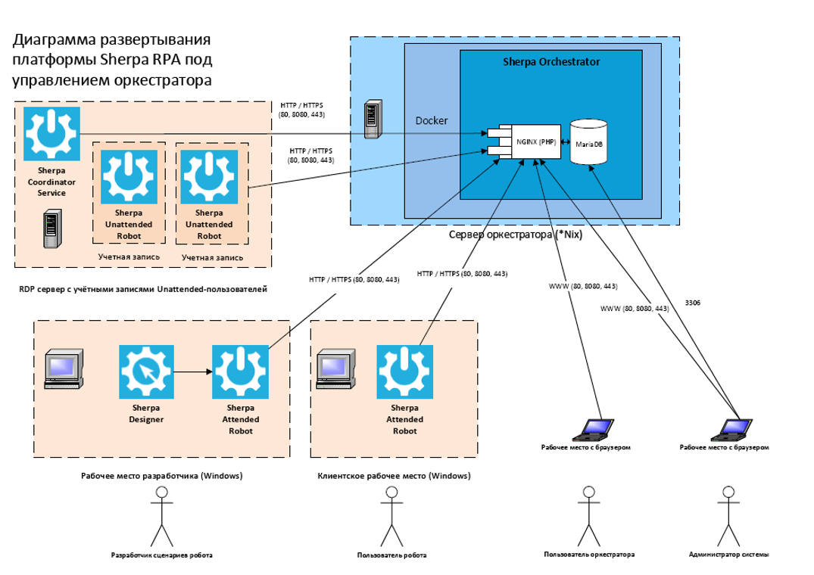

# Диаграмма развертывания Sherpa RPA

Диаграмма развертывания Sherpa RPA под управлением Оркестратора выглядит следующим образом:

<figure><figcaption></figcaption></figure>

## **Описание**

Диаграмма описывает верхнеуровневую реализацию функционала, который обеспечивает автоматизацию бизнес-процессов, выполняемых на пользовательских рабочих местах и терминальных серверах путём роботизации (имитации действий пользователя при работе с информационными системами). Разработчики сценариев роботизации после тестирования передают сценарии в централизованное средство управления – Оркестратор.

Бизнес-пользователи на своих рабочих местах по требованию запускают Attended-сценарии автоматизации (требующие интерактивного взаимодействия робота или бизнес-процесса с пользователем), запуск осуществляется путём выбора сценария из списка установленных на рабочем месте, нажатия горячей клавиши, также возможен запуск сценариев из локального планировщика Windows и в автозагрузке.

Оркестратор по событиям или входящим данным из внешней среды (через API), по команде робота или бизнес-пользователя или по расписанию запускает Unattended-сценарии роботизации (выполняемые в учётных записях терминальных серверов без участия пользователя). Роботы обоих типов обмениваются с оркестратором логами, задачами из очередей, централизованно хранимыми учетными данными и общими данными.

В процессе исполнения сценария робот достигает поставленных задач путём имитации действий пользователя (включая действия с мышью и клавиатурой) в пользовательских интерфейсах десктоп-приложений, веб-приложений (исполняемых в браузере), а также путём взаимодействия с операционной системой и установленными приложениями и веб-сервисами с помощью разнообразных программных API.

Уровень доступа робота к информационным системам и контурам клиента ограничивается и определяется уровнем доступа того пользователя, под учётной записью которого робот производит действия, описанные в сценарии. Для Unattended-роботов рекомендуется создавать выделенные учетные с уровнями доступа, правами и ролями, определяемыми решаемой данным роботом бизнес-задачей.

## **Конфигурация сети**

Конфигурация портов и сетевые протоколы Sherpa RPA могут быть настроены для поддержки всех общих требований брандмауэра. Конфигурация порта по умолчанию выглядит следующим образом:

* \*Sherpa Attended Robot, Sherpa Unattended Robot, Sherpa Coordinator исходящие на Sherpa Orchestrator: 80 или 443.
* \*Во всех сетевых коммуникациях инициатива установки подключения и первоначального запроса принадлежит только клиентским компонентам, то есть Sherpa Attended Robot, Sherpa Unattended Robot и Sherpa Coordinator. Sherpa Orchestrator по своей инициативе не выполняет запросы к клиентам.
* \*Связь с базой данных: 3306 и 1433-настраивается.
* \*Доступ пользователя к веб-интерфейсу Sherpa Orchestrator: 80 или 443.

Для взаимодействия с веб-сервером используется https, опционально возможно http.

Sherpa RPA поддерживает защищенную связь (с использованием протокола TLS 1.2) между Attended Robot, Sherpa Unattended Robot, Sherpa Coordinator и Sherpa Orchestrator. При установке с помощью TLS клиент должен предоставить необходимые сертификаты, разместив их по пути /opt/app/config/certs/, переименовав их в orchestrator.crt и orchestrator.key.

Все компоненты Sherpa RPA устанавливается локально в сети Заказчика, без связи с внешними серверами или службами SaaS. Возможность и необходимость доступа компонентов платформы к внутренним и внешним системам определяется решаемой в рамках бизнес-процесса задачей.

Развертывание рабочего места разработчика, рабочего места Attended и Unattended-роботов производится вручную с помощью соответствующих exe-инсталляторов либо автоматически с помощью msi-инсталлятора с использованием механизма GPO.

Установка Sherpa Coordinator Service производится в администраторской учетной записи терминального сервера с помощью exe-инсталлятора. По умолчанию развертывание Sherpa Orchestrator осуществляется с помощью Docker-контейнера.

## **Механизмы аутентификации**

Аутентификация Sherpa Attended Robot, Sherpa Unattended Robot, Sherpa Coordinator в Orchestrator\
осуществляется с помощью Bearer Token, передаваемого в заголовке запросов. Bearer Token сопоставляется с\
уникальным GUID каждого экземпляра Sherpa Attended Robot, Sherpa Unattended Robot, Sherpa Coordinator. Для\
аутентификации пользователей веб-интерфейса Orchestrator применяется авторизация с помощью пары логин-пароль. При повторном входе используется сессионные Cookies, имеющие ограниченный срок жизни.

## **Логирование**

Для логирования используется компонент Monolog. События аудита и системные ошибки сохраняются в выделенную таблицу базы данных.
