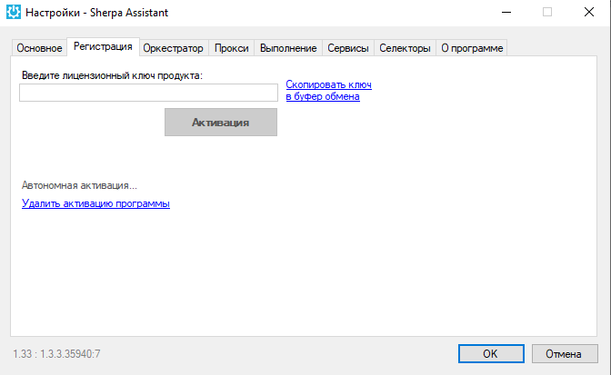

# Автономная активация

Запустите **Sherpa Assistant** с помощью ярлыка на рабочем столе.

После этого в системном трее найдите значок Sherpa Assistant , нажмите на него правой кнопкой мыши, откроется контекстное меню, в нем выберите пункт «Настройки…».

Откроется окно настроек на вкладке Регистрация:

<figure><figcaption></figcaption></figure>

Откроется окно автономной активации. Введите Ваш серийный ключ и нажмите на ссылку «Автономная активация…». Откроется окно автономной активации:

В окне есть два поля. Необходимо скопировать значение из верхнего поля «Код запроса» и прислать нам на info@sherparpa.ru.

В ответ мы пришлем Вам «Ответный код», который необходимо вставить в нижнее окно.\
После этого нажмите кнопку «Активация».
