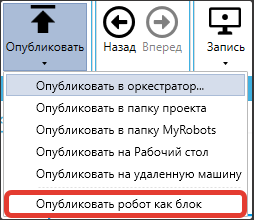
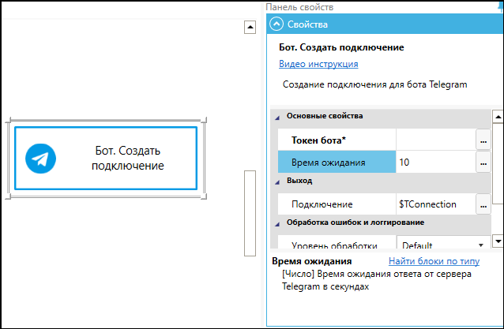
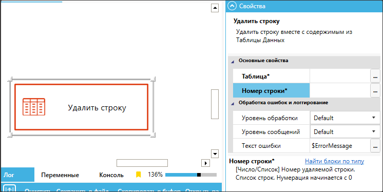
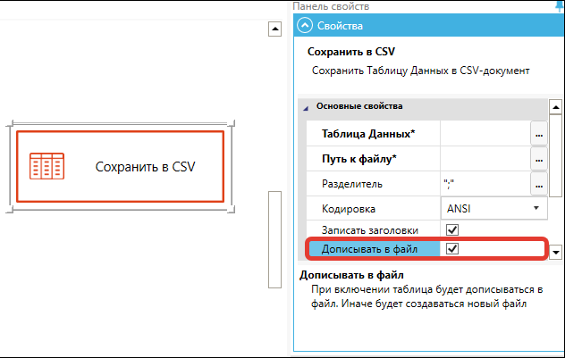
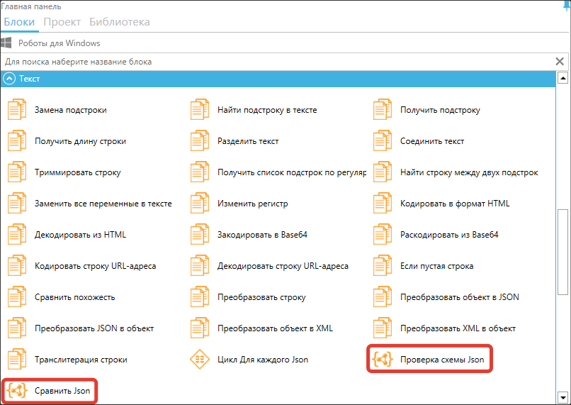
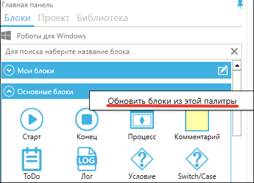

# Версия 1.40

**Вышел новый релиз Sherpa Designer: Версия 1.40.**

1\) Протестирована и подтверждена корректная работа Роботов и Дизайнера на импортозамещенных операционных системах: [Astra Linux, Red OS, Alt Linux](../../sherpa-rpa/ustanovka-sherpa-rpa/ustanovka-sherpa-rpa-na-linux.md), [ОСнова](../../sherpa-rpa/ustanovka-sherpa-rpa/ustanovka-sherpa-rpa-na-osnova.md). Адаптация работы Роботов под данные ОС обеспечивает стабильность, защиту используемых данных и универсальность применения в различных средах, что важно для соблюдения требований безопасности.

2\) Добавлена возможность запускать Робота в [PiP-режиме](../../sherpa-designer/rabota-v-sherpa-designer/rezhim-kartinka-v-kartinke-pip.md) в скрытом (фоновом) режиме.&#x20;

Для этого в меню Sherpa Assistant в трее нужно выбрать пункт “Роботы”:

<figure><figcaption></figcaption></figure>

Далее в окне “Роботы - Sherpa Assistant” необходимо нажать на кнопку  и выбрать во всплывающем меню пункт: ”Всегда запускать PiP-клиент в скрытом режиме”:

<figure><figcaption></figcaption></figure>

Настройки запуска PiP-клиента:

* **“Всегда запускать в режиме PiP-клиента”** – при включении этого параметра Робот будет всегда запускаться с отображением интерфейса PiP клиента, видимым для Пользователя.
* **“Всегда запускать PiP-клиент заблокированным”** – Робот запускается в заблокированном состоянии (интерфейс PiP-клиента открыт, но Пользователь не может повлиять на работу Робота).
* **“Всегда запускать PiP-клиент в скрытом режиме”** – Робот запускается, но окно PiP-клиента скрыто и не отображается на экране.

3\) Для работы с селекторами реализована поддержка технологии Microsoft Active Accessibility (MSAA). Кнопка “Запись MSAA” в окне “Селектор - Редактировать селектор” позволяет начать автоматическую запись всех взаимодействий с пользовательским интерфейсом с использованием возможностей MSAA.&#x20;

Нажмите на кнопку  справа от элемента “Запись” и у вас появится возможность выбрать и нажать “Запись MSAA”:

<figure><figcaption></figcaption></figure>

Microsoft Active Accessibility (MSAA) — это технология на основе com-модели компонентов, которая улучшает работу с приложениями, работающими в Microsoft Windows. Поддержка MSAA позволяет более старым программам взаимодействовать с современными системами и технологиями, улучшая их работу, повышая стабильность и доступность, а также облегчая интеграцию с другими компонентами системы. Целесообразно попробовать использовать этот метод записи селекторов в том случае, если с UI-элементами вашего целевого приложения не работает стандартный метод кнопки Запись.

4\) Появилась возможность создавать свой блок из текущего проекта робота. Для этого нужно выбрать пункт “Опубликовать робот как блок”. В свойствах проекта необходимо указать и входные, и выходные данные.

<figure><figcaption></figcaption></figure>

5\) Появилась возможность быстро выносить (конвертировать) выделенные блоки в отдельный Процесс и таким образом осуществлять быстрый рефакторинг проекта. Для этого выделите блоки так, чтобы у выделенной группы блоков была только одна входная и одна выходная стрелка (количество стрелок внутри группы не пересекающих границы группы не имеет значения).

<figure><figcaption></figcaption></figure>

Выберите “Конвертировать в процесс” через контекстное меню и во всплывающем окне “Имя диаграммы” укажите имя нового Процесса.&#x20;

<figure><figcaption></figcaption></figure>

На месте этих блоков появится блок “Процесс”, а сами блоки попадут в новую созданную диаграмму, на которую ссылается данный блок “Процесс”.

<figure><figcaption></figcaption></figure>

6\) Для переменных добавлена возможность добавлять комментарии. Для этого необходимо правой кнопкой кликнуть на переменной и выбрать пункт “Редактировать комментарий к переменной”. &#x20;

<figure><figcaption></figcaption></figure>

7\) При работе блока “Бот. Отправить сообщение” из палитры “Telegram” реализовано автоматическое разделение длинных сообщений на короткие части. Размер поста в мессенджере Telegram — 4096 символов. Лимит поста с фото и другими медиафайлами — 1024 символа. &#x20;

<figure><figcaption></figcaption></figure>

8\) В блоках “Бот. Отправить сообщение” и “Клиент. Отправить сообщение” в палитре “Telegram” добавлено свойство “Поток сообщений” (`message_thread_id`) для указания ID потока, в который необходимо отправить сообщение. Это позволяет отправлять сообщение в конкретную группу в рамках супергруппы, а также в чат комментариев для конкретного сообщения канала.&#x20;

Если вы отправляете сообщение в супергруппу, то `message_thread_id` означает конкретную группу в рамках супергруппы. Если вы пишете комментарий для сообщения в канале, то `message_thread_id` означает поток комментариев к конкретному сообщению канала. Мы продемонстрировали как определить `message_thread_id` потока комментариев для конкретного сообщения канала в этом видео:&#x20;



<figure><figcaption></figcaption></figure>

9\) В блок “Клиент. Создать подключение” в палитре “Telegram” добавлено свойство “Время ожидания окна авторизации”. &#x20;

<figure><figcaption></figcaption></figure>

10\) Добавлен блок “Изменить свойства письма” в палитре “Outlook” для редактирования свойств письма. &#x20;

<figure><figcaption></figcaption></figure>

11\) Добавлены блоки “Ответить на письмо” для палитр “Outlook” и “Exchange”. &#x20;

<figure><figcaption></figcaption></figure>

<figure><figcaption></figcaption></figure>

12\) В блоке “Записать значение в ячейку” в палитре “Excel” в “Панели свойств” при выборе типа значения добавлена возможность установить тип “Url”.

<figure><figcaption></figcaption></figure>

13\) В палитру “Списки и словари” добавлены новые блоки: “Словарь в Список”, “Список в Словарь”. &#x20;

<figure><figcaption></figcaption></figure>

В палитру “Таблицы Данных” добавлены новые блоки: “Таблица в Список”, “Список в Таблицу”.

<figure><figcaption></figcaption></figure>

14\) В блоки “Удалить строку” и “Удалить столбец” палитры “Таблицы данных” добавлена возможность задания списка индексов для удаления. &#x20;

<figure><figcaption></figcaption></figure>

15\) В блок “Сохранить в CSV” палитры “Таблицы данных” добавлена возможность дописывать данные в существующий файл. &#x20;

<figure><figcaption></figcaption></figure>

16\) Включена поддержка браузера Chromium-Gost. Включение поддержки Chromium-Gost обеспечивает соответствие стандартам безопасности, повышая уровень защиты данных.

17\) Для блоков “Получить значение” и “Получить учетные данные” в палитре “Оркестратор” добавлены альтернативные функции: ‘\_getAssetText’ и ‘\_getAssetAuth’. Эти альтернативные функции позволяют более гибко и эффективно получать значения и учетные данные из Оркестратора, улучшая масштабируемость и адаптивность системы. Примеры отображаются в Редакторе выражений на вкладке “Вывод”. &#x20;

<figure><figcaption></figcaption></figure>

18\) Для блока “Выполнить сценарий” в палитре “Удаленный рабочий стол RDP/Citrix” появилась возможность указывать аргументы вызова.

Свойство “Аргументы” заполняется автоматически и только при нажатии на кнопку “Аргументы”, ручной ввод не предусмотрен. &#x20;

<figure><figcaption></figcaption></figure>

19\) Добавлены блоки “Проверка схемы Json” и “Сравнить Json” в палитру “Текст”, которые позволяют автоматически проверять соответствие JSON-данных схемам и сравнивать их, что повышает качество, надежность и удобство работы с JSON в автоматизированных сценариях (в том числе в сценариях, где JSON генерируется нейросетью).

<figure><figcaption></figcaption></figure>

20\) Введена возможность обновлять блоки только из выбранной палитры. Для этого кликните правой кнопкой по названию палитры и выберите “Обновить блоки из этой палитры”. &#x20;

<figure><figcaption></figcaption></figure>

21\) В свойствах проекта добавлена возможность указать настройки проекта. Настройки сохраняются не только на компьютере Пользователя (локально), но и системно — в Оркестраторе, если он используется.&#x20;

<figure><figcaption></figcaption></figure>

Эти настройки доступны через блоки "Загрузить настройки проекта" и "Сохранить настройки проекта" в палитре "Оркестратор". Блок "Загрузить настройки проекта" возвращает переменную типа Словарь.&#x20;

<figure><figcaption></figcaption></figure>

<figure><figcaption></figcaption></figure>

Подробное описание работы со словарем “Настройки проекта” доступно в Редакторе выражений:

<figure><figcaption></figcaption></figure>

При выборе типа Credentials в Свойствах проекта во вкладке Настройки проекта можно передавать login и password:

1.

    <figure><figcaption></figcaption></figure>
2.

    <figure><figcaption></figcaption></figure>

Настройки проекта в Оркестраторе сохраняются как соответствующий тип Ресурса - для логинов (login) и паролей (password) используются Реквизиты (Credentials), которые хранятся и передаются в зашифрованном виде, а для остальных типов настроек - Текст (Text). Их можно просмотреть через интерфейс Оркестратора во вкладке "Ресурсы":

<figure><figcaption></figcaption></figure>

А также значения констант можно увидеть в окне “Ресурс”, кликнув на иконку :

<figure><figcaption></figcaption></figure>

Когда Пользователь задает настройки на уровне проекта (константу, тип и описание), эти параметры можно использовать повторно в других проектах, если вы применяете одни и те же константы для ключей словаря. Это обеспечивает единообразие и облегчает управление.

Однако важно понимать, что в настройках проекта доступны только указания констант, их типа и описания. Само значение константы задается отдельно при использовании или внедрении в автоматизацию.

Например: Задавая константы “SMTP\_SERVER” и “SMTP\_EMAIL” Пользователь может прописать сервер и порт для SMTP, и потом так же использовать эти настройки с этими же ключами в словаре настроек в других проектах.

22\) Если в Свойствах проекта указаны входные параметры, то можно использовать “Настройки отладки” для указания значений параметров, которые будут использоваться при запуске проекта в режиме отладки. Установив значения входных параметров, можно запустить отладку проекта именно с этими входными параметрами. &#x20;

<figure><figcaption></figcaption></figure>

23\) В Редакторе выражений появилась возможность указать путь к папке или файлу в поле редактирования выражения. Для этого нужно кликнуть правой кнопкой мыши на поле редактирования выражения и выбрать один из пунктов во всплывающем меню:&#x20;

* “Выбрать путь к папке…”;
* “Выбрать путь к файлу…”.

Путь будет вставлен в окно в текущую позицию курсора.

<figure><figcaption></figcaption></figure>

24\) Появилась возможность проверить обновление Робота и Дизайнера и скачать его с сайта. Для этого нужно выбрать пункт “Проверить обновление…” в меню Sherpa Assistant в иконке системного трея.&#x20;

<figure><figcaption></figcaption></figure>

Далее, если найдено обновление, то необходимо нажать на кнопку “Скачать обновление” в окне “Найдено обновление”:

<figure><figcaption></figcaption></figure>

Или же, если у вас последняя версия программы, то просто закрыть окно с сообщением:"У Вас последняя версия программы":&#x20;

<figure><figcaption></figcaption></figure>

Для проверки обновлений требуется наличие интернета.

25\) В Sherpa Assistant появилась функция авторизации под конкретным Пользователем Оркестратора с последующей подгрузкой из Оркестратора Папок и Процессов, доступных именно этому Пользователю. Таким образом, у Пользователя появляется возможность использовать не только локальных Роботов, но и Роботов, доступ к которым предоставлен ему через Оркестратор.

Для этого необходимо:

* в меню Sherpa Assistant в трее нужно выбрать пункт “Роботы”:

<figure><figcaption></figcaption></figure>

* в верхней части окна нажать на кнопку “Настройки”:

<figure><figcaption></figcaption></figure>

* во всплывающем окне “Настройки” ввести логин и пароль Пользователя (который задан для этого Пользователя в Оркестраторе):

<figure><figcaption></figcaption></figure>

* нажать на кнопку “ОК”.

После входа Пользователю станут доступны Процессы, синхронизированные с Оркестратором:

<figure><figcaption></figcaption></figure>

Также их можно увидеть на экране [Процессы](https://docs.sherparpa.ru/sherpa-orchestrator/rabota-v-sherpa-orchestrator/ekrany/processy) Оркестратора:

<figure><figcaption></figcaption></figure>

Функционал Папок доступа в Оркестраторе позволяет:

1. Разграничить доступ Пользователям с разными Ролями к разным наборам Процессов;
2. Визуально разделить Процессы по разным папкам, что повышает удобство поиска и запуска нужных Процессов в окне Ассистента.

Для использования данного функционала совместно с Sherpa Assistant присвойте через Оркестратор разные Папки доступа разным Процессам в свойствах этих процессов. После этого в окне Sherpa Assistant залогиненый Пользователь увидит только те Процессы из Оркестратора, к которым он имеет доступ согласно присвоенным ему Ролям в Оркестраторе и доступным этим Ролям Папкам доступа (и соответственно Процессам в этих Папках доступа). Также залогиненый Пользователь увидит Процессы не в линейном списке, а разложенными по соответствующим Папкам доступа, как определено в Оркестраторе.

26\) В окне Sherpa Assistant при выборе раздела "Оркестратор" появилась возможность запускать Процессы последовательно при старте Sherpa Assistant (или при загрузке компьютера если Sherpa Assistant запускается вместе со стартом компьютера).&#x20;

Порядок запуска нескольких последовательных Процессов в автозагрузке определен их сортировкой по имени. Поэтому для организации последовательного запуска рекомендуется называть Процессы для запуска Роботов с индексами, например: &#x20;

* “1 робот“;
* “2 робот“.

Процессы будут выполняться в выбранном порядке, обеспечивая удобное и гибкое управление:

<figure><figcaption></figcaption></figure>

Процессы для запуска Роботов можно переименовывать непосредственно в папках:

`c:\Users\User\AppData\Roaming\Sherpa RPA Data\MyRobots\`

> Для корректной работы автозагрузки необходимо в окне “Настройки - Sherpa Assistant” перейти во вкладку “Основное” и заполнить чекбокс “Автозагрузка программы из Windows”:

<figure><figcaption></figcaption></figure>

После этого достаточно установить галочки в чекбоксы для автозапуска в нужном порядке, и Процессы будут выполняться друг за другом.

Также Процессы в данном окне можно запускать нажатием на кнопку .

27\) Внесены другие улучшения и доработки в разные части системы.
