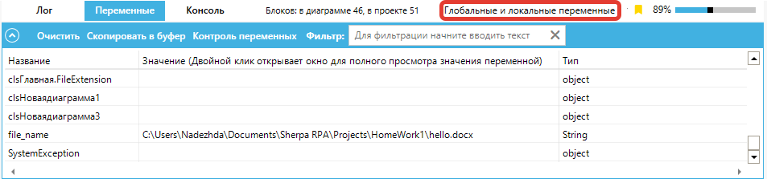
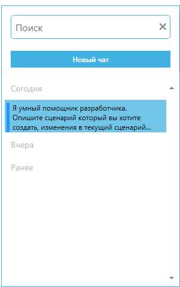

# Версия 1.41

Вышел новый релиз Sherpa Designer: Версия 1.41.

1. Реализована вкладка "Автодизайнер" в "Главной панели" Sherpa Designer для доступа к встроенному инструменту вайб-кодинга. Автодизайнер использует большую языковую модель и позволяет создавать и отлаживать роботов с нуля с помощью простого текстового описания, в режиме диалога с пользователем. Он также позволяет отлаживать, исправлять и дополнять уже существующие проекты роботов, проверять и исправлять селекторы, отвечать на разнообразные вопросы по проекту, проводить аудиты и писать участки документации.&#x20;

<figure><figcaption></figcaption></figure>

Ниже расположены:

* Поле для ввода сообщения Пользователя: "Сообщение в чат...", позволяющее описывать задачи или запрашивать действия. &#x20;
* Иконка "Показать историю чата", позволяющая открыть историю чата с Автодизайнером за сегодня, вчера и более ранний период, чтобы продолжить общение или переиспользовать запросы.

<figure><figcaption></figcaption></figure>

* Иконка "Прикрепить файлы", позволяющая добавлять дополнительные файлы к запросу (например, скриншоты интерфейсов). &#x20;
* Кнопка "Отправить сообщение", позволяющая отправлять сообщение на обработку. &#x20;
* Кнопка "Параметры", позволяющая открывать панель разрешений для автопилота автоматически без подтверждения пользователя выполнять следующие типы действий: "Запуск команды PowerShell", "Получение списка файлов", "Чтение из файла", "Запись в файл", "Получение списка диаграмм", "Создание диаграммы", "Запуск диаграммы", "Делать скриншот, если выполнение диаграммы завершилось с ошибкой".

<figure><figcaption></figcaption></figure>

2. Реализован Sherpa Autopilot - система автоматизации задач на рабочем месте, предназначенная для экономии времени сотрудников разных ролей при выполнении повторяющихся и интеллектуальных операций. Она позволяет быстро формулировать задачи с помощью голоса или текста, контролировать их выполнение и получать результат существенно быстрее, чем при ручной работе. В Sherpa Autopilot входят чат-ассистент с различными режимами, обработка изображений, документов, таблиц, проведение веб-исследований, генерация изображений, а также запуск Роботов с возможностью подтверждения или автоматического исполнения.&#x20;

<figure><figcaption></figcaption></figure>

3. В палитру “Учетные данные и безопасность” добавлен новый блок "Генерация TOTP", который позволяет автоматически создавать одноразовые пароли времени (TOTP) для повышения безопасности.

<figure><figcaption></figcaption></figure>

4. В палитру “Telegram” добавлены новые блоки: “Клиент. Получить пользователей чата”, "Клиент. Создать Супергруппу или Канал", "Клиент. Добавить администратора в группу", "Клиент. Получить пригласительные ссылки".

Блок "Клиент. Получить пользователей чата" позволяет получать список участников чата.&#x20;

<figure><figcaption></figcaption></figure>

Блок "Клиент. Создать Супергруппу или Канал" позволяет автоматизировать создание групп и каналов.

<figure><figcaption></figcaption></figure>

Блок "Клиент. Добавить администратора в группу" позволяет добавлять администратора.&#x20;

<figure><figcaption></figcaption></figure>

Блок "Клиент. Получить пригласительные ссылки" позволяет получать ссылки для приглашения в группы или каналы.

<figure><figcaption></figcaption></figure>

5.  Добавлена автоматическая генерация ошибки “The script aborted without the End block” при отсутствии завершающего блока “End” в сценарии.\

    <figure><figcaption></figcaption></figure>

Это позволяет своевременно находить “обрывы” сценариев.\

6. Для запуска Sherpa Designer добавлены новые параметры командной строки, расширяющие возможности автоматизации обновлений:

* "-updateremotepackages" автоматически обновляет все удалённые пакеты при запуске.
* "-updateallpackages" автоматически обновляет все блоки в проекте.
* "-updatepackage имя" обновляет только указанный пакет по имени.

**Внимание:** После выполнения обновлений Sherpa Designer не сохраняет проект автоматически. Для сохранения изменений необходимо вручную нажать кнопку “Сохранить”.

7. На панель “Инструменты” добавлена кнопка “Документировать..”.&#x20;

При нажатии на кнопку “Документировать…”, если проект открыт, откроется окно “Документировать…”, в котором будут доступны следующие элементы:

<figure><figcaption></figcaption></figure>

* Поле “Шаблон PDD”, которое позволяет выбрать шаблон документации с помощью кнопки “…” для поиска файла на компьютере.
* Флаг “Сокращенную версию (без ИИ)”, который включает создание обобщенной версии документации без использования искусственного интеллекта.
* Флаг “Полную версию (с ИИ)” (выключен).
* Кнопка “Генерировать документацию”, которая запускает процесс создания документа.
* Кнопка “Отмена”, которая закрывает окно без выполнения генерации документации.

При нажатии на кнопку “Генерировать документацию” появится окно “Сохранение”, в котором Пользователю необходимо выбрать нужную папку для сохранения будущего файла с документацией.&#x20;

После выбора папки (и последующего подтверждения) начнется процесс генерации. В начале, в логах появится сообщение: “Запущено генерирование документации. Пожалуйста, подождите…”. После завершения генерации в логах можно будет увидеть сообщение: “Генерация завершена. Создан файл `"C:\Users\<выбранная папка>\<имя файла>.docx"`”.

<figure><figcaption></figcaption></figure>

Перейдя в выбранную папку, Пользователь сможет открыть сгенерированный DOCX-файл и просмотреть итоговую документацию.
