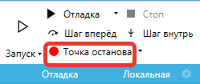

# Обучение PowerShell

PowerShell — это мощный скриптовый язык и универсальная командная оболочка, широко используемая для автоматизации и упрощения задач в среде Windows. Выражения в свойствах блоков Sherpa Designer пишутся на модифицированном языке PowerShell и сами блоки (их внутренний код) написаны на языке PowerShell. Для No-Code (без кода) использования Sherpa Designer знание языка PowerShell не требуется. Однако для Low-Code подхода желательно овладеть некоторыми базовыми знаниями этого языка, это позволит вам создавать более лаконичные диаграммы и решать нестандартные задачи.

***

## 1. Основы PowerShell и сравнение с C# и VB

PowerShell обладает богатым набором средств для работы с объектами и их методами. Он позволяет работать со всеми классами и методами Microsoft .NET Framework. Отличие от использования PowerShell от других .NET языков программирования, таких как например C# и VB заключается в синтаксисе.

Например для C# строка для получения информации о языке и настройках региона можно выполнить команду:

```
var cultureInfo = System.Globalization.CultureInfo.GetCultureInfo("ru-RU")
```

В PowerShell такая команда будет выглядеть так:

```
$cultureInfo = [System.Globalization.CultureInfo]::GetCultureInfo("ru-RU")
```

В Visual Basic .NET:

```
Dim cultureInfo As System.Globalization.CultureInfo = System.Globalization.CultureInfo.GetCultureInfo("ru-RU")
```

или

```
Dim cultureInfo As New System.Globalization.CultureInfo("ru-RU")
```

## 2. Операторы сравнения в PowerShell

Эффективное взаимодействие с данными в PowerShell базируется на использовании операторов сравнения. Эти инструменты интегрированы в Sherpa RPA, расширяя возможности автоматизации.

Работа с операторами сравнения и шаблонами:

* `*-c..` — различает большие и маленькие буквы;
* `-eq` — проверяет, равны ли два значения;
* `-ne` — проверяет, не равны ли два значения;
* `-gt` — проверяет, больше ли первое число второго;
* `-ge` — проверяет, больше или равно ли первое число второму;
* `-lt` — проверяет, меньше ли первое число второго;
* `-le` — проверяет, меньше или равно ли первое число второму;
* `-like` — проверяет, содержит ли текст определённое слово или шаблон. Можно использовать `?` и `*` для поиска по шаблонам (например, `*.txt` — все файлы с расширением `.txt`);
* `-notlike "#find text#"` — проверяет, что текст НЕ содержит определённое слово или шаблон;
* `-match "#pattern#"` — использует регулярные выражения для поиска сложных шаблонов в тексте;
* `-is [type]` — проверяет, какой у объекта тип (например, строка, число);
* `-isnot [type]` — проверяет, что объект НЕ этого типа.

Данные операторы помогают создавать более понятные и удобные скрипты для анализа и обработки данных.

## 3. Работа с коллекциями и базовыми операциями

PowerShell отлично подходит для работы с различными структурами данных, такими как массивы, списки, словари, таблицы данных и строки. Например, для фильтрации вложений в сообщении:

<pre class="language-powershell"><code class="lang-powershell"><strong>($Mail.Attachments | Where-Object {$_.DisplayName -Contains "текст"}).Length > 0
</strong></code></pre>

Данный пример показывает, как отфильтровать вложения по имени и проверить, есть ли такие вложения.

## 4. Объявление переменных и приведение типов

Примеры выражений и команд для работы с переменными и приведением типов:

* преобразование типа к первому аргументу:
  * `'1' + 1` дает `'11'` — строковое сложение, поскольку первый аргумент является строкой, то и число преобразуется в строку, а после - происходит объединение;
  * `1 + '1'` дает `2` — числовое сложение, потому что в этом случае происходит преобразование второго аргумента к числовому типу, и оба слагаемых становятся числами;
* `"5/7/07" -as [DateTime]` и `[datetime]"5/7/07"` — способы преобразовать строку с датой (например, "5/7/07") в специальный тип данных "Дата и время";
* `[Convert]::ToDateTime("5/7/07")` — еще один способ преобразовать строку с датой (например, "5/7/07") в специальный тип данных "Дата и время";
* `(1+12).ToString()` — выражение, в результате которого выполняется математическая операция, а затем результат меняет тип данных на строку: `'13'` ;
* `Ctrl+Space` — команда, которая автоматически дополняет код или показывает полезные подсказки для продолжения написания скрипта;
* `$null` — "пустое значение" (null), его используют, чтобы указать, что переменная или результат отсутствует;
* `[string]::IsNullOrEmpty()` — команда, которая проверяет, является ли строка пустой или равной null. Если да, она возвращается `true`, иначе — `false`.

PowerShell поддерживает работу с любыми типами данных, аналогично C#:

* создайте переменную `$MyListInList` с типом `Object` (для хранения любого типа данных);
* используйте команду, представленную ниже, чтобы создать список:&#x20;

`$script:MyListInList = New-Object Collections.Generic.List[Collections.Generic.List[string]];`

* добавьте два пустых списка в список.&#x20;

Первый список:&#x20;

`$MyListInList.Add((New-Object Collections.Generic.List[string]));`&#x20;

Второй список:&#x20;

`$MyListInList.Add((New-Object Collections.Generic.List[string]));`

* добавьте данные во вложенные списки, например, строку `"myval1"` в первый список и `"myval2"` во второй:&#x20;

`$MyListInList[0].Add("myval1"); $MyListInList[1].Add("myval2");`\


Обратите внимание, что в системе может быть включена опция "Локальные и глобальные переменные":

<figure><figcaption></figcaption></figure>

Если эта опция активирована, то переменные, создаваемые внутри блока, по умолчанию считаются “локальными” и видны только внутри этого блока. Если активирована опция “Все переменные глобальные”, то переменные могут быть доступны и быть использованы в любой части программы или скрипта, независимо от блока кода или функции, в которой они были созданы.

## 5. Область видимости переменных внутри блока "Выполнить выражение"

Когда вы пишете команды внутри блока, (например, в блоке "Выполнить выражение") и включена опция “Локальные и глобальные переменные”, то переменные, созданные там, по умолчанию считаются "локальными" (видны только внутри этого блока).

Например, переменная `$test2`, созданная внутри такого блока, не будет доступна за его пределами:

<figure><figcaption></figcaption></figure>

Если вы хотите, чтобы переменная `$test2` была доступна и после выполнения этого блока (например, из другого места вашего скрипта), нужно явно указать, что она принадлежит области "скрипта" (весь скрипт, а не только блок). Для этого используйте запись:

`if ($test -eq 100) { $script:test2 = 100 }`

Обратите внимание на `$script:` , данное выражение говорит о том, что переменная `$test2` создана в области видимости всего скрипта, и к ней можно обращаться за пределами блока.

<figure><figcaption></figcaption></figure>


> Когда вы читаете значение переменной, PowerShell сначала ищет её внутри блока (локально). Если там ее нет, то в области скрипта. Но если вы хотите задать значение переменной и сделать её доступной вне блока, обязательно укажите область `$script:`

## 6. Использование локальной и удаленной консоли PowerShell в Дизайнере Sherpa RPA для проверки выражений и отладки сценариев

Когда вы работаете со сценариями в Sherpa RPA, иногда бывает нужно проверить команды или отладить их работу. Для этого можно использовать консоль.

В нижней центральной панели Sherpa Designer вы можете открыть консоль, нажав на вкладку "Консоль". Это позволит вам вводить команды и видеть результаты их выполнения. Вы можете очистить консоль с помощью кнопки "Очистить" или перезагрузить консоль с помощью кнопки "Перезагрузить консоль", чтобы сбросить текущее состояние.

Очистка и перезагрузка: Вы можете очистить консоль с помощью кнопки "Очистить" или перезагрузить консоль с помощью кнопки "Перезагрузить консоль", чтобы сбросить текущее состояние.\
\
Локальная консоль — это встроенная консоль, которая запускается прямо в окне Sherpa RPA. Позволяет быстро проверить отдельные команды или выражения. Хорошо подходит для тестирования и отладки небольших участков кода.

<figure><figcaption></figcaption></figure>

Когда Робот ещё не запущен, доступна только локальная консоль. Локальная консоль позволяет проверить команды, выражения и условия:\


<figure><figcaption></figcaption></figure>

Если запустить Робота в режиме отладки и поставить его на паузу, появляется возможность работать с удаленной консолью (это контекст самого Робота, все команды выполняются в его стеке PowerShell), что дает возможность просматривать текущие переменные Робота, изменять их и проверять выражения с учетом введенных данных. Для того, чтобы поставить Робота на паузу, Пользователю необходимо:

*   поставить точки останова. Для этого он должен кликнуть на нужный блок правой кнопкой мыши и:

    * выбрать .png>) во всплывающем списке;&#x20;
    * кликнуть на нужный блок и нажать F9 на клавиатуре;
    * нажать на кнопку "Точка останова" в меню "Отладка": .&#x20;

    Блок выделится красной рамкой:

<figure><figcaption></figcaption></figure>

* нажать на кнопку .png>) . Робот остановится на том блоке диаграммы, в котором установлена точка останова;
* ввести имя переменной (или иную команду для работы с удаленной консолью) :

<figure><figcaption></figcaption></figure>

Соответственно, управление в консоли происходит через два потока: локальный (“L”) и удаленный (“R”). При запуске и постановке Робота на паузу автоматически активируется удаленная консоль (в Роботе). Также возможно переключение между этими потоками, для этого требуется нажать на соответствующую кнопку: “L” или “R”, пока Робот стоит на паузе:

<figure><figcaption></figcaption></figure>

Примеры использования:

* Проверка значений переменных: Введите имя переменной, например, `$myVariable`, чтобы увидеть ее текущее значение.
* Методы и свойства, доступные для данной переменной: Введите имя переменной, например, `$myVariable`, далее введите точку `.` и нажмите на Ctrl+Space.
* Выполнение выражений: Вы можете выполнять более сложные выражения, такие как `$myArray | Where-Object { $_ -eq "value" }`, чтобы фильтровать массивы.
* Отладка функций: Если у вас есть функции, вы можете вызывать их из консоли, чтобы проверить их работу, например, `MyFunction -Parameter $myParameter`.

## 7. Создание собственных блоков в редакторе блоков Sherpa RPA

Если вы хотите использовать свои собственные функции в Sherpa RPA, для вас есть возможность создать свои блоки.

Пример, как это делается с помощью PowerShell и внешней библиотеки (.dll файл):

* Подключение внешней библиотеки:

`Add-Type -Path "e:\123\1\TestDialog.dll"`

* Создание объекта класса из библиотеки:

`$mycls = [TestDialog.Class1]::new();`

* Вызов методов диалога:

`$mycls.MyDialog1($MyText);`

* Запуск статического метода `MyDialog2`, в который передается переменная `$MyText` :

&#x20;`[TestDialog.Class1]::MyDialog2($MyText);`

* Работа с таблицами данных:

`$dt = $dt.DefaultView.ToTable($false, "Column1", "Column2")`

Формируется таблица данных с колонками "Column1" и "Column2".
