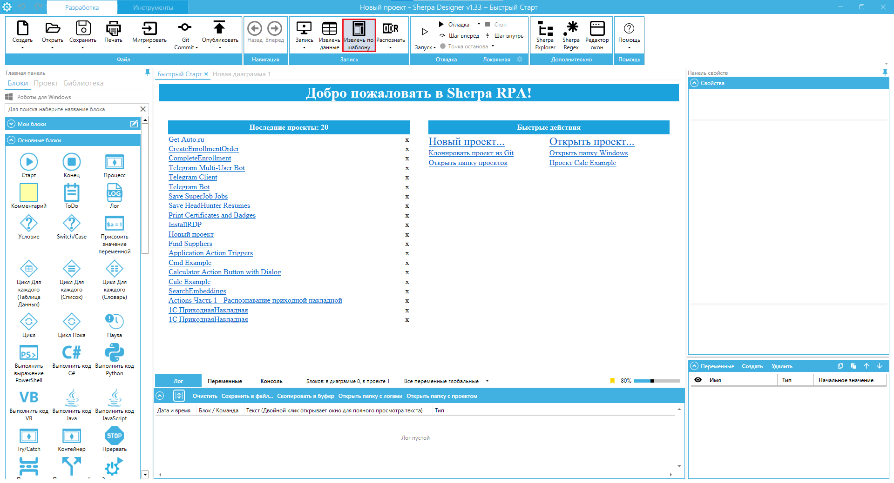

# Интерфейс Шаблонизатора

Запуск Шаблонизатора осуществляется на [панели "Разработка"](../../sherpa-designer/rabota-v-sherpa-designer/osnovnoe-menyu/panel-razrabotka/) основного меню Дизайнера по кнопке "Извлечь по шаблону".

<figure><figcaption></figcaption></figure>

**Кнопка “Извлечь по шаблону”** в меню “Запись” позволяет создавать интеллектуальные шаблоны для извлечения структурированной и полуструктурированной информации (таблиц, атрибутов) из документов (PDF, PNG, JPG и т.д.). При нажатии на кнопку “Извлечь по шаблону” открывается новое окно с генератором шаблонов (далее - Шаблонизатор).

Пользовательский интерфейс Шаблонизатора состоит из следующих основных областей:

1. [Основное меню ](osnovnoe-menyu-shablonizatora/)(верхняя панель).
2. [Центральная рабочая область Шаблонизатора](centralnaya-rabochaya-oblast-shablonizatora.md) – область для работы с шаблоном обрабатываемого документа.
3. [Панель настроек](panel-nastroek-shablonizatora/).

<figure><figcaption></figcaption></figure>
