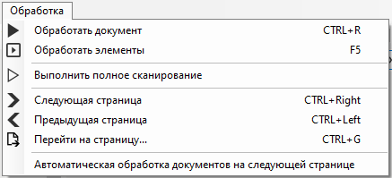
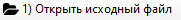
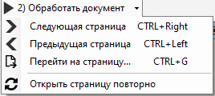

# Основное меню Шаблонизатора

Основное меню Шаблонизатора позволяет увидеть данные (вычисленные встроенным OCR-модулем), а также предлагает основные действия для создания и обработки шаблонов.

<figure><figcaption></figcaption></figure>

<table data-header-hidden><thead><tr><th width="57"></th><th width="229"></th><th></th></tr></thead><tbody><tr><td><strong>№ п/п</strong></td><td><strong>Элемент интерфейса</strong></td><td><strong>Описание</strong></td></tr><tr><td>1.</td><td>​<a href="https://app.gitbook.com/o/zn3l5J7H4k1e3Z4m9hVo/s/pyvTUnAaOD3OMZ1w2jM6/~/changes/997/shablonizator/interfeis-shablonizatora/osnovnoe-menyu-shablonizatora/menyu-fail">меню “Файл”</a> </td><td>Позволяет использовать базовые функции по управлению файлами документов и шаблонов.</td></tr><tr><td>2.</td><td><a href="https://app.gitbook.com/o/zn3l5J7H4k1e3Z4m9hVo/s/pyvTUnAaOD3OMZ1w2jM6/~/changes/997/shablonizator/interfeis-shablonizatora/osnovnoe-menyu-shablonizatora/menyu-obrabotka">меню “Обработка”</a> </td><td>Позволяет производить основные действия по обработке документа.</td></tr><tr><td>3.</td><td>кнопка “Сохранить шаблон” </td><td>Позволяет сохранить сканированный документ, который будет использоваться в качестве образца при создании шаблона для распознавания Роботом определенного типа документа.</td></tr><tr><td>4.</td><td>кнопка “<a href="https://app.gitbook.com/o/zn3l5J7H4k1e3Z4m9hVo/s/pyvTUnAaOD3OMZ1w2jM6/~/changes/997/shablonizator/interfeis-shablonizatora/osnovnoe-menyu-shablonizatora/knopka-otkryt-iskhodnyi-fail">Открыть исходный файл</a>” </td><td>Позволяет выбрать и открыть ранее сохраненный сканированный документ, который будет использоваться в качестве образца при создании шаблона для распознавания Роботом определенного типа документа.</td></tr><tr><td>5.</td><td>кнопка “<a href="https://app.gitbook.com/o/zn3l5J7H4k1e3Z4m9hVo/s/pyvTUnAaOD3OMZ1w2jM6/~/changes/997/shablonizator/interfeis-shablonizatora/osnovnoe-menyu-shablonizatora/knopka-obrabotat-dokument">Обработать документ</a>” </td><td>
Позволяет запустить обработку документа по выбранным параметрам для отображения:
<ul><li>Якоря,</li></ul><ul><li>Атрибуты,</li></ul><ul><li>Таблицы,</li></ul><ul><li>Чертежи таблиц,</li></ul><ul><li>OCR блоки,</li></ul><ul><li>OCR таблицы,</li></ul><ul><li>OCR линии.</li></ul></td></tr><tr><td>6.</td><td>кнопка “<a href="https://app.gitbook.com/o/zn3l5J7H4k1e3Z4m9hVo/s/pyvTUnAaOD3OMZ1w2jM6/~/changes/997/shablonizator/interfeis-shablonizatora/osnovnoe-menyu-shablonizatora/knopka-proverit">Проверить</a>” </td><td>
Позволяет визуально обновить макет шаблона после обработки документа и внесения каких-либо правок в шаблон без повторной отправки документа на обработку OCR:
<ul><li>создание/редактирования якоря,</li></ul><ul><li>создание/редактирование атрибута,</li><li>создание/редактирование таблицы.</li></ul></td></tr><tr><td>7.</td><td>кнопка “<a href="https://app.gitbook.com/o/zn3l5J7H4k1e3Z4m9hVo/s/pyvTUnAaOD3OMZ1w2jM6/~/changes/997/shablonizator/interfeis-shablonizatora/osnovnoe-menyu-shablonizatora/knopka-dobavit-atribut">Добавить атрибут</a>” </td><td>Позволяет определить и обозначить области документа, данные которых будут распознаваться Роботом и импортироваться в таблицу “Результаты”.</td></tr><tr><td>8.</td><td>кнопка “<a href="https://app.gitbook.com/o/zn3l5J7H4k1e3Z4m9hVo/s/pyvTUnAaOD3OMZ1w2jM6/~/changes/997/shablonizator/interfeis-shablonizatora/osnovnoe-menyu-shablonizatora/knopka-vypolnit-polnoe-skanirovanie">Выполнить полное сканирование</a>” </td><td>Позволяет выполнить полное сканирование.</td></tr><tr><td>9.</td><td>кнопка “<a href="https://app.gitbook.com/o/zn3l5J7H4k1e3Z4m9hVo/s/pyvTUnAaOD3OMZ1w2jM6/~/changes/997/shablonizator/interfeis-shablonizatora/osnovnoe-menyu-shablonizatora/knopka-umnyi-pomoshnik">Умный помощник</a>” </td><td>Позволяет проанализировать документ и создать шаблон для документа.</td></tr><tr><td>10.</td><td>кнопка “Показать/Скрыть Эскизы” </td><td>Позволяет показать и скрыть эскизы.</td></tr><tr><td>11.</td><td>переключатель “<a href="https://app.gitbook.com/o/zn3l5J7H4k1e3Z4m9hVo/s/pyvTUnAaOD3OMZ1w2jM6/~/changes/997/shablonizator/interfeis-shablonizatora/osnovnoe-menyu-shablonizatora/pereklyuchatel-masshtab">Масштаб</a>”  </td><td>Позволяет задать масштаб при работе с отсканированным документом.</td></tr><tr><td>12.</td><td>меню “<a href="https://app.gitbook.com/o/zn3l5J7H4k1e3Z4m9hVo/s/pyvTUnAaOD3OMZ1w2jM6/~/changes/997/shablonizator/interfeis-shablonizatora/osnovnoe-menyu-shablonizatora/menyu-otobrazhat">Отображать</a>” </td><td>
Позволяет управлять отображением:
<ul><li>якорей, </li><li>атрибутов, </li><li>таблиц и чертежей таблиц, </li><li>OCR блоков, </li><li>OCR таблиц, </li><li>OCR линий в рабочей области.</li></ul></td></tr></tbody></table>
