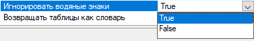
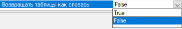

# Настройки

Шаблонизатор использует несколько видов модулей для извлечения данных из исходных файлов.&#x20;

## **OCR модуль**

**OCR модуль** — модуль, которым будет производиться распознавание текста.

<figure><figcaption></figcaption></figure>

В платформу Sherpa RPA интегрированы несколько OCR-модулей. Два из них поставляются вместе с роботом: Tesseract OCR и Microsoft OCR. Данные модули могут работать офлайн, без подключения к интернету.

**Tesseract OCR** — это движок оптического распознавания символов (OCR) с открытым исходным кодом, является самой популярной и качественной OCR-библиотекой. OCR использует нейронные сети для поиска и распознавания текста на изображениях.

**Yandex Vision и ABBYY OCR** — онлайн-модули, которые используют функции соответствующих облачных сервисов.

**Yandex Handwriting** — модуль, позволяющий распознавать рукописный текст.

**Microsoft OCR** — модуль, позволяющий распознавать текст на изображениях и сканированных документах с помощью оптического распознавания символов (OCR).

**OCR Space** — модуль, позволяющий распознавать кириллический шрифт на изображениях формата .jpg.&#x20;

**ABBYY FineReader** — это коммерческий оффлайн-модуль, использование которого требует отдельной лицензии.

Платформа Sherpa RPA позволяет настроить работу сценария с распознаванием изображений и переключаться между этими OCR-модулями в любой момент времени.&#x20;

## **OCR масштаб**

**OCR масштаб** — параметр, позволяющий улучшить качество распознавания, если документы имеют плохое разрешение. &#x20;

<figure><figcaption></figcaption></figure>

В случае высокого и среднего качества сканированного документа рекомендуется оставить значение масштаба равное «2».

## **Язык распознавания**

**Язык распознавания** — параметр, позволяющий увеличить точность распознавания документа. Также, можно задать несколько языков, использовав в качестве разделителя запятые.

<figure><figcaption></figcaption></figure>

При выборе настройки “Язык распознавания” открывается выпадающий список, в нем с помощью флагов можно отметить нужные для распознавания языки.&#x20;

## **Язык распознавания для якорей**

**Язык распознавания для якорей** — параметр, позволяющий указывать конкретный язык распознавания для якорей. Также можно задать несколько языков, использовав в качестве разделителя запятые.

<figure><figcaption></figcaption></figure>

## **Прямое извлечение текста из PDF**

**Прямое извлечение текста из PDF** — параметр, позволяющий управлять прямым извлечением текста со страницы.&#x20;

<figure><figcaption></figcaption></figure>

Возможные значения:

* No — отключено;
* Yes — используется только прямое извлечение текста;
* Auto — автоматический режим (если на странице нет текста, то будет реализовано распознавание текста с заданным OCR модулем).

## **OCR размер ячейки по горизонтали**

**OCR размер ячейки по горизонтали** — параметр, позволяющий указать делитель по горизонтали, по которому определяются ячейки таблиц на странице. Значение должно быть больше или равно 1.

<figure><figcaption></figcaption></figure>

Размер ячейки определяется как размер изображения, деленное на это значение.

Шаблонизатор использует два параметра (по горизонтали и по вертикали) для более точного определения таблиц.

По умолчанию задан параметр: 40 (OCR размер ячейки по горизонтали). Это значение является оптимальным при распознавании документов со стандартными (или близкими к стандартным) размерами ячеек таблиц.

Рекомендуется оставлять это значение без изменений и менять его только в случае некорректного распознавания (после проверки).

Если при заданном параметре таблица не будет распознана, то алгоритм Шаблонизатора увеличит это значение на 10 автоматически и осуществит попытку повторно.

## **OCR размер ячейки по вертикали**

**OCR размер ячейки по вертикали** — параметр, позволяющий указать делитель по вертикали, по которому определяются ячейки таблиц на странице. Значение должно быть больше или равно 1.

<figure><figcaption></figcaption></figure>

Размер ячейки определяется как размер изображения, деленное на это значение.

Шаблонизатор использует два параметра (по горизонтали и по вертикали) для более точного определения таблиц.

По умолчанию задан параметр: 20 (OCR размер ячейки по вертикали). Это значение является оптимальным при распознавании документов со стандартными (или близкими к стандартным) размерами ячеек таблиц.

Рекомендуется оставлять это значение без изменений и менять его только в случае некорректного распознавания (после проверки).

Если при заданном параметре таблица не будет распознана, то алгоритм Шаблонизатора увеличит это значение на 10 автоматически и осуществит попытку повторно.

## **Фильтр горизонтальных линий**

**Фильтр горизонтальных линий** — параметр, указывающий процент, меньше которого линии будут проигнорированы. Определяется как отношение горизонтальной линии к ширине изображения. Данный параметр используется для атрибутов.

<figure><figcaption></figcaption></figure>

По умолчанию значение данного параметра равно 5.

Часто в сканированных документах присутствуют линии, не являющиеся границами таблиц (различные артефакты, которые необходимо отфильтровать). При заданном параметре все лишние артефакты (линии, нарисованные ручкой или линии, появившиеся при некачественном сканировании) будут проигнорированы.

## **Автоповорот страницы**

**Автоповорот страницы** — параметр, позволяющий автоматически разворачивать страницы на угол, кратный 90 градусам (90̊, 180̊ и 270̽).&#x20;

<figure><figcaption></figcaption></figure>

Автоповорот страницы не разворачивает документ на малые углы. По умолчанию значение параметра “True”, рекомендуется оставлять его без изменения.

## **Автовыравнивание страницы**

**Автовыравнивание страницы** — параметр, позволяющий выравнивать содержимое страницы при некорректном сканировании листа. В отличие от “Автоповорота страницы”, “Автовыравнивание страницы” разворачивает документ на малые углы.

<figure><figcaption></figcaption></figure>

При автовыравнивании страницы распознается самая длинная OCR линия, имеющаяся на странице (чаще всего это линия из таблицы или атрибута) и определяет угол ее наклона относительно горизонтали. После этого происходит разворот документа, чтобы найденная линия стала параллельна линии горизонта.

По умолчанию значение параметра “True”, рекомендуется оставлять его без изменения.

Этот параметр нежелательно использовать в случае, если сканированный документ сильно повернут и угол поворота составляет более 40̊, в этом случае Шаблонизатор не сможет распознать, в какую сторону нужно выровнять документ и выдаст ошибку. В такой ситуации можно использовать параметр “Корректировка угла”.

## **Критерий длины. Автовыравнивание страницы**

**Критерий длины. Автовыравнивание страницы** — параметр, позволяющий ограничивать длину линии. Данный параметр используется как делитель для ширины страницы. Если длина линии меньше вычисленного значения, то она пропускается в алгоритме. Если страница изначально сильно повернута, то следует указать или большее значение или 0 для отключения параметра.&#x20;

<figure><figcaption></figcaption></figure>

По умолчанию значение равно 10.

## **Обрабатывать PDF аннотации**

**Обрабатывать PDF аннотации** — параметр, позволяющий включить обработку аннотаций PDF-файла.

<figure><figcaption></figcaption></figure>

## **Обрабатывать все страницы**

**Обрабатывать все страницы** — параметр, позволяющий включить обработку всех страниц в документе. Этот режим не делает проверку якоря LastPage.

<figure><figcaption></figcaption></figure>

## **Склеивать блоки**

**Склеивать блоки** — параметр, позволяющий склеивать рядом стоящие блоки в один блок.

<figure><figcaption></figcaption></figure>

## **Разделить блоки**

**Разделить блоки** — параметр, позволяющий разделить блоки, содержащие пробелы, на блоки без пробелов.&#x20;

<figure><figcaption></figcaption></figure>

## **Игнорировать ошибки якорей**

**Игнорировать ошибки якорей** — параметр, позволяющий отключить генерацию ошибок, если якори (любые) не найдены. В этом случае, область якоря считается нулевой.

<figure><figcaption></figcaption></figure>

## **Удалить блоки превышающие размер**

**Удалить блоки превышающие размер** — параметр, позволяющий удалить блоки превышающие указанный размер. Поле для ввода расположено рядом с наименованием параметра. Если указать одно число, то будут удалены блоки, у которых ширина или высота будут больше этого значения. Также, можно указать значения через запятую в формате: ширина, высота.

<figure><figcaption></figcaption></figure>

В качестве единицы измерения требуется указывать размер в пикселях.

## **Процент изображения для распознавания**

**Процент изображения для распознавания** — параметр, позволяющий указать процент изображения, который пойдет на распознавание OCR движком. Поле для ввода расположено рядом с наименованием параметра. Значение необходимо записывать как одно число или два числа через тире.&#x20;

<figure><figcaption></figcaption></figure>

Например:&#x20;

30 или (0-30) — будет распознано 0-30 % изображения;\
30-70 — будет распознана часть изображения;\
70-100 — будет распознано нижние 30 % изображения.

## **Найти печать**

**Найти печать** — параметр, позволяющий включить поиск печатей на документе. В атрибуты будет добавлен ключ “Stamps”, который возвратит массив объектов StampItem со свойствами X, Y, Width, Height, PageIndex.

<figure><figcaption></figcaption></figure>

## **Игнорировать водяные знаки**

Игнорировать водяные знаки — при включении не будут извлекаться символы и текст водяных знаков.

<figure><figcaption></figcaption></figure>

## **Возвращать таблицы как словарь**&#x20;

Возвращать таблицы как словарь — при включении таблицы будут возвращаться как словарь. Ключом словаря будет являться имя таблицы.

<figure><figcaption></figcaption></figure>
