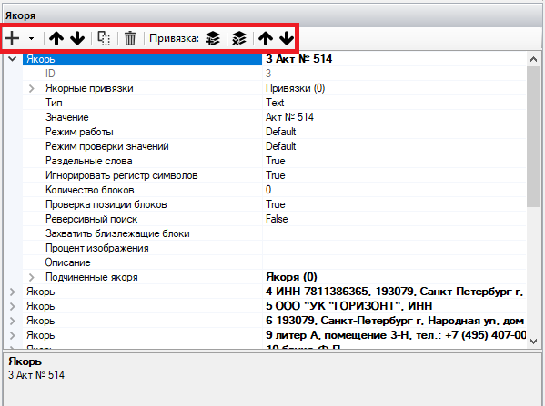

# Якоря

**Якоря** — блоки на обработанном документе, с помощью которых Робот определяет, в какой части документа размещаются определенные данные.

<figure><figcaption></figcaption></figure>

При помощи Якорей задаются границы определенных Атрибутов. Якорей может быть неограниченное количество, в зависимости от типа документа.&#x20;

## Инструменты для работы с Якорями

При создании нового Якоря на рабочей панели открывается список свойств и инструментов для работы с Якорем.

<figure><figcaption></figcaption></figure>

Основные инструменты для работы с Якорями:

<table data-header-hidden><thead><tr><th width="53"></th><th width="143"></th><th></th></tr></thead><tbody><tr><td><strong>№ п/п</strong></td><td><strong>Инструмент</strong></td><td><strong>Описание</strong></td></tr><tr><td>1.</td><td>кнопка </td><td>
Позволяет добавить новый Якорь. 

Кнопка ,  позволяет добавить новый подчиненный Якорь, при этом нужно в списке выбрать свойство “Новый  подчиненный якорь”.
</td></tr><tr><td>2.</td><td>кнопка </td><td>Позволяет переместить Якорь вверх.</td></tr><tr><td>3.</td><td>кнопка </td><td>Позволяет переместить Якорь вниз.</td></tr><tr><td>4.</td><td>кнопка </td><td>Позволяет копировать выделенный Якорь и автоматически добавить новый Якорь вместе с заданными настройками.</td></tr><tr><td>5.</td><td>кнопка </td><td>Позволяет удалить выделенный Якорь.</td></tr><tr><td>6.</td><td>кнопка </td><td>Позволяет добавить новую привязку к выделенному Якорю.</td></tr><tr><td>7.</td><td>кнопка </td><td>Позволяет удалить выделенную привязку.</td></tr><tr><td>8.</td><td>кнопка </td><td>Позволяет переместить привязку вверх.</td></tr><tr><td>9.</td><td>кнопка </td><td>Позволяет переместить привязку вниз.</td></tr></tbody></table>

## **Настройки Якоря**

Параметры настроек Якоря:

<figure><figcaption></figcaption></figure>

<table data-header-hidden><thead><tr><th width="53"></th><th width="175"></th><th></th></tr></thead><tbody><tr><td><strong>№ п/п</strong></td><td><strong>Параметр</strong></td><td><strong>Значение параметра</strong></td></tr><tr><td>1.</td><td>ID</td><td>Идентификатор Якоря. Присваивается автоматически.</td></tr><tr><td>2.</td><td>Якорные привязки</td><td>Список якорных привязок. </td></tr><tr><td>3.</td><td>Тип</td><td>
Тип Якоря. Выбирается из выпадающего списка:
<ul><li>Text – текст;</li><li>Table – таблица или ячейка таблицы;</li><li>Packet – пакет взаимозаменяемых Якорей (при привязке к этому Якорю будут взяты его подчиненные Якоря, первым будет Якорь, успешно найденный из списка).</li></ul></td></tr><tr><td>4.</td><td>Значение</td><td>
Значение Якоря.   Для Якоря типа “Text” возможно указывать подстановочные знаки: <code>(*)(?)</code>. 

Для Якоря типа “Table” значение записывается в формате: 

“Индекс таблицы:Индекс строки:Индекс колонки” 

Пример для Якоря типа “Text”:

<code>“*обл* страх*”</code> 

(два слова при включении “Раздельные слова”)

Примеры для Якоря типа “Table”:

<code>“0:1:2”</code>

(таблица 0, строка 1, колонка 2)

<code>“1:2”</code>

(таблица 1, строка 2)

<code>“2”</code> 

(вся таблица 2)
</td></tr><tr><td>5.</td><td>Режим работы</td><td>
Режим работы Якоря.   Возможные значения:
<ul><li>Default – Якорь обязателен на первой странице многостраничного документа;</li><li>LastPage – Якорь будет обязателен в многостраничном документе и укажет на последнюю страницу;</li><li>Optional – необязательный Якорь. Если он не будет найден на странице, то ошибка не генерируется.</li></ul></td></tr><tr><td>6. </td><td>Режим проверки значения</td><td>
Выбор режима проверки значений.   Возможные значения:
<ul><li>Default (по умолчанию);</li><li>EveryWordContains (проверка каждого слова в значении как вхождение в строку. Пример: <code>“тест” => ”*тест*”</code>);</li><li>RemoveNonWordSumbols (при проверке удаляются все не числовые и буквенные символы).</li></ul></td></tr><tr><td>7.</td><td>Раздельные слова</td><td>Значение Якоря разбивается на слова и каждое слово ищется отдельно.</td></tr><tr><td>8.</td><td>Игнорировать регистр символов</td><td>При включенной настройке будет игнорироваться регистр символов.</td></tr><tr><td>9.</td><td>Количество блоков</td><td>Если включена настройка “Раздельные слова”, то при поиске Якоря возможна ситуация, когда в заданной области могут быть найдены несколько значений блоков, соответствующие заданным словам.   Данное свойство позволяет ограничить максимальное количество слов между блоками.</td></tr><tr><td>10.</td><td>Проверка позиции блоков</td><td>При включенной настройке проверяется позиция блоков относительно координаты Y и берутся блоки с наименьшим значением.</td></tr><tr><td>11.</td><td>Реверсивный поиск</td><td>При включенной настройке поиск Якоря будет идти снизу страницы.</td></tr><tr><td>12.</td><td>Захватить близлежащие блоки</td><td>Захват ближних блоков Якоря.   Позволяет захватить в Якорь ближние блоки от уже захваченного значения.   Например, если указать <code>+2-1</code>, то к уже захваченному Якорю будут присоединены ближние блоки (<code>2</code> блока справа и <code>1</code> блок слева).   Данное свойство может использоваться когда не удается установить полное устойчивое значение для Якоря, но часть его имеет устойчивое значение.</td></tr><tr><td>13.</td><td>Процент изображения</td><td>
Процент изображения, в котором будет производиться поиск Якоря.   Значение необходимо записывать как одно число или два числа через тире.   Например: 

30 (0-30) - будут использоваться 0-30 % изображения; 30-70 - будут использоваться часть изображения; 70-100 - будут использоваться нижние 30 % изображения.
</td></tr><tr><td>14.</td><td>Описание</td><td>Пользовательское описание Якоря.</td></tr><tr><td>15.</td><td>Подчиненные якоря</td><td>
Якоря, напрямую зависящие от родительского Якоря.  Поиск подчиненных Якорей будет происходит только после того, как будет найден главный/родительский Якорь.   В случае, если:
<ul><li>в настройках родительского Якоря указан режим Optional (т.е. Якорь не обязательный), </li><li>родительский Якорь не был найден,</li></ul>
поиск подчиненных Якорей не будет осуществлен, и Якоря будут пропускаться.   Этот параметр используется, если Атрибут находится в середине многостраничного документа.
</td></tr></tbody></table>
