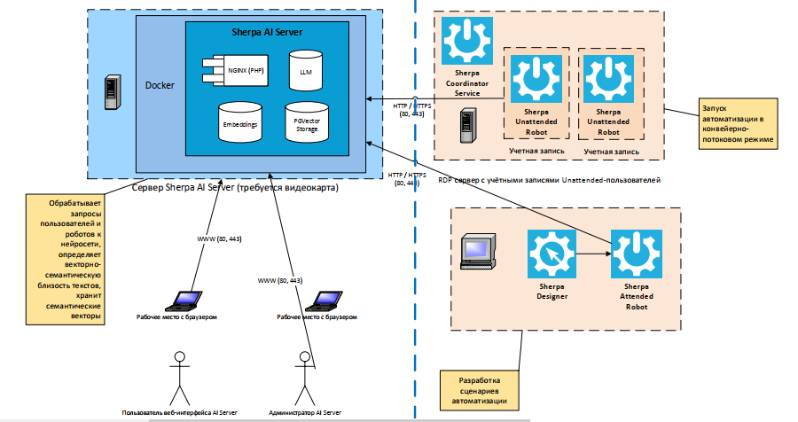

# Диаграмма развертывания Sherpa AI Server в связке с Роботами

<figure><figcaption></figcaption></figure>

В хорошем качестве можно скачать [здесь](https://drive.google.com/file/d/1BGgtGA2WmPNgwklzZ1Gne3Yerv3GOkqH/view?usp=drive_link).

Расширение схемы развертывания платформы Sherpa RPA описывает использование компонента Sherpa AI Server в составе платформы роботизации для реализации сценариев с использованием искусственного интеллекта и\
больших языковых моделей.

Все компоненты Sherpa AI Server устанавливаются локально в сети Заказчика, без связи с внешними серверами или службами SaaS. Развертывание Sherpa AI Server осуществляется с помощью Docker-контейнера.

## Состав решения

1. Веб-интерфейс пользователя для непосредственного общения с большой языковой моделью
2. Векторно-семантическое хранилище
3. Инференс-сервер большой языковой модели
4. Эмбеддинг-сервер большой языковой модели

## Конфигурация сети

Конфигурация портов и сетевые протоколы Sherpa Sherpa AI Server могут быть настроены для поддержки всех общих требований брандмауэра. Для взаимодействия с веб сервером используется https, опционально возможно http. При установке с помощью TLS клиент должен предоставить необходимые сертификаты, разместив их по пути /opt/app/config/certs/, переименовав их в aiserver.crt и aiserver.key.

## Механизмы аутентификации

Аутентификация веб-пользователей в Sherpa AI Server производится с помощью логина и пароля. Аутентификация внешних приложений, включая роботов платформы Sherpa RPA, производится с помощью API токена.
