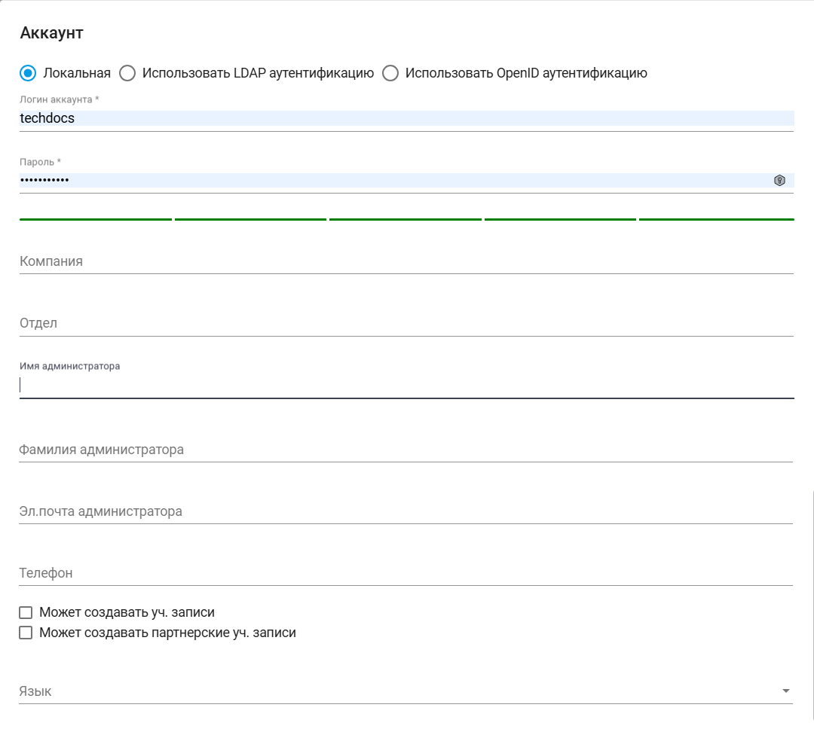

# Аккаунты

Инструмент “Аккаунты” позволяет создать несколько независимых областей внутри Sherpa AI Server, каждая из которых будет обладать своими чатами, историями чатов, документами, файлами, пользователями, что позволяет изолировать друг от друга работу разных отделов компании. Ограничений по количеству созданных аккаунтов в Sherpa AI Server нет.

> Аккаунты внутри Sherpa AI Server не являются пользователями. Для определения прав Пользователей предусмотрен отдельный инструмент “Пользователи”.

<figure><figcaption></figcaption></figure>

Для создания нового аккаунта необходимо нажать на кнопку “Создать” в таблице “Аккаунты” и заполнить открывшуюся форму.

<figure><figcaption></figcaption></figure>

Форма создания нового аккаунта предлагает три варианта аутентификации, из которых можно выбрать нужную с помощью установки флага:&#x20;

* Локальная аутентификация;
* LDAP аутентификация;
* OpenID аутентификация.

Форма создания нового аккаунта состоит из:

<table data-header-hidden><thead><tr><th width="55"></th><th width="206"></th><th width="361"></th></tr></thead><tbody><tr><td><strong>№ п/п</strong></td><td><strong>Элемент интерфейса</strong></td><td><strong>Описание</strong> </td></tr><tr><td>1. </td><td>чекбокс “Локальная”</td><td>Позволяет установить вариант локальной аутентификации аккаунта.</td></tr><tr><td>1.1</td><td>текстовое поле “Логин аккаунта”</td><td>Логин аккаунта. Обязательное для заполнения поле.</td></tr><tr><td>1.2.</td><td>текстовое поле “Пароль”</td><td>Пароль аккаунта. Обязательное для заполнения поле.</td></tr><tr><td>2.</td><td>чекбокс “Использовать LDAP аутентификацию”</td><td>Позволяет установить вариант аутентификации аккаунта через LDAP.</td></tr><tr><td>2.1</td><td>поле “Пользователи LDAP”</td><td>
Позволяет указать пользователя LDAP с помощью выпадающего списка. Данный вариант аутентификации доступен, если в конфиге Sherpa AI Server прописаны данные для подключения к LDAP-серверу. 

Данное поле доступно при LDAP аутентификации.
</td></tr><tr><td>3.</td><td>чекбокс “Использовать OpenID аутентификацию”</td><td>Позволяет установить вариант аутентификации аккаунта через OpenID .</td></tr><tr><td>3.1</td><td>текстовое поле “oAuth id”</td><td>Идентификатор oAuth. Обязательное для заполнения поле. Данное поле доступно при OpenID аутентификации.</td></tr><tr><td>4.</td><td>текстовое поле “Компания”</td><td>Название компании, в которой будет создан аккаунт.</td></tr><tr><td>5.</td><td>текстовое поле “Отдел”</td><td>Название отдела/департамента, места работы или расположения аккаунта.</td></tr><tr><td>6.</td><td>текстовое поле “Имя администратора”</td><td>Имя администратора аккаунта.</td></tr><tr><td>7.</td><td>текстовое поле “Фамилия администратора”</td><td>Фамилия администратора аккаунта.</td></tr><tr><td>8.</td><td>текстовое поле “Эл.почта администратора”</td><td>Электронная почта администратора аккаунта.</td></tr><tr><td>9.</td><td>текстовое поле “Телефон”</td><td>Телефон администратора аккаунта.</td></tr><tr><td>10.</td><td>чекбокс “Может создавать уч. записи”</td><td>Позволяет дать аккаунту право создавать другие аккаунты.</td></tr><tr><td>11.</td><td>чекбокс “Может создавать партнерские уч. записи”</td><td>Позволяет дать аккаунту право создавать партнерские аккаунты.</td></tr><tr><td>12.</td><td>поле “Язык”</td><td>
Позволяет выбрать язык, который будет выбран для аккаунта по умолчанию. Возможные варианты:
<ul><li>Русский;</li><li>English.</li></ul></td></tr></tbody></table>

Для просмотра и редактирования свойств конкретного аккаунта необходимо выбрать его в списке и нажать на кнопку .png>). После этого откроется форма с настройками аккаунта, в которую можно внести необходимые изменения. Новых полей в ранее созданном аккаунте нет.
