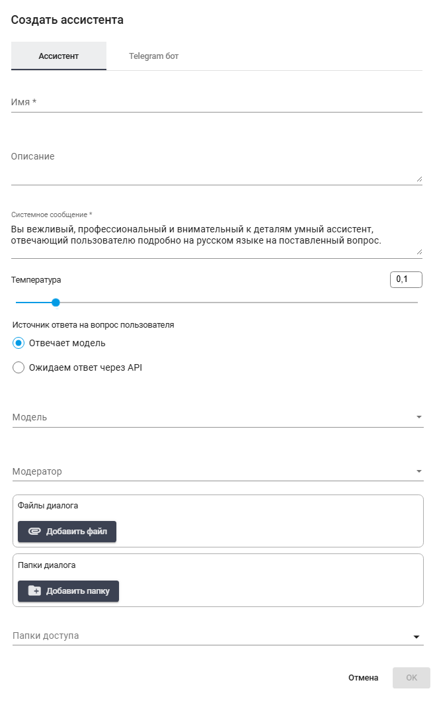
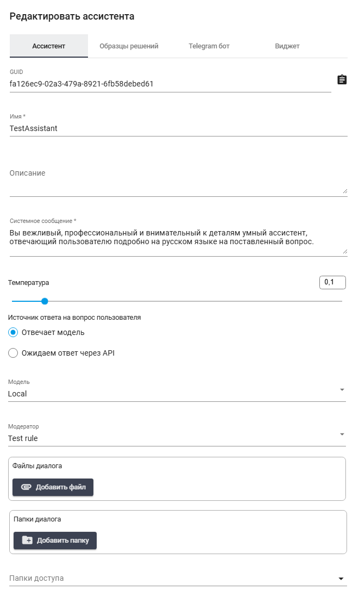

# Ассистенты

Пункт меню "Ассистенты" предоставляет Пользователю возможность создания и настройки взаимодействия с персонализированными Ассистентами. При выборе данного пункта открывается кнопка "Создать ассистента", которая, в свою очередь, инициирует появление всплывающего окна с двумя вкладками: "Ассистент", "Telegram бот".&#x20;

<figure><figcaption></figcaption></figure>

### Вкладка "Ассистент"

На вкладке "Ассистент" Пользователи могут настраивать параметры своего Ассистента.&#x20;

<figure><figcaption></figcaption></figure>

Включает следующие поля:

* **Имя \***

Данное поле предназначено для ввода уникального Имени для Ассистента. Указанное Имя будет использоваться Пользователями при обращении к Ассистенту. Например, "Ваш помощник" или "Служба поддержки".

* **Описание**

В данном поле можно указать, какие задачи Ассистент может выполнять, и/или предоставить краткую информацию о его функциональности. Это поможет Пользователям понять, как лучше взаимодействовать с Ассистентом.

* **Системное сообщение**

В данном поле можно указать системное сообщение, которое будет направлено Ассистенту для обработки запросов. Это сообщение может содержать инструкции о том, как Ассистент должен себя вести, в каком стиле отвечать или какую информацию использовать.

* **Температура**

<figure><figcaption></figcaption></figure>

Ползунок позволяет регулировать креативность ответов Ассистента — чем выше значение, тем более случайные и менее предсказуемые ответы он будет генерировать. Это может быть полезно в ситуациях, когда требуется больше разнообразия в ответах.

В правом верхнем углу отображается счетчик , где можно свериться со значением в цифровом эквиваленте, или ввести его вручную.

Настройка "Температура" позволяет регулировать креативность нейросети с помощью шкалы от 0 до 1, где:

0 – отсутствие креативности. Все ответы на одни и те же вопросы будут почти одинаковыми, строгими и лаконичными. Этот режим подходит для ситуаций, когда необходимы точные ответы или решения задач по генерации кода.

1 – максимальная степень креативности. Все ответы нейросети будут разными и непредсказуемыми. Подходит для написания статей и творческих текстов.

По умолчанию значение "Температура" установлено на отметке 0,5. Если вы работаете с документами, рекомендуется установить значение на 0,4.

* **Источник ответа на вопрос пользователя**

<figure><figcaption></figcaption></figure>

Чекбоксы для указания источника информации, который Ассистент будет использовать для генерации ответов.

* **Файлы диалога**

<figure><figcaption></figcaption></figure>

Кнопка “Добавить файл” позволяет загрузить необходимые файлы, которые могут быть использованы во время диалога. Это могут быть текстовые документы, изображения или другие типы файлов, которые помогут Ассистенту предоставлять обоснованные ответы.

* **Папки диалога**

<figure><figcaption></figcaption></figure>

Кнопка “Добавить папку” позволяет указать папки, в которых будут храниться диалоги Ассистента. Это поможет структурировать взаимодействие и легко находить нужные данные в будущем.

### Вкладка "Telegram бот"

На вкладке "Telegram бот" пользователи могут интегрировать своего Ассистента с платформой Telegram, что открывает новые возможности для взаимодействия.

<figure><figcaption></figcaption></figure>

* **Токен Telegram-бота**

В данном поле Пользователю необходимо указать токен, полученный у BotFather в Telegram. Это позволит создать функционального бота, который будет отвечать на запросы пользователей через Telegram.

* **Текст приветствия Telegram-бота**

Данное поле предназначено для ввода приветственного сообщения, которое Пользователи увидят после запуска бота или ввода команды /start. Приветственное сообщение может быть персонализированным и служить для информирования Пользователей о доступных командах или функциональности бота.

Для просмотра и редактирования свойств ассистента необходимо выбрать его в списке и нажать на кнопку .png>). После этого откроется форма с настройками ассистента, в которую можно внести необходимые изменения.

<figure><figcaption></figcaption></figure>

Вкладка «Образцы решений» позволяет добавить несколько примеров пользовательских запросов или вопросов, а также примеры наиболее эффективных ответов. Это особенно актуально при работе с документами, задачами. Образец решения помогает системе лучше понять контекст и выбрать наиболее подходящие ответы.

<figure><figcaption></figcaption></figure>

Под капотом эта функция реализована через механизм RAG (Retrieve and Generate), однако результат вставляется не прямо в пользовательский запрос (User Prompt), а в системный (System Prompt). В начале системного промпта задаётся базовая структура (в первой вкладке «Ассистент»). Затем вставляются один или несколько наиболее релевантных примеров из таблицы «Образцы решений». Если подключен документ или папка с файлами, то также автоматически вставляются релевантные фрагменты подключенных материалов.

Образцы решений служат своего рода подборкой примеров (RAG) по списку, которые включаются в системный промпт. Такой подход можно применять не только для ответов, но и для классификации. Например, для создания большой таблицы, где в первой колонке находятся вопросы, а во второй — соответствующие им классы или метки. Эти данные можно вручную редактировать, дополнять или удалять прямо на экране, либо загружать из внешнего файла XLSX или CSV.

Важно учитывать, что контекстное окно модели ограничено по размеру, поэтому не все строки таблицы обязательно попадут в запрос. В системный промпт вставляются только наиболее релевантные образцы — те, что наиболее соответствуют запросу Пользователя. Алгоритм использует эмбеддинги для оценки релевантности по первой колонке (вопросам). В результате такого подхода формируется подборка из пяти наиболее релевантных примеров, которая помогает модели лучше ориентироваться и давать точные ответы.

Использование вкладки «Образцы решений» отлично подходит для нескольких сценариев:&#x20;

* для демонстрации нескольких примеров,&#x20;
* корректировки ответов в сложных случаях, когда стандартные шаблоны не обеспечивают нужной точности,&#x20;
* для задач классификации.

Если требуется интегрировать чат с ассистентом в ваш сайт или веб-приложение, необходимо открыть вкладку «Виджет». Для этого достаточно вставить скрипт embed в исходный код страницы, между тегами `<body>`:

<figure><figcaption></figcaption></figure>
