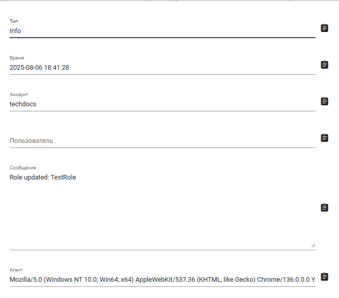

# Аудит

Инструмент “Аудит” логирует все события, произошедшие внутри Sherpa AI Server.

<figure><figcaption></figcaption></figure>

В таблице отображается информация о:

* создании/удалении Аккаунта;&#x20;
* создании/удалении Пользователя;&#x20;
* попытках ввода логина (успешно/неуспешно) Пользователями;
* манипуляциях Пользователей с различными инструментами Sherpa AI Server.

<table data-header-hidden><thead><tr><th width="58"></th><th width="175"></th><th></th></tr></thead><tbody><tr><td><strong>№ п/п</strong></td><td><strong>Колонка</strong></td><td><strong>Описание</strong> </td></tr><tr><td>1. </td><td>Тип</td><td>Тип информации.</td></tr><tr><td>2.</td><td>Время</td><td>Дата и время события.</td></tr><tr><td>3.</td><td>Аккаунт</td><td>Имя Аккаунта. </td></tr><tr><td>4.</td><td>Пользователь</td><td>Имя Пользователя.</td></tr><tr><td>5.</td><td>Сообщение</td><td>Сообщение о событии.</td></tr><tr><td>6.</td><td>Агент</td><td>Агент (User-Agent браузер) с которого совершалось событие.</td></tr></tbody></table>

Для просмотра записи о событии, совершенном в Sherpa AI Server, в виде карточки необходимо кликнуть на иконку .png>).

<figure><figcaption></figcaption></figure>

При клике на иконку .png>) справа от выбранного поля, информация из него копируется в буфер обмена.
