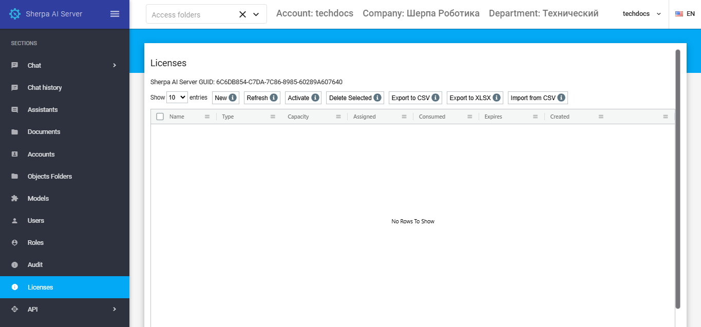

# Лицензии

Лицензии (лицензионные ключи) выдаются поставщиками для компаний-клиентов и представляют собой последовательности букв и цифр.

В Sherpa AI Server доступны четыре типа Лицензий:

* Sherpa AI Server 500 t/s;
* Sherpa AI Server 1000 t/s;
* Sherpa AI Server 2000 t/s;
* Безлимит.

<figure><figcaption></figcaption></figure>

## Создание и активация лицензии

Для создания новой Лицензии необходимо нажать на кнопку “Создать” (.png>)) в таблице “Лицензии” и заполнить открывшуюся форму:

* Имя (имя Лицензии);
* Ключ (ключ Лицензии, предоставленный вендором).

<figure><figcaption></figcaption></figure>

Для активации созданной лицензии необходимо нажать кнопку “Активировать” (.png>)) и в открывшемся окне выбрать один из двух типов активации: автоматическую или ручную.

<figure><figcaption></figcaption></figure>

При выборе автоматической активации нужно просто кликнуть на “ОК”. Автоматическая активация возможна только в том случае, если Sherpa AI Server имеет открытый доступ в Интернет.

При выборе ручной активации появляется код запроса, который нужно передать вендору для подтверждения ручной активации. В ответ на код запроса вам будет передан код ответа, его необходимо ввести в соответствующее поле и нажать “ОК”. Лицензия будет активирована, и в колонке “Истекает” изменится дата и время лицензии.

## Редактирование ранее созданной Лицензии

Для просмотра и редактирования ранее созданной Лицензии необходимо выбрать ее в списке и нажать на кнопку .png>). После этого откроется форма с настройками выбранной лицензии, в которую можно внести необходимые изменения. Помимо полей заполняемых при создании новой лицензии в форме редактирования есть дополнительные поля:

<figure><figcaption></figcaption></figure>

* “GUID” (уникальный идентификатор, присвоенный Лицензии после ее создания). Данное поле нельзя отредактировать;
* “Истекает” (дата и время истечения Лицензии);
* “Создано” (дата и время создания Лицензии);
* “Обновлена” (дата и время обновления Лицензии).
