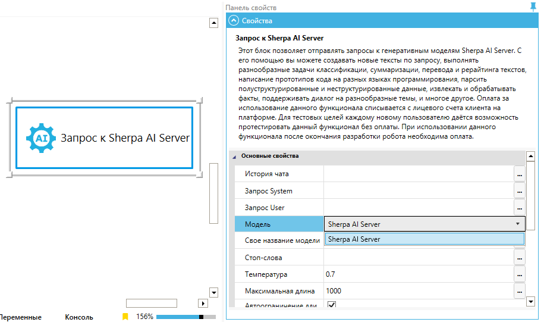

# Запрос к Моделям в Sherpa Designer

Подключение осуществляется внутри блока "Запрос к Sherpa AI Server". Необходимо выбрать "Sherpa AI Server" в поле "Модель":

<figure><figcaption></figcaption></figure>

А затем в поле "Свое название модели" указать название собственной Модели:

<figure><figcaption></figcaption></figure>

Запрос будет направлен к выбранному экземляру Модели внутри группы.
