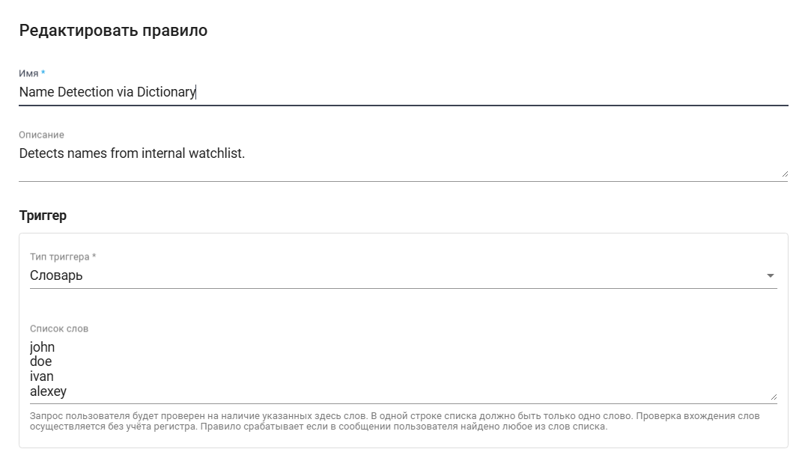

# Модерация

Экран "Модерация", разделённый на "Наборы правил" и "Правила", предназначен для защиты, скрытия и блокировки данных. Также предусмотрены режимы маскировки информации, уточнение и корректировка данных внутри модели.&#x20;

В разделе "Наборы правил" отображаются группы связанных правил, а в разделе "Правила" — конкретные настройки или инструкции, входящие в эти группы.

<figure><figcaption></figcaption></figure>

Для создания нового набора правил необходимо нажать на кнопку “Создать” в таблице “Наборы правил” и заполнить открывшуюся форму.&#x20;

<figure><figcaption></figcaption></figure>

Для создания нового правила необходимо нажать на кнопку “Создать” в таблице “Правила” и заполнить открывшуюся форму.&#x20;

<figure><figcaption></figcaption></figure>

Имя и описание служат для идентификации , а триггер — это условие, при котором срабатывает данное правило:

<figure><figcaption></figcaption></figure>

Словарь — это набор определённых фраз или слов, который используется для распознавания и обработки входящих данных. Каждая фраза или слово располагаются в отдельной строке (все слова должны быть записаны по одному в столбик, каждое на своей линии):

<figure><figcaption></figcaption></figure>

Регулярное выражение — это специальные символы, позволяющие описать определённые шаблоны или паттерны, которые нужно искать в тексте:

<figure><figcaption></figcaption></figure>

Локальная модель используется для того, чтобы правило срабатывало при использовании конкретного экземляра модели. В рамках настройки задаются все необходимые параметры: промпт, Regex для проверки ответа и температура:

<figure><figcaption></figcaption></figure>

Внешний сервис используется при вызове определенного внешнего API по заданному URL. Когда необходимо инициировать событие или получить информацию, то система посылает запрос на указанный URL внешнего сервиса:

<figure><figcaption></figcaption></figure>

Ниже есть возможность настраивать типы действия (то, что произойдет при срабатывании нашего триггера). Иными словами, если в сообщении обнаружатся определённые слова или фразы, то задаваемое действие будет выполнено.

**Блокировка** означает, что сообщение будет заблокировано, и нейросеть ответит простым уведомлением об ошибке.&#x20;

<figure><figcaption></figcaption></figure>

**Маскировка** — это механизм скрытия данных. Если необходимо заменить или скрыть определённые слова, то они замазываются в ответе (и также замазаны в запросе). Это особенно важно, чтобы функция модерации предотвращала утечку чувствительной информации из внутреннего контура компании во внешний нейросетевой сервис.

<figure><figcaption></figcaption></figure>

**Переписывание** предполагает отправку дополнительного запроса на нашу собственную модель с определённым промптом, цель которого — перефразировать или заменить нежелательные слова. Такой подход помогает избегать использования нежелательного контента без блокировки или удаления исходного сообщения.

<figure><figcaption></figcaption></figure>

**Перенаправление** — это отправка запроса на другую модель или сервис, что позволяет гибко управлять обработкой данных.

<figure><figcaption></figcaption></figure>

**Уведомление** позволяет системе не блокировать само сообщение, а просто фиксировать факт обращения, отправляя соответствующее уведомление администратору. В логах или аудите сохраняется информация о том, что Пользователь задал вопрос, содержащий неподходящий или чувствительный контент, что помогает службе безопасности своевременно на него реагировать.

<figure><figcaption></figcaption></figure>

**Фиксированный ответ** позволяет Пользователю получать заранее заданный ответ без обращения к внешней нейросети. Такой ответ может служить уведомлением об ошибке или ограничениях (например, о недопустимых словах или выражениях). Его можно расширить, добавив в сообщение более информативное объяснение, что конкретно недопустимо в системе.

<figure><figcaption></figcaption></figure>

Чтобы проверить, корректно ли отрабатывается выбранное действие, можно использовать поле "Тестовый текст". Введите в него текст и нажмите на кнопку "Выполнить тест".

Группу правил можно выбрать при создании ассистента в поле "Модератор":

<figure><figcaption></figcaption></figure>

Для просмотра и редактирования свойств конкретного набора правил необходимо выбрать его в списке и нажать на кнопку .png>). После этого откроется форма с настройками набора правил, в которую можно внести необходимые изменения. Новых полей в ранее созданном наборе правил нет.

<figure><figcaption></figcaption></figure>

Для просмотра и редактирования свойств конкретного правила необходимо выбрать его в списке и нажать на кнопку .png>). После этого откроется форма с настройками правила, в которую можно внести необходимые изменения. Новых полей в ранее созданном правиле нет.

<figure><figcaption></figcaption></figure>

<figure><figcaption></figcaption></figure>
