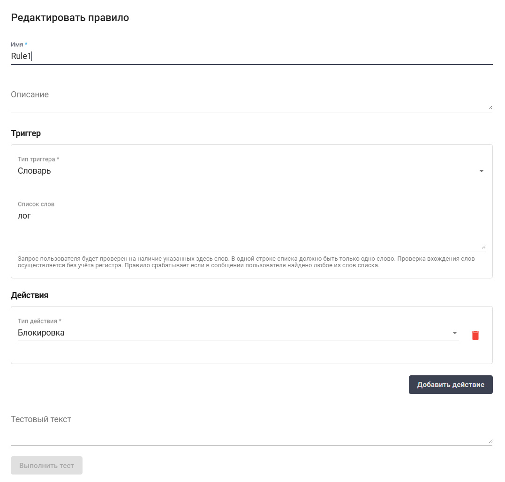

# Модерация

Экран "Модерация", разделённый на "Наборы правил" и "Правила", предназначен для управления и контроля правил, используемых системой. В разделе "Наборы правил" отображаются группировки или коллекции связанных правил, а в разделе "Правила" — конкретные настройки или инструкции, входящие в эти наборы.

<figure><figcaption></figcaption></figure>

Для просмотра и редактирования свойств конкретного набора правил необходимо выбрать его в списке и нажать на кнопку .png>). После этого откроется форма с настройками набора правил, в которую можно внести необходимые изменения. Новых полей в ранее созданном наборе правил нет.

<figure><figcaption></figcaption></figure>

Для просмотра и редактирования свойств конкретного правила необходимо выбрать его в списке и нажать на кнопку .png>). После этого откроется форма с настройками правила, в которую можно внести необходимые изменения. Новых полей в ранее созданном правиле нет.

<figure><figcaption></figcaption></figure>
