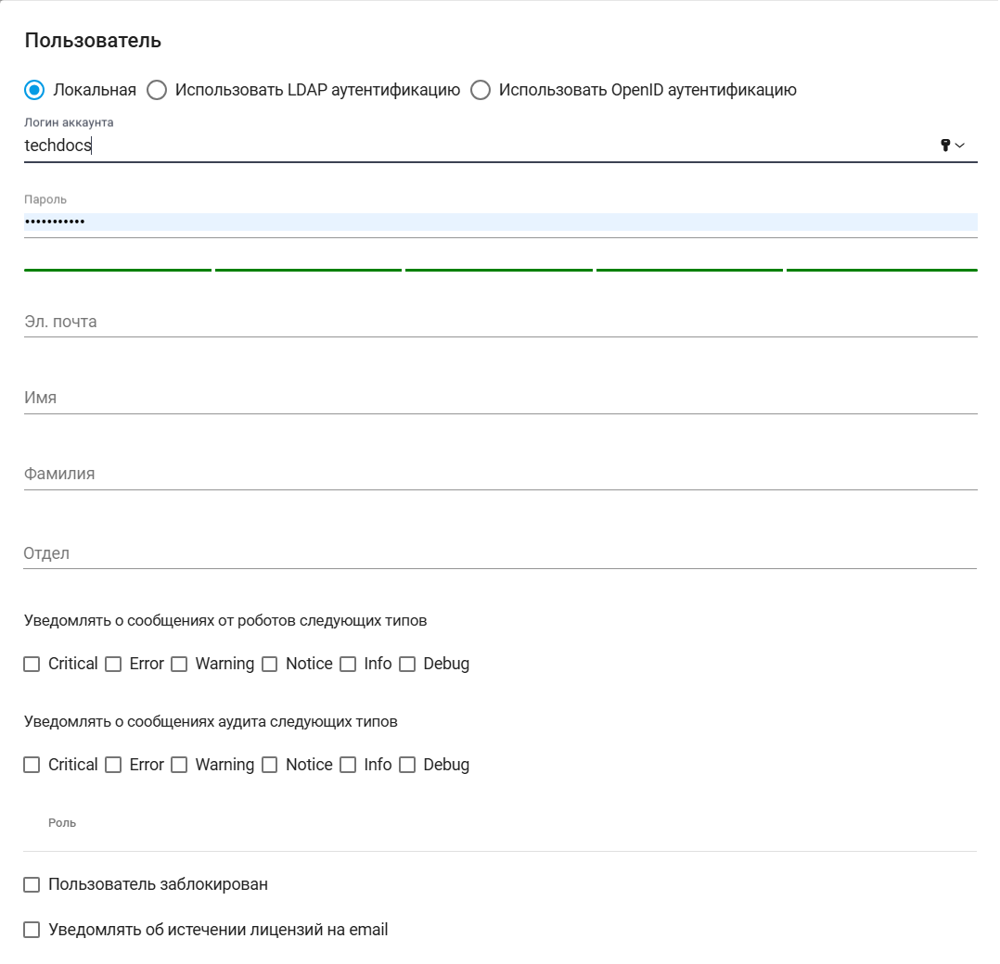

# Пользователи

В рамках Аккаунта можно создать Пользователей. Каждому Пользователю присваивается определенная Роль с помощью инструмента “Роли”. Пользователю можно присвоить определенную Роль или несколько Ролей. Ограничений по количеству созданных Пользователей в Sherpa AI Server нет.

<figure><figcaption></figcaption></figure>

Для создания нового Пользователя необходимо нажать на кнопку “Создать” в таблице “Пользователи” и заполнить открывшуюся форму.&#x20;

<figure><figcaption></figcaption></figure>

Форма создания нового Пользователя предлагает три варианта аутентификации, из которых можно выбрать нужную с помощью заполнения чекбокса:&#x20;

* [Локальная](avtorizaciya-polzovatelei/lokalnaya-avtorizaciya.md);
* [Использовать LDAP аутентификацию](avtorizaciya-polzovatelei/ldap-autentifikaciya.md);
* [Использовать OpenID аутентификацию](avtorizaciya-polzovatelei/openid-autentifikaciya.md).

> При создании и/или редактировании Пользователя должно быть указано какой именно способ аутентификации для него использовать.

Для просмотра и редактирования свойств конкретного Пользователя необходимо выбрать его в списке и нажать на кнопку  (1) (1) (1).png>). После этого откроется форма с настройками Пользователя, в которую можно внести необходимые изменения. Новых полей в форме ранее созданного Пользователя нет.
