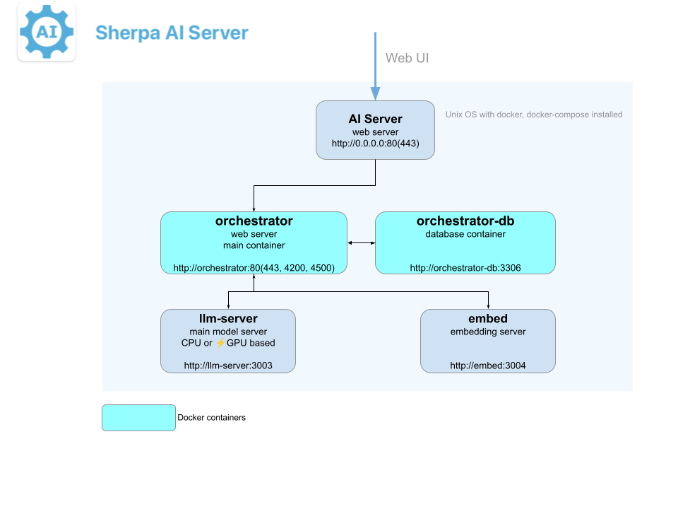
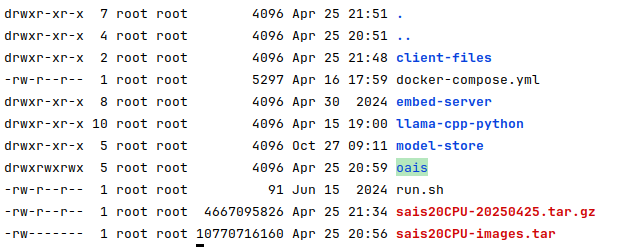
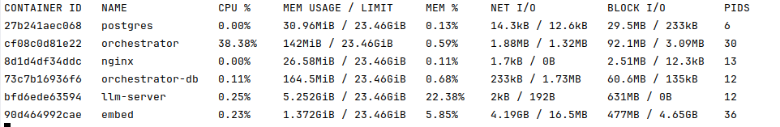

# Установка Sherpa AI Server

Перед установкой программных продуктов платформы Sherpa RPA ознакомьтесь с системными требованиями к компьютеру.

Схема взаимодействия между компонентами Sherpa AI Server.

<figure><figcaption></figcaption></figure>

Установка производится по инструкции представленной ниже.

> Для установки Sherpa AI Server необходимо обладать правами администратора.&#x20;

Для Docker-контейнеров, использующих CUDA, необходимо установить:

* драйверы NVIDIA GPU на хост-системе;
* пакет NVIDIA Docker Toolkit (nvidia-docker2) на хост-системе, чтобы обеспечить доступ контейнера к GPU хоста;
* среду разработки CUDA Toolkit внутри контейнера (она уже установлена).

> Если в системе установлены Docker и Docker-compose, следует сразу перейти в раздел “Установка CUDA”.

## Установка Docker и Docker-compose

Для корректной установки Docker и Docker-compose необходимо установить обновления системы Linux OS.&#x20;

Далее, в терминале, необходимо выполнить следующую команду (для этого скопируйте скопируйте команду, вставьте ее в окно терминала и нажмите Enter):

<table data-header-hidden><thead><tr><th width="207.25" valign="bottom">Действие</th><th width="244.916748046875" valign="bottom">Команда</th></tr></thead><tbody><tr><td valign="bottom">Update Linux OS</td><td valign="bottom">$ sudo apt update</td></tr></tbody></table>

Затем установите Docker, для этого скачайте установочный файл на сайте по ссылке: [https://docs.docker.com/engine/install/ubuntu/](https://docs.docker.com/compose/install/other/) и выполните в терминале поочередно следующие команды:

<table data-header-hidden><thead><tr><th width="457.666748046875" valign="bottom"></th></tr></thead><tbody><tr><td valign="bottom">$ sudo apt install docker.io -y</td></tr><tr><td valign="bottom">$ sudo systemctl enable docker</td></tr><tr><td valign="bottom">$ sudo systemctl start docker</td></tr></tbody></table>

Следующим шагом необходимо установить Docker Compose, для этого перейдите по ссылке: [https://docs.docker.com/compose/install/other/](https://docs.docker.com/compose/install/other/) , после этого выполните в терминале поочередно следующие команды:

<table data-header-hidden><thead><tr><th width="443" valign="bottom"></th></tr></thead><tbody><tr><td valign="bottom">$ sudo apt install curl -y</td></tr><tr><td valign="bottom">$ LATEST_COMPOSE_VERSION=$(curl -s https://api.github.com/repos/docker/compose/releases/latest | grep 'tag_name' | cut -d\" -f4)</td></tr><tr><td valign="bottom">$ sudo curl -L "https://github.com/docker/compose/releases/download/${LATEST_COMPOSE_VERSION}/docker-compose-$(uname -s | tr '[:upper:]' '[:lower:]')-$(uname -m | tr '[:upper:]' '[:lower:]')" -o /usr/local/bin/docker-compose</td></tr><tr><td valign="bottom">$ sudo chmod +x /usr/local/bin/docker-compose</td></tr></tbody></table>

## Установка NVIDIA GPU drivers

**Примечание:** _если в системе уже установлены NVIDIA drivers (CUDA version >= 12.2) и NVIDIA Docker Toolkit (nvidia-docker2), то можно сразу перейти в раздел “Установка Приложения”._

Для установки NVIDIA GPU drivers выполните в терминале поочередно следующие команды:

```
sudo apt update && sudo apt upgrade
sudo apt install nvidia-driver-535
sudo reboot
```

Затем проведите проверку с помощью команды:

```
nvidia-smi
```

## Установка NVIDIA Docker Toolkit (nvidia-docker2) online

Для установки NVIDIA Docker Toolkit (nvidia-docker2) online выполните в терминале поочередно следующие команды:

```
sudo apt-get purge -y nvidia-docker
distribution=$(. /etc/os-release;echo $ID$VERSION_ID)
curl -s -L https://nvidia.github.io/nvidia-docker/gpgkey | sudo apt-key add -
curl -s -L https://nvidia.github.io/nvidia-docker/$distribution/nvidia-docker.list | sudo tee /etc/apt/sources.list.d/nvidia-docker.list
sudo apt-get update
sudo apt-get install -y nvidia-docker2
sudo systemctl restart docker
```

## Установка NVIDIA Container Toolkit online

Для установки NVIDIA Container Toolkit online выполните в терминале поочередно следующие команды:

1. Настройка продакшн-репозитория:

```
curl -fsSL https://nvidia.github.io/libnvidia-container/gpgkey | sudo gpg --dearmor -o /usr/share/keyrings/nvidia-container-toolkit-keyring.gpg \
&& curl -s -L https://nvidia.github.io/libnvidia-container/stable/deb/nvidia-container-toolkit.list | \
sed 's#deb https://#deb [signed-by=/usr/share/keyrings/nvidia-container-toolkit-keyring.gpg] https://#g' | \
sudo tee /etc/apt/sources.list.d/nvidia-container-toolkit.list
```

2. При необходимости настройки репозитория для использования экспериментальных пакетов:

```
sed -i -e '/experimental/ s/^#//g' /etc/apt/sources.list.d/nvidia-container-toolkit.list
```

3. Для обновления списка пакетов из репозитория:

```
sudo apt-get update
```

4. Для установки пакетов NVIDIA Container Toolkit:

```
sudo apt-get install -y nvidia-container-toolkit
```

## Установка CUDA offline

Для установки CUDA offline скачайте архивы файлов (\~3,5Gb), доступные по следующий ссылкам:

```
https://sherparpa.ru/downloads/private/SherpaAIServer/cuda-offline-install.tar.gz
https://sherparpa.ru/downloads/private/SherpaAIServer/nvidia-graphics-drivers-535_535.129.03.orig-amd64.tar.gz
```

При необходимости обновите драйвер NVIDIA, выполнив в терминале следующие команды:

```
tar -xzvf nvidia-graphics-drivers-535_535.129.03.orig-amd64.tar.gz --strip-components=1
sudo bash NVIDIA-Linux-x86_64-535.129.03.run
```

Затем распакуйте ранее скачанный архив, это можно сделать с помощью следующей команды:

```
tar -xzvf cuda-offline-install.tar.gz
```

Для установки CUDA repository package используйте команду:

```
sudo dpkg -i cuda-repo-ubuntu2004-11-8-local_11.8.0-520.61.05-1_amd64.deb
```

Переместите pin с помощью команды:

```
sudo mv cuda-ubuntu2004.pin /etc/apt/preferences.d/cuda-repository-pin-600
```

Скопируйте GPG keyring, используя команду:

```
sudo cp /var/cuda-repo-ubuntu2004-11-8-local/cuda-*-keyring.gpg /usr/share/keyrings/
```

Для запуска установщика приложение используйте следующие команду:

```
cd /var/cuda-repo-ubuntu2004-11-8-local/
sudo dpkg -i *.deb
```

Последним шагом в установке CUDA offline является обновление переменных окружения, для этого используйте следующую команду:

```
echo 'export PATH=/usr/local/cuda/bin:$PATH' >> ~/.bashrc
echo 'export LD_LIBRARY_PATH=/usr/local/cuda/lib64:$LD_LIBRARY_PATH' >> ~/.bashrc
source ~/.bashrc
```

## Установка приложения

Для установки приложения необходимо поочередно выполнить следующие действия:

<table data-header-hidden><thead><tr><th width="271"></th><th></th></tr></thead><tbody><tr><td>Перейти в папку приложения:</td><td><code>$ cd /opt</code></td></tr><tr><td>Скачивание архивов в папку проекта.<br>3 архива (~10-20 Gb)</td><td><p>Клиенту передаются файлы .tar.gz:</p><p><code>sais20CPU-****.tar.gz .</code></p><p><code>Meta-Llama-3-8B-Instruct-Q4_K_S.gguf</code></p><p><code>sentence-transformers-model.tar.gz</code></p><p> </p><p>Либо скачиваются из хранилища:</p><p><code>$ sudo wget -O Meta-Llama-3-8B-Instruct-Q4_K_S.gguf https://sherparpa.ru/downloads/private/SherpaAIServer/Meta-Llama-3-8B-Instruct-Q4_K_S.gguf</code></p><p><code>$ sudo wget -O sais20CPU-20250425.tar.gz https://sherparpa.ru/downloads/private/SherpaAIServer/sais20CPU-20250425.tar.gz</code> </p><p><code>$ sudo wget -O sentence-transformers-model.tar.gz https://sherparpa.ru/downloads/private/SherpaAIServer/sentence-transformers-model.tar.gz</code></p></td></tr></tbody></table>

<table data-header-hidden><thead><tr><th width="272"></th><th></th></tr></thead><tbody><tr><td>Создайте папку проекта</td><td><code>$ sudo mkdir -p /opt/</code><a href="https://sherparpa.ru/downloads/private/SherpaAIServer/sais-cpu.tar.gz"><code>sais</code></a></td></tr><tr><td>Перейдите в папку</td><td><code>$ cd /opt/sais</code></td></tr><tr><td>Скопировать модель</td><td><p><code>$ sudo mkdir -p /opt/sais/model-store/meta-llama</code></p><p><code>$ cp Meta-Llama-3-8B-Instruct-Q4_K_S.gguf  /opt/sais/model-store/meta-llama</code></p></td></tr><tr><td>Распакуйте архивы(5-10 минут)</td><td><p><code>$ sudo tar -xf sais20CPU-20250425.tar.gz</code></p><p> <code>sudo tar -xf sentence-transformers-model.tar.gz</code></p></td></tr></tbody></table>

<figure><figcaption></figcaption></figure>

| <p>*если у текущего пользователя &#x3C;username></p><p>нет разрешений для docker group</p> | `$ sudo usermod -aG docker <username>`                                                                                                                                                                                                                                                   |
| ------------------------------------------------------------------------------------------ | ---------------------------------------------------------------------------------------------------------------------------------------------------------------------------------------------------------------------------------------------------------------------------------------- |
| Распаковка docker images                                                                   | `$ sudo docker load --input sais20CPU-images.tar`                                                                                                                                                                                                                                        |
| Сделайте вcе сценарии в директории исполняемыми                                            | `$ sudo find ./*.sh -type f \| sudo xargs chmod +x`                                                                                                                                                                                                                                      |
| Установите права на конфиг для mysql                                                       | `$ sudo chmod 0444 /opt/`[`sais`](https://sherparpa.ru/downloads/private/SherpaAIServer/sais-cpu.tar.gz)`/oais/backend/config/my.cnf`                                                                                                                                                    |
| Настройте Доменное имя                                                                     | <p><code>$ sudo nano ./oais/backend/config/domain.conf</code></p><p> </p><p>Замените в этом файле домен "exampledomain" на свой во всех местах и сохраните файл (3 изменения).</p>                                                                                                       |
| Настройка окружения                                                                        | <p>Задайте IP-сервер в файле окружения. Для этого задайте IP-сервер в файле ./client-files/.env и установите параметр HOST_IP=ВАШ.IP</p><p> </p>                                                                                                                                         |
| Создайте общую сеть, выполнив в терминале следующую команду                                | `$ sudo docker network create --driver bridge --subnet 172.18.0.0/16 llm-net`                                                                                                                                                                                                            |
| Настройте сертификаты                                                                      | Переименуйте сертификат и ключ для своего домена в orchestrator.crt и orchestrator.key соответственно и скопируйте их в "./oais/backend/config/certs".                                                                                                                                   |
| Выполните запуск контейнеров                                                               | `$ sudo sh ./run.sh`                                                                                                                                                                                                                                                                     |
| Создайте базу данных                                                                       | <p><code>$ docker exec -it orchestrator-db mysql -u root -e "CREATE DATABASE IF NOT EXISTS orchestrator CHARACTER SET utf8mb4 COLLATE utf8mb4_unicode_ci"</code></p><p># Если стандартный пароль от базы меняли на свой, то нужно после root добавить <code>-p</code> и свой пароль.</p> |
| Выполните обновление базы данных:                                                          | `$ sudo sh ./oais/migrate.sh`                                                                                                                                                                                                                                                            |

| Проверка | `$ docker stats` |
| -------- | ---------------- |

<figure><figcaption></figcaption></figure>

| При необходимости удалите архивы для экономии места            | `$ rm  <file_name>`                                                                                                                                                                                                                                                                                                  |
| -------------------------------------------------------------- | -------------------------------------------------------------------------------------------------------------------------------------------------------------------------------------------------------------------------------------------------------------------------------------------------------------------- |
| На этом установка завершена, и приложение доступно в браузере: | <p>Требуется 5-7 минут на загрузку контейнера языковой модели ( llm-server):</p><p>CPU %  ~ 0%  MEM USAGE > 5 Gib<br>После этого можно переходить по ссылке:<br><a href="http://host:3001/">https://&#x3C;host_url></a>(web interface)</p>                                                                           |
| Выполните активацию AI Server                                  | <p>Перейдите в браузере по url адресу:<br> &#x3C;доменное_АИ_сервера>/setup.php</p><p>и если IP адрес отображается верно нажмите на кнопку “Отправить”.</p><p></p><p>В ответе скрипта будет указан GUID АИ сервера, который необходимо записать вместе с регистрационными данными для дальнейшего использования.</p> |
