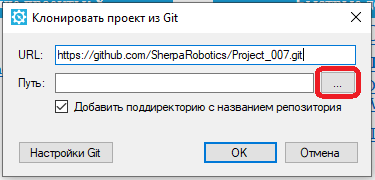

# Как разместить проект на GitHub с помощью Sherpa Designer

На старте разработки, Руководитель проекта направляет URL-ссылку на репозиторий, в котором необходимо сохранить проект, а также Логин и Токен для подключения к корпоративному аккаунту [GitHub](https://github.com/) Sherpa RPA. Чтобы разместить свой проект в репозитории на GitHub, используя встроенные инструменты в Sherpa Designer, необходимо выполнить следующие шаги:

### 1 Подготовка к работе

Разработчику понадобятся следующие данные:

* Адрес репозитория;
* Логин;
* Токен.

Когда все необходимые данные собраны, необходимо открыть Sherpa Designer.&#x20;

### 2 Клонирование проекта из Git

На вкладке “Быстрый старт”, в разделе “Быстрые действия” необходимо нажать “Клонировать проект из Git”:

<figure><figcaption></figcaption></figure>

Откроется окно, в котором нужно указать URL-ссылку на репозиторий, в которой будут сохраняться все коммиты проекта:

<figure><figcaption></figcaption></figure>

Ссылку для ввода в поле “URL” формирует и предоставляет разработчику Руководитель проекта на старте разработки. Далее необходимо указать путь к папке на персональном компьютере разработчика, в которой будет сохраняться сам проект и все бэкапы.

<figure><figcaption></figcaption></figure>

Выбранная папка должна быть пустой (в том числе не содержать скрытых файлов), в противном случае возникнет сообщение об ошибке LibGit2Sharp.NameConflictException.

<table data-header-hidden><thead><tr><th width="50"></th><th></th></tr></thead><tbody><tr><td></td><td>В случае, если разработчик одновременно работает над несколькими проектами, файлы по каждому проекту должны сохраняться в разных папках. Также рекомендуется присваивать названия папкам, соответствующие названиям создаваемых Роботов. Файлы каждого проекта (Робота) должны сохраняться в отдельном репозитории, предназначенном для одного конкретного проекта. Соответственно, для разных проектов разработчика должен быть предоставлен отдельный URL.</td></tr></tbody></table>

Нажмите на кнопку “Настройки Git”, откроется следующее окно:

<figure><figcaption></figcaption></figure>

В разделе настроек выбираем способ авторизации: “Логин/Токен” и вводим ранее предоставленные данные (см. п. 1).

<figure><figcaption></figcaption></figure>

После заполнения всех полей и нажатия на кнопку “ОК” произойдет клонирование проекта из Git, что необходимо для обеспечения контроля версий и совместной работы над проектом в дальнейшем.

<figure><figcaption></figcaption></figure>

В созданной папке на персональном компьютере разработчика появятся папка .git и файл .gitignore:

<figure><figcaption></figcaption></figure>

### 3 Создание или перенос проекта

Теперь разработчик должен перейти к созданию нового проекта или перенести уже существующий проект в выбранную папку (с папкой .git и файлом .gitignore). Например:

<figure><figcaption></figcaption></figure>

### Запуск проекта

Для запуска проекта разработчик должен открыть его в Sherpa Designer и нажать на иконку работы с Git (“Git Commit“ на верхней панели “Файл”).&#x20;

Далее в окне “Git Commit” отобразится список файлов, которые будут размещены в репозитории.&#x20;

<table data-header-hidden><thead><tr><th width="49"></th><th></th></tr></thead><tbody><tr><td></td><td>Обратите внимание, файлы бэкапа не размещаются в репозитории.</td></tr></tbody></table>

Например:

<figure><figcaption></figcaption></figure>

В поле “Сообщение” можно при необходимости оставить любой комментарий (commit message). Необходимо написать текст сообщения, отражающий суть внесенных в проект изменений. Например: “Добавлена диаграмма проверки прав доступа сотрудника” или “Исправлена ошибка сохранения файла”.

Далее необходимо нажать на кнопку “Commit and push”. После этого сохраненные изменения будут переданы в репозиторий, путь к которому был указан ранее в настройках GitHub (см. п. 2).

Дополнительную информацию о разделах всплывающего меню “Git Commit” в Sherpa Designer можно найти [здесь](https://docs.sherparpa.ru/sherpa-designer/rabota-v-sherpa-designer/osnovnoe-menyu/panel-razrabotka/menyu-fail).
