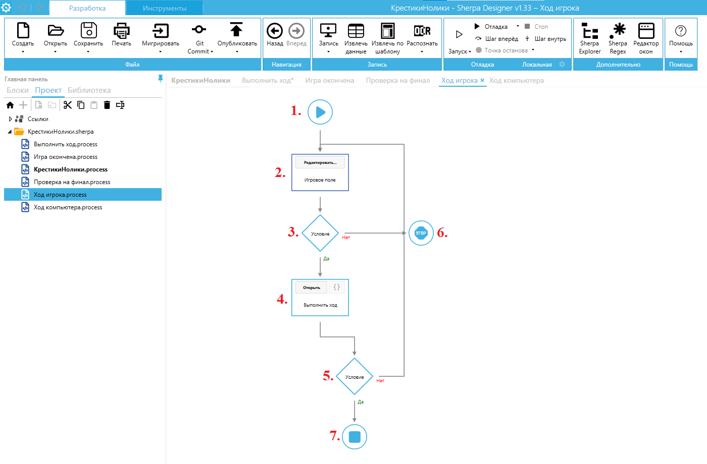

# Крестики-нолики

Рассмотрим пример робота, который запускает игру в крестики-нолики, реализованную на Sherpa Robot.

Проект робота состоит из шести диаграмм. Если описывать пошагово, то данный робот работает следующим образом:

1. Запускает игру, предлагая выбрать символ, которым пользователь будет играть.&#x20;

<figure><figcaption></figcaption></figure>

2. Открывает игровое поле, после чего пользователь и компьютер поочередно выбирают клетку для хода.

<figure><figcaption></figcaption></figure>

3. В случае выигрыша пользователя, выводит окно с сообщением об этом.

<figure><figcaption></figcaption></figure>

Основная диаграмма проекта называется “КрестикиНолики” выглядит так (для удобства блоки диаграммы пронумерованы):

<figure><figcaption></figcaption></figure>

1. **Блок “Старт”** (с этого блока начинается любая диаграмма).
2. **Блок “Получить путь”** позволяет узнать полный путь к файлу. Для данного блока указаны следующие свойства:

* Имя файла (имя файла);
* Генерировать имя (при установленном флаге будет сгенерировано случайное имя файла, включая расширение).

<figure><figcaption></figcaption></figure>

3. **Блок “Получить путь”** позволяет узнать полный путь к файлу. Для данного блока указаны следующие свойства:

* Имя файла (имя файла);
* Генерировать имя (при установленном флаге будет сгенерировано случайное имя файла, включая расширение).

<figure><figcaption></figcaption></figure>

4. **Блок “Показать окно”** позволяет создавать свои собственные окна (формы) и отображать их в модальном и немодальном режиме, в том числе асинхронно по отношению к ходу сценария. Если задан селектор, координаты созданного окна будут привязаны элементу управления в другом приложении. Для данного блока указаны следующие свойства:

* Конфигурация (строка  конфигурации);
* Объект окна (переменная с объектом окна);
* Модальное (при установленном флаге окно будет показано как модальное);
* ID процесса (переменная, в которой хранится идентификатор процесса).

<figure><figcaption></figcaption></figure>

Для создания и редактирования окна используется кнопка “Редактировать…”, находящаяся в блоке. При нажатии на данную кнопку открывается “[Редактор окон](../rabota-v-sherpa-designer/osnovnoe-menyu/panel-razrabotka/menyu-dopolnitelno/redaktor-okon.md)”.

<figure><figcaption></figcaption></figure>

5. **Блок “Switch/Case”**. Оператор switch сравнивает выражение с указанными значениями и выходит по указанному коннектору. Если совпадений не будет обнаружено, то выходит по коннектору “По умолчанию”. Для данного блока указаны следующие свойства:

* Выражение (сравниваемое выражение);
* Условие 1 (при совпадении будет произведен выход по коннектору 1, а также выполнено выражение 1 если оно задано. Если коннектор не задан, то выход будет произведен по умолчанию);
* Выполнить выражение 1 (при выполнении условия 1 будет выполнено данное выражение и произведен выход по соответствующему коннектору. Если коннектор не подключен, то выход будет производится по умолчанию);
* Условие 2 (при совпадении будет произведен выход по коннектору 2, а также выполнено выражение 2 если оно задано. Если коннектор не задан, то выход будет произведен по умолчанию);
* Выполнить выражение 2 (при выполнении условия 2 будет выполнено данное выражение и произведен выход по соответствующему коннектору. Если коннектор не подключен, то выход будет производится по умолчанию);

<figure><figcaption></figcaption></figure>

6. **Блок “Присвоить значение переменной”** устанавливает новые значения для одной или нескольких переменных. В данном случае, в свойствах указано одно значение, которое необходимо присвоить одной переменной, соответственно.

<figure><figcaption></figcaption></figure>

7. **Блок “Процесс”** позволяет создавать сценарии, состоящие из нескольких диаграмм. Выполнение сценария продолжится с блока “Старт” указанной диаграммы проекта. Выполнение сценария вернётся к текущему блоку и продолжится в текущей диаграмме как только будет достигнут блок “Конец” во внешней диаграмме. Для блока “Процесс” указано свойство “Имя диаграммы” (имя файла диаграммы, в которой продолжится выполнение сценария).&#x20;

<figure><figcaption></figcaption></figure>

8. **Блок “Условие”** проверяет указанное условие на истинность, после чего выполнение сценария продолжается в сторону выхода “Да” (если условие выполняется) или в сторону выхода “Нет” (если условие не выполнилось).&#x20;

Условие записывается в формате: “переменная” равна (==)/ больше (>)/ меньше (<) “значение”.&#x20;

Например: $a == “Привет”, то есть, если значение переменной $a равно “Привет”, то выход “Да”, в противном случае – выход “Нет”.

$Result > 5, то есть, если значение переменной $Result меньше 5, то выход “Да”, в противном случае – выход “Нет”.

В данном случае, в качестве условия установлено:$IsFinal. Т.е., происходит проверка на финал.

<figure><figcaption></figcaption></figure>

9. **Блок “Процесс”** позволяет создавать сценарии, состоящие из нескольких диаграмм. Выполнение сценария продолжится с блока “Старт” указанной диаграммы проекта. Выполнение сценария вернётся к текущему блоку и продолжится в текущей диаграмме как только будет достигнут блок “Конец” во внешней диаграмме. Для блока “Процесс” указано свойство “Имя диаграммы” (имя файла диаграммы, в которой продолжится выполнение сценария).&#x20;

<figure><figcaption></figcaption></figure>

10. **Блок “Условие”** проверяет указанное условие на истинность, после чего выполнение сценария продолжается в сторону выхода “Да” (если условие выполняется) или в сторону выхода “Нет” (если условие не выполнилось).&#x20;

Условие записывается в формате: “переменная” равна (==)/ больше (>)/ меньше (<) “значение”.&#x20;

Например: $a == “Привет”, то есть, если значение переменной $a равно “Привет”, то выход “Да”, в противном случае – выход “Нет”.

$Result > 5, то есть, если значение переменной $Result меньше 5, то выход “Да”, в противном случае – выход “Нет”. В данном случае, в качестве условия установлено: $IsStepUser. Т. е., делается проверка на ход игрока.

<figure><figcaption></figcaption></figure>

11. **Блок “Процесс”** позволяет создавать сценарии, состоящие из нескольких диаграмм. Выполнение сценария продолжится с блока “Старт” указанной диаграммы проекта. Выполнение сценария вернётся к текущему блоку и продолжится в текущей диаграмме как только будет достигнут блок “Конец” во внешней диаграмме. Для блока “Процесс” указано свойство “Имя диаграммы” (имя файла диаграммы, в которой продолжится выполнение сценария).&#x20;

<figure><figcaption></figcaption></figure>

12. **Блок “Процесс”** позволяет создавать сценарии, состоящие из нескольких диаграмм. Выполнение сценария продолжится с блока “Старт” указанной диаграммы проекта. Выполнение сценария вернётся к текущему блоку и продолжится в текущей диаграмме как только будет достигнут блок “Конец” во внешней диаграмме. Для блока “Процесс” указано свойство “Имя диаграммы” (имя файла диаграммы, в которой продолжится выполнение сценария).&#x20;

<figure><figcaption></figcaption></figure>

13. **Блок “Присвоить значение переменной”** устанавливает новые значения для одной или нескольких переменных. В данном случае, в свойствах указано одно значение, которое необходимо присвоить одной переменной, соответственно.

<figure><figcaption></figcaption></figure>

14. – 15. **Блоки “Конец”** (этими блоками завершается работа сценария или возврат диаграммы подпроцесса в основной процесс).

**Диаграмма “Выполнить ход”**

Данная диаграмма состоит из пар блоков “Условие” и “Конец”. Диаграмма “Выполнить ход” выполняет каждый последующий ход и проверяет соблюдение условия.

<figure><figcaption></figcaption></figure>

**Диаграмма “Ход игрока”**

<figure><figcaption></figcaption></figure>

1. **Блок “Старт”** (с этого блока начинается любая диаграмма).
2. **Блок “Показать окно”** позволяет создавать свои собственные окна (формы) и отображать их в модальном и немодальном режиме, в том числе асинхронно по отношению к ходу сценария. Если задан селектор, координаты созданного окна будут привязаны элементу управления в другом приложении. Для данного блока указаны следующие свойства:

* Конфигурация (строка  конфигурации);
* Объект окна (переменная с объектом окна);
* ID процесса (переменная, в которой хранится идентификатор процесса).

<figure><figcaption></figcaption></figure>

Для создания и редактирования окна используется кнопка “Редактировать…”, находящаяся в блоке. При нажатии на данную кнопку открывается “Редактор окон”.&#x20;

<figure><figcaption></figcaption></figure>

3. **Блок “Условие”** проверяет указанное условие на истинность, после чего выполнение сценария продолжается в сторону выхода “Да” (если условие выполняется) или в сторону выхода “Нет” (если условие не выполнилось).&#x20;

Условие записывается в формате: “переменная” равна (==)/ больше (>)/ меньше (<) “значение”.&#x20;

Например: $a == “Привет”, то есть, если значение переменной $a равно “Привет”, то выход “Да”, в противном случае – выход “Нет”.

$Result > 5, то есть, если значение переменной $Result меньше 5, то выход “Да”, в противном случае – выход “Нет”. В данном случае, в качестве условия установлено: $ControlEvent -ne "linkStop.LinkClicked". Т. е., осуществляется проверка, что не была нажата ссылка “Завершить игру”.&#x20;

<figure><figcaption></figcaption></figure>

4. **Блок “Процесс”** позволяет создавать сценарии, состоящие из нескольких диаграмм. Выполнение сценария продолжится с блока “Старт” указанной диаграммы проекта. Выполнение сценария вернётся к текущему блоку и продолжится в текущей диаграмме как только будет достигнут блок “Конец” во внешней диаграмме. Для данного блока указаны следующие свойства:

* Имя диаграммы (имя файла диаграммы, в которой продолжится выполнение сценария);
* Переменная 1 (имя первой переменной, которой необходимо присвоить новое значение);
* Значение 1 (новое значение первой переменной);
* Переменная 2 (имя второй переменной, которой необходимо присвоить новое значение);
* Значение 2 (новое значение второй переменной).

<figure><figcaption></figcaption></figure>

5. **Блок “Условие”** проверяет указанное условие на истинность, после чего выполнение сценария продолжается в сторону выхода “Да” (если условие выполняется) или в сторону выхода “Нет” (если условие не выполнилось).&#x20;

Условие записывается в формате: “переменная” равна (==)/ больше (>)/ меньше (<) “значение”.&#x20;

Например: $a == “Привет”, то есть, если значение переменной $a равно “Привет”, то выход “Да”, в противном случае – выход “Нет”.

$Result > 5, то есть, если значение переменной $Result меньше 5, то выход “Да”, в противном случае – выход “Нет”. В данном случае, в качестве условия установлено: $IsCorrectMove. Т. е., проверяется корректность хода игрока.

<figure><figcaption></figcaption></figure>

6. **Блок “Стоп”** прерывает работу сценария или генерирует ошибку.&#x20;
7. **Блок “Конец”** (этим блоком завершается работа сценария или возврат диаграммы подпроцесса в основной процесс).

**Диаграмма “Ход компьютера”**

<figure><figcaption></figcaption></figure>

1. **Блок “Старт”** (с этого блока начинается любая диаграмма).
2. **Блок “Случайное число”** генерирует случайное числа с заданными параметрами. Для данного блока заданы следующие свойства:

* Мин. значение (случайное число не будет меньше данного значения);
* Макс. значение (случайное число не будет больше данного значения);
* Шаг (шаг случайного числа).

<figure><figcaption></figcaption></figure>

3. **Блок “Присвоить значение переменной”** устанавливает новые значения для одной или нескольких переменных. В данном случае, в свойствах указано одно значение, которое необходимо присвоить одной переменной, соответственно.

<figure><figcaption></figcaption></figure>

4. **Блок “Процесс”** позволяет создавать сценарии, состоящие из нескольких диаграмм. Выполнение сценария продолжится с блока “Старт” указанной диаграммы проекта. Выполнение сценария вернётся к текущему блоку и продолжится в текущей диаграмме как только будет достигнут блок “Конец” во внешней диаграмме. Для данного блока указаны следующие свойства:

* Имя диаграммы (имя файла диаграммы, в которой продолжится выполнение сценария);
* Переменная 1 (имя первой переменной, которой необходимо присвоить новое значение);
* Значение 1 (новое значение первой переменной);
* Переменная 2 (имя второй переменной, которой необходимо присвоить новое значение);
* Значение 2 (новое значение второй переменной).

<figure><figcaption></figcaption></figure>

\

5. **Блок “Условие”** проверяет указанное условие на истинность, после чего выполнение сценария продолжается в сторону выхода “Да” (если условие выполняется) или в сторону выхода “Нет” (если условие не выполнилось).&#x20;

Условие записывается в формате: “переменная” равна (==)/ больше (>)/ меньше (<) “значение”.&#x20;

Например: $a == “Привет”, то есть, если значение переменной $a равно “Привет”, то выход “Да”, в противном случае – выход “Нет”.

$Result > 5, то есть, если значение переменной $Result меньше 5, то выход “Да”, в противном случае – выход “Нет”. В данном случае, в качестве условия установлено: $IsCorrectMove. Т. е., проверяется корректность хода игрока.

<figure><figcaption></figcaption></figure>

6. **Блок “Конец”** (этим блоком завершается работа сценария или возврат диаграммы подпроцесса в основной процесс).

**Диаграмма “Проверка на финал”**

Данная диаграмма состоит из пар блоков “Условие” и “Присвоить значение переменной”. Диаграмма “Проверка на финал” осуществляет проверку после каждого хода игрока или компьютера.

<figure><figcaption></figcaption></figure>

\

**Диаграмма “Игра окончена”**

<figure><figcaption></figcaption></figure>

1. **Блок “Старт”** (с этого блока начинается любая диаграмма).
2. **Блок “Показать окно”** позволяет создавать свои собственные окна (формы) и отображать их в модальном и немодальном режиме, в том числе асинхронно по отношению к ходу сценария. Если задан селектор, координаты созданного окна будут привязаны элементу управления в другом приложении. Для данного блока указаны следующие свойства:

* Конфигурация (строка  конфигурации);
* Объект окна (переменная с объектом окна);
* Модальное (при установленном флаге окно будет показано как модальное);
* ID процесса (переменная, в которой хранится идентификатор процесса).

<figure><figcaption></figcaption></figure>

Для создания и редактирования окна используется кнопка “Редактировать…”, находящаяся в блоке. При нажатии на данную кнопку открывается “Редактор окон”.

<figure><figcaption></figcaption></figure>

3. **Блок “Условие”** проверяет указанное условие на истинность, после чего выполнение сценария продолжается в сторону выхода “Да” (если условие выполняется) или в сторону выхода “Нет” (если условие не выполнилось).&#x20;

Условие записывается в формате: “переменная” равна (==)/ больше (>)/ меньше (<) “значение”.&#x20;

Например: $a == “Привет”, то есть, если значение переменной $a равно “Привет”, то выход “Да”, в противном случае – выход “Нет”.

$Result > 5, то есть, если значение переменной $Result меньше 5, то выход “Да”, в противном случае – выход “Нет”. В данном случае, в качестве условия указано: $UserWon. Т. е., проверка на то, выиграл ли игрок.

<figure><figcaption></figcaption></figure>

4. **Блок “Окно с сообщением”** показывает пользователю модальное диалоговое окно с заданным заголовком, текстом и набором кнопок. Если используется окно с несколькими кнопками, блок позволяет записать в переменную текстовую константу, соответствующую нажатой пользователем кнопке. Для данного блока указаны следующие свойства:

* Сообщение (текст, который будет отображен  внутри диалогового окна);
* Кнопки (кнопки, которые будут доступны пользователю для нажатия).

<figure><figcaption></figcaption></figure>

5. Блок “Окно с сообщением” показывает пользователю модальное диалоговое окно с заданным заголовком, текстом и набором кнопок. Если используется окно с несколькими кнопками, блок позволяет записать в переменную текстовую константу, соответствующую нажатой пользователем кнопке. Для данного блока указаны следующие свойства:

* Сообщение (текст, который будет отображен  внутри диалогового окна);
* Кнопки (кнопки, которые будут доступны пользователю для нажатия).

<figure><figcaption></figcaption></figure>

6. \- 7. **Блоки “Конец”** (этими блоками завершается работа сценария или возврат диаграммы подпроцесса в основной процесс).
