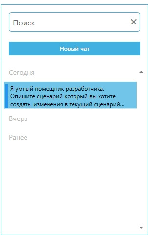

# Автодизайнер

Внимание: Для работы Автодизайнера необходимо:

* установить .NET Desktop Runtime 8,
* перезапустить Sherpa Designer.

Скачать и установить нужную версию можно по этой ссылке:



Автодизайнер - это ИИ-инструмент, позволяющий создавать и изменять проекты в Sherpa Designer через текстовый диалог с пользователем.

Автодизайнер использует большую языковую модель и позволяет отлаживать, исправлять и дополнять уже существующие проекты, проверять и исправлять селекторы, отвечать на разнообразные вопросы по проекту.

### Начало работы

Для начала работы необходимо перейти во вкладку “Автодизайнер” на “Главной панели” в Sherpa Designer и ввести запрос в поле “Сообщение в чат…”.

На данной вкладке представлен чат-интерфейс, который представляет собой:

1. область диалоговой панели с полем для ввода запроса пользователя,
2. область отображения диалога с большой языковой моделью.

<figure><figcaption></figcaption></figure>

### Область диалоговой панели

На диалоговой панели представлены следующие элементы интерфейса:

* Иконка  "Показать историю чата", позволяющая открыть историю чата с Автодизайнером за сегодня, вчера и более ранний период, чтобы продолжить общение или переиспользовать запросы.

<figure><figcaption></figcaption></figure>

* Поле для ввода сообщения Пользователя "Сообщение в чат...", позволяющее описывать задачи или запрашивать действия.

<figure><figcaption></figcaption></figure>

* Иконка  "Прикрепить файлы", позволяющая добавлять дополнительные файлы к запросу (например, скриншоты интерфейсов).

После клика по иконке появится окно “Открытие”, в котором необходимо выбрать файл и нажать на кнопку “Открыть”:

<figure><figcaption></figcaption></figure>

Пример запроса:

“В проекте КрестикиНолики добавь счетчик побед по новым правилам из test.txt: переменные ScoreX/ScoreO/TotalGames, отображение в UI, сохранение в JSON, кнопку сброса.”

<figure><figcaption></figcaption></figure>

Автодизайнер получит список файлов, прочитает их, изучит каждую диаграмму в проекте, обновит все данные под описанные пользователем условия и добавит новые диаграммы в проект, направит сообщение о том, что обработал запрос пользователя с подробным описанием внесенных изменений:

<figure><figcaption></figcaption></figure>

Далее, пользователь сможет запустить и протестировать измененный проект самостоятельно (также, при необходимости, ввести дополнительных запрос в Автодизайнер).

* Кнопка  "Отправить сообщение", позволяющая отправлять запрос пользователя на обработку в чат.
* Кнопка  "Параметры", позволяющая открывать панель разрешений для Автопилота автоматически (без подтверждения пользователя) выполнять следующие типы действий:&#x20;
* Запуск команды PowerShell: Выполнение скриптов PowerShell для системных операций и автоматизации (интеграция с вашими RPA-процессами).

Когда искусственному интеллекту потребуется выполнить такое действие, появится запрос пользователю: «Хотите выполнить Запуск команды PowerShell?». Если отключить данный параметр, то в проекте будут использоваться только встроенные блоки Sherpa Designer без внешних скриптов. 

* Получение списка файлов: Сканирование директорий для поиска входных данных.

Когда искусственному интеллекту потребуется выполнить такое действие, появится запрос пользователю: «Хотите выполнить Получение списка файлов?». Если отключить данный параметр, Автодизайнер будет работать только с заданными пользователем путями к файлам, без динамического поиска в папках.

* Чтение из файла: Загрузка конфигураций, JSON-схем, PDD-шаблонов или TXT/PDF-файлов.

Когда искусственному интеллекту потребуется выполнить такое действие, появится запрос пользователю: «Хотите выполнить Чтение из файла?». Если отключить данный параметр, проект будет создан без анализа приложенных файлов, только по текстовому описанию в чате.

* Запись в файл: Сохранение результатов (JSON-файл, файлы логов в папке проекта).

Когда искусственному интеллекту потребуется выполнить такое действие, появится запрос пользователю: «Хотите выполнить Запись в файл?». Если отключить этот параметр, значения результирующих переменных будут храниться временно, до закрытия/перезагрузки проекта.

* Получение списка диаграмм: Просмотр доступных в проекте диаграмм для анализа/модификации.

Когда искусственному интеллекту потребуется выполнить такое действие, появится запрос пользователю: «Хотите выполнить Получение списка диаграмм?». Если отключить данный параметр, Автодизайнер не сможет найти существующие диаграммы проекта и будет создавать новые с нуля, не опираясь на созданный пользователем проект.

* Создание диаграммы: Генерация новых блок-схем Роботов.

Когда искусственному интеллекту потребуется выполнить такое действие, появится запрос пользователю: «Хотите выполнить Создание диаграммы?». Если отключить данный параметр, изменения будут применяться только к созданным ранее диаграммам в проекте, без создания новых блоков и процессов.

* Запуск диаграммы: Автоматический тест сгенерированных сценариев.

Когда искусственному интеллекту потребуется выполнить такое действие, появится запрос пользователю: «Хотите выполнить Запуск диаграммы?». Если отключить данный параметр, Автодизайнер внесет изменения в проект, но не выполнит автоматическое тестирование. Для проверки работоспособности проекта пользователю будет необходимо запустить его вручную.

* Делать скриншот, если выполнение диаграммы завершилось с ошибкой: Фиксация выявляемых при запуске проекта ошибок при помощи снимков экрана пользователя.

Когда искусственному интеллекту потребуется выполнить такое действие, появится запрос пользователю: «Хотите выполнить Делать скриншот, если выполнение диаграммы завершилось с ошибкой?». Если отключить данный параметр, ошибки будут логироваться только текстово, без снимков экрана.

### Область отображения диалога

В области отображения диалога с большой языковой моделью выводится:

* Сообщения (запросы) пользователя;
* Ответы большой языковой модели (например, код проекта, описание созданных блоков, диагностика ошибок селекторов);
* Статусы выполнения (например: "Генерирую проект...", "Тестирую диаграмму", "Найдена ошибка в селекторе клетки 2-3");
* Результаты (например, ответы на вопросы пользователя, список созданных диаграмм, список измененных диаграмм, скриншоты ошибок, логи выполнения);
* Предложения (например: "Добавить переменную ScoreX?").

Также в данной области можно выделять текст сообщений и копировать их, чтобы вставить в другое поле:

<figure><figcaption></figcaption></figure>

Если нажать правой кнопкой мыши на иконку файла/изображения внутри сообщения, то появится всплывающее меню с текстом:”Открыть изображение”, - при нажатии на него откроется файл/изображение, которое было привязано к запросу пользователя:

<figure><figcaption></figcaption></figure>
