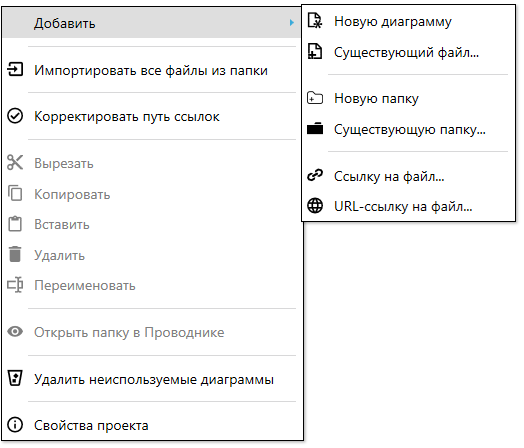

# Проект

**Проект** — совокупность файлов диаграмм, в котором одна из диаграмм назначена главной. Проект описывается файлом с расширением «.sherpa».&#x20;

На вкладке “Проект” можно просматривать диаграммы текущего проекта, а также добавлять, удалять, переименовывать диаграммы и изменять их порядок.

Одновременно в программе может быть открыт только один проект. При открытии другого проекта предыдущий будет закрыт. При этом можно запустить еще один Дизайнер, где загрузить другой проект, а также есть возможность копировать блоки из одного Дизайнера в другой.

Допускается открытие в программе файлов диаграмм, которые не являются частью текущего проекта.\
\
Существуют три типа файлов робота:

* Файл с расширением **.sherpa** – файл проекта. Для редактирования проекта в Дизайнере необходимо выбрать файл с этим расширением.
* Файлы с расширением **.process** – диаграммы конкретных процессов, из которых состоит проект или отдельные диаграммы.
* Файл с расширением **.robot** – итоговый файл, представляющий собой собранного робота. Для получения данного файла необходимо воспользоваться функцией “Опубликовать”, в ходе выполнения которой все исходные файлы собираются в один итоговый. Этот файл подается на вход исполнительной программы – Sherpa Robot.

> Полностью собранный и отлаженный Робот не нуждается в файлах с расширениями .sherpa и .process, они нужны только на стадии разработки.

## Элементы интерфейса во вкладке “Проект”

<table data-header-hidden><thead><tr><th width="57" valign="top"></th><th width="193" valign="top"></th><th width="314" valign="top"></th></tr></thead><tbody><tr><td valign="top"><strong>№ п/п</strong></td><td valign="top"><strong>Элемент интерфейса</strong></td><td valign="top"><strong>Описание</strong></td></tr><tr><td valign="top">1.</td><td valign="top">Кнопка  </td><td valign="top">Позволяет сделать выбранную диаграмму главной в проекте.</td></tr><tr><td valign="top">2.</td><td valign="top">Кнопка </td><td valign="top">Позволяет добавить в проект выбранную диаграмму в проект.</td></tr><tr><td valign="top">3.</td><td valign="top">Кнопка </td><td valign="top">Позволяет добавить в проект новую диаграмму.</td></tr><tr><td valign="top">4.</td><td valign="top">Кнопка </td><td valign="top">Позволяет добавить новую папку в проект.</td></tr><tr><td valign="top">5.</td><td valign="top">Кнопка </td><td valign="top">Позволяет вырезать выбранную диаграмму или папку.</td></tr><tr><td valign="top">6.</td><td valign="top">Кнопка </td><td valign="top">Позволяет копировать выбранную диаграмму или папку.</td></tr><tr><td valign="top">7.</td><td valign="top">Кнопка </td><td valign="top">Позволяет вставить ранее вырезанную или скопированную диаграмму или папку.</td></tr><tr><td valign="top">8.</td><td valign="top">Кнопка </td><td valign="top">Позволяет удалить выбранную диаграмму или папку.</td></tr><tr><td valign="top">9.</td><td valign="top">Кнопка </td><td valign="top">Позволяет переименовать выбранную диаграмму или папку.</td></tr><tr><td valign="top">10.</td><td valign="top">Виртуальная папка “Ссылки” </td><td valign="top">Содержит ссылки на готовые сборки библиотек (файлы DLL), а также позволяет подключать свои.</td></tr></tbody></table>

<figure><figcaption></figcaption></figure>

## Ссылки

**Ссылки** – это внешние библиотеки, которые может использовать Робот в процессе работы.

Для добавления новой ссылки необходимо нажать правой кнопкой мыши на пункте “Ссылки” и выбрать “Добавить ссылку”.

<figure><figcaption></figcaption></figure>

После чего откроется окно “Менеджер ссылок”, которое позволяет выбрать необходимые сборки (файлы DLL), предоставляемые Framework или же добавить свою сборку.

<figure><figcaption></figcaption></figure>

[Использование ссылок на примере подключения своей библиотеки на С# для использования в проекте продемонстрировано здесь.](https://sherparpa.ru/ucontent/?07)

## Контекстное меню папки проекта

Контекстное меню папки проекта предлагает следующие опции:

<table data-header-hidden><thead><tr><th width="59"></th><th width="240"></th><th width="375"></th></tr></thead><tbody><tr><td><strong>№ п/п</strong></td><td><strong>Опция</strong></td><td><strong>Описание</strong></td></tr><tr><td>1.</td><td>пункт “Добавить”</td><td>
Позволяет добавить:
<ul><li>Новую диаграмму;</li><li>Существующий файл;</li><li>Новую папку;</li><li>Существующую папку;</li><li>Ссылку на файл;</li><li>URL-ссылку на файл.</li></ul></td></tr><tr><td>2.</td><td>пункт “Импортировать все файлы из папки”</td><td>Позволяет импортировать все файлы из папки из выбранной директории.</td></tr><tr><td>3. </td><td>пункт “Корректировать путь ссылок”</td><td>Позволяет корректировать путь ссылок внутри выбранной папки на указанную папку</td></tr><tr><td>4.</td><td>пункт “Вырезать”</td><td>Позволяет вырезать выбранную папку проекта. </td></tr><tr><td>5.</td><td>пункт “Копировать”</td><td>Позволяет копировать выбранную папку проекта. </td></tr><tr><td>6.</td><td>пункт “Вставить”</td><td>Позволяет вставить выбранную папку проекта. </td></tr><tr><td>7.</td><td>пункт “Удалить”</td><td>Позволяет удалить выбранную папку проекта.  </td></tr><tr><td>8.</td><td>пункт “Переименовать”</td><td>Позволяет переименовать выбранную папку проекта.  </td></tr><tr><td>9.</td><td>пункт “Открыть папку в Проводнике”</td><td>Позволяет открыть папку проекта в проводнике.</td></tr><tr><td>10.</td><td>пункт “Удалить неиспользуемые диаграммы”</td><td>Позволяет удалить неиспользуемые диаграммы из проекта.</td></tr><tr><td>11.</td><td>пункт “Свойства проекта”</td><td>Позволяет открыть окно “Свойства проекта”.</td></tr></tbody></table>

<figure><figcaption></figcaption></figure>

<figure><figcaption></figcaption></figure>

### Меню “Добавить”

<table data-header-hidden><thead><tr><th width="53"></th><th width="187"></th><th width="388"></th></tr></thead><tbody><tr><td><strong>№ п/п</strong></td><td><strong>Опция</strong></td><td><strong>Описание</strong></td></tr><tr><td>1.</td><td>пункт “Новую диаграмму”</td><td>Создает новую диаграмму для визуального отображения процесса, схемы.</td></tr><tr><td>2.</td><td>пункт “Существующий файл”</td><td>Позволяет выбрать и подключить уже имеющийся файл из системы для использования в проекте.</td></tr><tr><td>3.</td><td>пункт “Новую папку”</td><td>Создает новую папку для организации и хранения связанных элементов.</td></tr><tr><td>4.</td><td>пункт “Существующую папку”</td><td>Подключает уже существующую папку из файловой системы.</td></tr><tr><td>5.</td><td>пункт “Ссылку на файл”</td><td>Создает ссылку на внешний файл или ресурс, позволяя обращаться к нему через проект. Также все изменения в данной диаграмме будут применяться во всех проектах. При выполнении операции Push в Оркестратор данный файл будет автоматически добавлен в проект.</td></tr><tr><td>6.</td><td>пункт “URL-ссылку на файл”</td><td>Добавляет гиперссылку на внешний файл или интернет-ресурс по URL для быстрого доступа из проекта.</td></tr></tbody></table>

<figure><figcaption></figcaption></figure>

## Контекстное меню файла проекта

Контекстное меню файла проекта, которое вызывается нажатием правой кнопки мыши:

<table data-header-hidden><thead><tr><th width="53"></th><th width="187"></th><th width="388"></th></tr></thead><tbody><tr><td><strong>№ п/п</strong></td><td><strong>Опция</strong></td><td><strong>Описание</strong></td></tr><tr><td>1.</td><td>пункт “Установить диаграмму как главную”</td><td>Позволяет установить выбранную диаграмму как главную.</td></tr><tr><td>2.</td><td>пункт “Вырезать”</td><td>Позволяет вырезать выбранный фай проекта. </td></tr><tr><td>3.</td><td>пункт “Копировать”</td><td>Позволяет копировать выбранный файл проекта. </td></tr><tr><td>4.</td><td>пункт “Удалить”</td><td>Позволяет удалить выбранный файл проекта.  </td></tr><tr><td>5.</td><td>пункт “Переименовать”</td><td>Позволяет переименовать выбранный файл проекта.  </td></tr><tr><td>6.</td><td>пункт “Показать файл в проводнике”</td><td>Показывает путь к выбранному файлу на Вашем компьютере.</td></tr></tbody></table>

<figure><figcaption></figcaption></figure>
