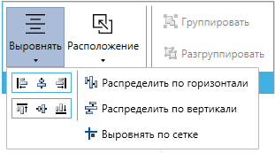

# Меню "Диаграмма"

Меню “Диаграмма” содержит кнопки для действий, которые необходимы при построении с диаграммы Робота.

<figure><figcaption></figcaption></figure>

Ниже представлен список данных кнопок с описанием их функций.

<table data-header-hidden><thead><tr><th width="60.86669921875"></th><th width="255.7166748046875"></th><th width="310.449951171875"></th></tr></thead><tbody><tr><td><strong>№ п/п</strong></td><td><strong>Элемент интерфейса</strong></td><td><strong>Описание</strong></td></tr><tr><td><ol><li></li></ol></td><td>кнопка “Выровнять”</td><td>Позволяет выровнять выделенные блоки по заданному правилу.</td></tr><tr><td><ol start="2"><li></li></ol></td><td>кнопка “Расположение”</td><td>Позволяет изменить порядок пересекающихся блоков.</td></tr><tr><td><ol start="3"><li></li></ol></td><td>кнопка “Полная проверка блоков”</td><td>Позволяет выполнить полную проверку свойств у блоков.</td></tr><tr><td><ol start="4"><li></li></ol></td><td>кнопка “Удалить неиспользуемые переменные”</td><td>Позволяет найти и удалить неиспользуемые переменные.</td></tr><tr><td><ol start="5"><li></li></ol></td><td>кнопка “Компилировать блоки вызова кода”</td><td>Позволяет компилировать все блоки вызова кода в проекте. Данное действие ускоряет работу этих блоков.</td></tr><tr><td><ol start="6"><li></li></ol></td><td>кнопка “Группировать”</td><td>Позволяет сгруппировать выделенные блоки, чтобы перемещать их как единое целое.</td></tr><tr><td><ol start="7"><li></li></ol></td><td>кнопка “Разгруппировать”</td><td>Позволяет разгруппировать ранее сгруппированные блоки.</td></tr></tbody></table>

Кнопка “**Выровнять**” в меню инструментов позволяет выровнять выделенные блоки по заданному правилу. Для того, чтобы выбрать нужный вариант, необходимо нажать иконку .png>) под кнопкой “Выровнять”.&#x20;

<figure><figcaption></figcaption></figure>

Кнопка “**Расположение**” в меню инструментов позволяет изменить порядок пересекающихся блоков. Для того, чтобы выбрать нужный вариант, необходимо кликнуть иконку .png>) под кнопкой “Расположение”.

<figure><figcaption></figcaption></figure>

Авторасстановка блоков продемонстрирована в следующем видео:



Авторасстановка блоков на примере крупного проекта со сложной структурой:


