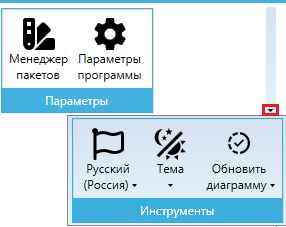
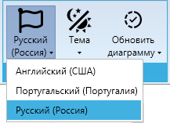
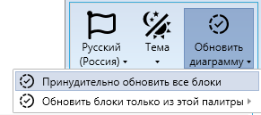

# Меню "Инструменты"

Меню “Инструменты” содержит основные функции для настройки интерфейса, актуализации элементов проектов.

<figure><figcaption></figcaption></figure>

## Русский (Россия)

Кнопка “**Русский (Россия)**” позволяет изменить язык интерфейса для Дизайнера диаграмм и инструмента “Записи”, а также программы-агента, установленной на компьютере Пользователя.&#x20;

<figure><figcaption></figcaption></figure>

Доступен выбор из следующих языков:

* английский,&#x20;
* португальский,
* русский.&#x20;

По умолчанию стоит русский язык.

## Тема

Кнопка “**Тема**” позволяет переключить тему оформления интерфейса. Доступны светлая и темная темы. Светлая тема стоит по умолчанию.

<figure><figcaption></figcaption></figure>

## Обновить диаграмму

Кнопка “**Обновить диаграмму**” обновляет версии блоков в текущем проекте до актуальных из [Палитры блоков](../../../spravochnik-blokov/), что полезно при открытии проектов, созданных в более ранних версиях Дизайнера, чтобы обеспечить соответствие функционала новым версиям.

<figure><figcaption></figcaption></figure>
