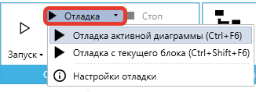

# Меню "Отладка"

**Отладка** — это процесс поиска и исправления ошибок в сценарии Робота. Рекомендуется выполнять ее на всех ключевых этапах проекта для пошагового контроля.

В Sherpa Designer помимо локальной отладки робота, доступна [удаленная отладка робота](udalennaya-otladka-robota.md), а также возможность построения диаграммы в режиме отладки, что продемонстрировано в видео:&#x20;

* Построение диаграммы в режиме отладки:



* Работа с браузерами при построении диаграммы в режиме отладки:



Основные инструменты для отладки и тестирования в Sherpa RPA:

* **Режим Отладки с точками останова;**
* **Консоль для проверки переменных;**
* **Логирование для контроля критических точек.**

Есть и другие Расширенные возможности [Try-Catch](../../../../spravochnik-blokov/osnovnye-bloki-main-blocks/try-catch-trycatchcontainer.md), а также [удаленная отладка](udalennaya-otladka-robota.md).

## Пример отладки

Представим задачу, в которой требуется разработать Робота для переноса данных из Excel в веб-форму. Построим его, применяя базовые инструменты отладки:

* Добавьте блок загрузки данных из документа Excel.&#x20;
* Загрузите таблицу данных и заполните путь к файлу.
* Добавьте блок "Получить значение ячейки". В его свойствах укажите имя таблицы, номер строки и номер столбца. Результат запишется в переменную email.&#x20;

> Этот шаг критически важен. Ошибка при чтении данных поставит под угрозу весь дальнейший сценарий, поэтому обязательно предусмотрите проверку. Если вы поставите точку останова непосредственно на этом блоке чтения, вы ничего не проверите, потому что точка останова делает паузу до выполнения блока, на котором она стоит. Вы увидите состояние системы перед тем, как данные были прочитаны.

* Добавьте блок "Установить текст", и в его свойствах укажите - куда записываете полученный email. Установите на нём первую точку останова.
* Перейдите в инструменты Отладки на верхней панели и поставьте точку останова на этом блоке (нажав F9 или через контекстное меню). Блок выделится красной рамкой.&#x20;
* Запустите режим отладки кликнув на верхней панели или нажав Ctrl+F6. Выполнение сценария остановится на точке останова. Дополнительно тот блок, на котором выполнение программы остановлено в данный момент, обводится синим прямоугольником.
* Проверьте Робота, для этого перейдите в [Консоль](../../../../../obuchenie-po-razrabotke-na-platforme-sherpa-rpa/obuchenie-powershell.md#id-6.-ispolzovanie-lokalnoi-i-udalennoi-konsoli-powershell-v-dizainere-sherpa-rpa-dlya-proverki-vyrazhe) в нижней части интерфейса. Переменная email высветиться с неверным значением. Так как нумерация начинается с `0`, в свойстве блока необходимо изменить строку на `0`, а столбец на `1` (это ошибка привязки колонки). Запустите режим отладки еще раз и проверьте, что значение переменной email теперь верное.

## Кнопка "Запуск"

Кнопка “**Запуск**” в меню разработки позволяет запустить выполнение проекта (главной и вложенных диаграмм) Роботом без отладки или приостановить его выполнение. По данной кнопке активируется работа агента Sherpa Robot, а окно Sherpa Designer сворачивается. Также, при нажатии на кнопку “Запуск” происходит автоматическое сохранение всего проекта. При нажатии на значок под кнопкой “Запуск” – откроется выпадающий список вариантов запуска.

* Вариант “**Запуск активной диаграммы без отладки**” позволяет активную диаграмму без отладки. Также, для выполнения запуска активной диаграммы без отладки можно воспользоваться сочетанием клавиш Ctrl+F5.
* Вариант “**Запуск в режиме PiP**” позволяет запустить выполнение проекта с отображением в отдельном окне запуска Робота.

<figure><figcaption></figcaption></figure>

## Кнопка "Отладка"

Кнопка “**Отладка**” в меню разработки позволяет запустить текущий проект в режиме отладки. В отличие от режима обычного запуска, в данном режиме будет доступна остановка выполнения процесса на точках останова и выполнение процесса по шагам. Также, при нажатии на кнопку “Отладка” происходит автоматическое сохранение всего проекта.При нажатии на значок справа от кнопки “Отладка” – откроется выпадающий список вариантов отладки.

* Вариант “**Отладка активной диаграммы**” позволяет запустить отладку активной диаграммы. Также, для выполнения  отладки активной диаграммы можно воспользоваться сочетанием клавиш Ctrl+F6.
* Вариант “**Отладка с текущего блока**” позволяет запустить отладку с текущего блока. Также, для выполнения  отладки с текущего блока можно воспользоваться сочетанием клавиш Ctrl+Shift+F6.
* Вариант “**Настройки отладки**” позволяет указать значения параметров, которые будут использоваться при запуске проекта в режиме отладки, если в Свойствах проекта указаны входные параметры. Установив значения входных параметров, можно запустить отладку проекта именно с этими входными параметрами.

<figure><figcaption></figcaption></figure>

Отладка с текущего блока продемонстрирована в данном видео:



## Кнопка "Точка останова"

Кнопка “**Точка останова**” в меню разработки позволяет делать паузу в процессе выполнения сценария для просмотра результатов его выполнения. Шаг, на котором Робот приостановит выполнение проекта. С помощью кнопки "Точка останова" до или во время запуска проекта можно пометить нужные блоки, на которых процесс должен быть приостановлен – и процесс автоматически встанет на паузу, когда его выполнение дойдет до этих блоков.

<figure><figcaption></figcaption></figure>

## Кнопка "Шаг вперед"

Кнопка “**Шаг вперед**” в меню разработки позволяет запустить или продолжить выполнение проекта до следующего блока и, затем, поставить выполнение на паузу, но для блоков подпроцессов следующая остановка будет произведена в текущей диаграмме на следующем после подпроцесса блоке (то есть весь подпроцесс выполнится полностью).

<figure><figcaption></figcaption></figure>

## Кнопка "Шаг внутрь"

Кнопка “**Шаг внутрь**” в меню разработки позволяет запустить или продолжить выполнение проекта до следующего блока и, затем, поставить выполнение на паузу, но для блоков подпроцессов следующая остановка будет произведена на первом блоке диаграммы подпроцесса.

Если текущий блок – это не блок подпроцесса, то действия "Шаг вперед" и "Шаг внутрь" будут выгляеть одинаково.

<figure><figcaption></figcaption></figure>

## Кнопка "Стоп"

Кнопка “**Стоп**” в меню разработки позволяет завершить работу Робота и вернуться в режим разработки.

<figure><figcaption></figcaption></figure>

## Рекомендации по отладке и тестированию RPA-процессов

Для обеспечения надежной работы ботов в продакшене и предотвращения неожиданных ошибок необходимо соблюдать следующие принципы и методы отладки:

1. **Проверка каждой переменной, условия и селектора**\
   Перед запуском и публикацией убедитесь, что все переменные и условия настроены правильно, а селекторы работают точно. Это поможет избежать ошибок во время выполнения и обеспечить стабильную работу бота.
2. **Проектирование с валидацией**\
   Включайте проверки данных при создании шагов процесса. Использование встроенных механизмов валидации позволяет выявлять некорректные данные на ранних этапах разработки.
3. **Интерактивная разработка и тестирование**\
   Используйте отладчик для запуска отдельных фрагментов процесса по мере их готовности. Это позволяет быстрее выявлять и исправлять ошибки, не дожидаясь окончательной сборки всего процесса.
4. **Добавление контрольных точек**\
   В качестве стандартной практики внедряйте контрольные логирующие точки и сообщения об остановке. Это способствует быстрому обнаружению проблем и повышает управляемость разработки.
5. **Тестирование всех новых блоков и логических связок**\
   Регулярно проверяйте работу каждого блока или связки во время разработки, чтобы убедиться в правильности их функционирования.
6. **Мониторинг значений переменных**\
   Следите за значениями переменных в реальном времени при выполнении процесса, чтобы своевременно обнаружить несоответствия или ошибки.
7. **Логирование важных событий**\
   Ведите журнал выполнения с акцентом на ключевые моменты и события процесса. Это существенно облегчает анализ ошибок и повышает качество поддержки.

Следование данным рекомендациям поможет создавать более устойчивые, быстрые и качественные процессы автоматизации, а также повысит ваш профессиональный уровень в области RPA.
