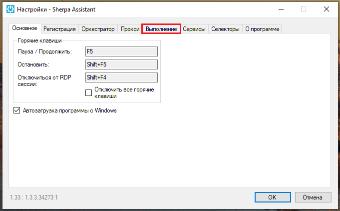

# Удаленная отладка робота

С помощью удаленной отладки Робота можно настроить рутинные бизнес-процессы на удаленных устройствах.&#x20;

[Удаленная отладка робота продемонстрирована здесь.](https://sherparpa.ru/ucontent/?0J)

Для работы в режиме удаленной отладки в меню “Отладка” нажмите на кнопку “Локальная” (локальный режим отладки стоит по умолчанию) и, в выпадающем списке, выберите режим "Удаленная".

<figure><figcaption></figcaption></figure>

Затем нажмите на иконку .png>), после чего откроется окно “Удаленная отладка”. После настройки удаленной отладки робота в этом окне появятся IP и наименование клиента, доступные для удаленной отладки.&#x20;

<figure><figcaption></figcaption></figure>

После включения режима удаленной отладки в Sherpa Designer, необходимо настроить удаленную отладку в Sherpa Assistant. Запустите программу,  затем в трее правой кнопкой мыши нажмите на .png>) и выберите пункт контекстного меню “Настройки…”&#x20;

**Примечание:** включить или отключить отладку можно также с помощью пункта контекстного меню “Удаленная отладка”.

В открывшемся окне, выберите вкладку “Выполнение”.

<figure><figcaption></figcaption></figure>

В меню вкладки “Выполнение” выберите вкладку “Удаленная отладка”.

<figure><figcaption></figcaption></figure>

В меню вкладки “Удаленная отладка” укажите:

* сервер удаленной отладки;
* порт удаленной отладки Sherpa Assistant;
* порт удаленной отладки Sherpa Robot.

Поставьте флаг в поле “Включить удаленную отладку”.

Нажмите кнопку “ОК”. Удаленная отладка робота на платформе Sherpa RPA включена.&#x20;

<figure><figcaption></figcaption></figure>

Проверьте в программе Sherpa Designer подключение удаленного клиента. Для этого снова нажмите на кнопку .png>). В открывшемся окне появилась строка с IP и наименованием клиента.

<figure><figcaption></figcaption></figure>

<table data-header-hidden><thead><tr><th width="54"></th><th width="192"></th><th width="308"></th></tr></thead><tbody><tr><td><strong>№ п/п</strong></td><td><strong>Элемент интерфейса</strong></td><td><strong>Описание</strong></td></tr><tr><td>1.</td><td>индикатор </td><td>Клиент подключен.</td></tr><tr><td>2.</td><td>иконка </td><td>Клиент по умолчанию. Если доступны для удаленной отладки несколько клиентов, то с помощью этой кнопки можно переключать клиента, на котором будет производиться удаленная отладка.</td></tr><tr><td>3.</td><td>столбец “IP клиента”</td><td>IP клиента, доступного для удаленной отладки.</td></tr><tr><td>4.</td><td>столбец “Наименование клиента”</td><td>Наименование клиента, доступного для удаленной отладки.</td></tr><tr><td>5.</td><td>иконка </td><td>Просмотр рабочего стола подключенного клиента.</td></tr><tr><td>6.</td><td>иконка </td><td>Удаление клиента из списка доступных для удаленной отладки.</td></tr></tbody></table>

Чтобы проверить работу режима удаленной отладки, нажмите на кнопку просмотра рабочего стола подключенного клиента.

В окне просмотра рабочего стола клиента можно включить автообновление, поставив флаг в поле “Автообновление”. Или использовать ручное обновление с помощью кнопки “Обновить”. Флаг в поле “Вписать в окно” стоит по умолчанию, его также можно убрать.&#x20;

<table data-header-hidden><thead><tr><th width="74"></th><th></th></tr></thead><tbody><tr><td></td><td>Если Работа выполняется Роботом из Sherpa Orchestrator, важно отключить удаленную отладку. В противном случае Робот рискует не выйти из системы.</td></tr></tbody></table>
