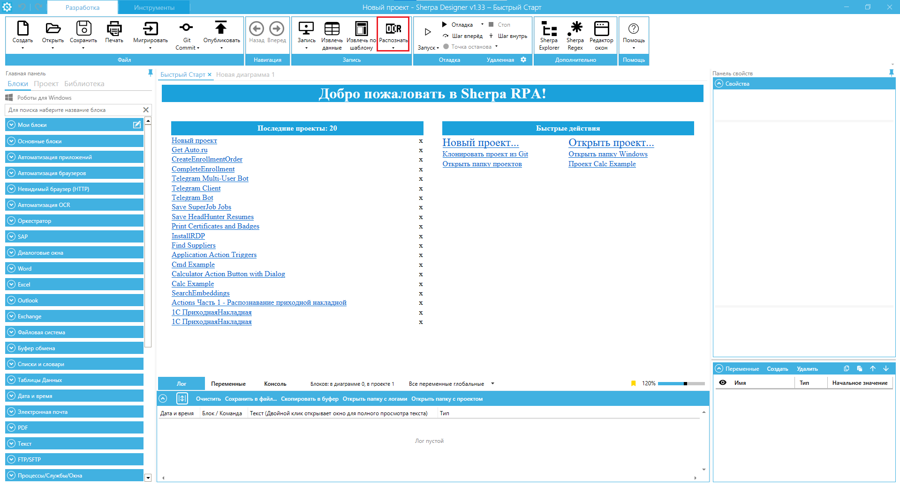

# Использование OCR Яндекс

## **Использование OCR-движка Yandex Vision в проектах**

При создании сценариев Роботов, в которых нужно распознавать скан-копии, фотографии (формата JPEG, PDF, TIFF или других форматов),  вы можете применять на выбор один из пяти OCR-движков встроенных в Платформу Sherpa RPA. OCR-движки распознают текст на изображении и возвращают в виде блоков текста, строк и слов.

<figure><figcaption></figcaption></figure>

Одним из лучших OCR-движков по качеству распознавания является Yandex Vision.&#x20;



## **Требования для использования Yandex** **Vision в Роботах**

Yandex Vision – облачный сервис компьютерного зрения для анализа изображений, для его использования нужен интернет. Политиками безопасности должны быть открыты доступы на исходящие вызовы Робота Yandex Vision:





## **Стоимость Yandex** **Vision**

Для тестирования и ваших экспериментов, Sherpa RPA дает 100 страниц бесплатного лимита. То есть на старте для использования вам нужно только выбрать этот движок и распознавание пройдет автоматически (то есть через аккаунт Sherpa RPA).

Для постоянного использования Yandex Vision вам нужно оформить оплату сервиса. При этом вы можете выбрать один из способов:

1. Оплатить кредиты страниц через нас. Шерпа Роботикс как партнер Яндекса предложит вам договор. Стоимость распознавания в настоящий момент — 0,13 руб за страницу (т.е. 13 копеек)
2. Создать собственный аккаунт в Yandex Cloud и прописать в настройках робота токен вашего аккаунта.

## **Инструкция по настройке**

1. Для работы должен быть создан аккаунт Yandex Vision  для вашей компании



2\. Привяжите облако Yandex Vision в вашему платежному аккаунту:

3\. Список серверов, к которым должен быть открыт доступ (т.е. исходящие запросы должны проходить к этим трём доменам):







4\. На стороне Sherpa RPA (в настройках) Нужно заполнить два параметра: как указано на скриншоте — это заполняет разработчик, после того, как ему передадут соответствующие данные.

<figure><figcaption></figcaption></figure>

5\. Для получения PasswordOauthToken (из аккаунта Яндекса — из Cloud Console) необходимо перейти по адресу, который подчеркнут в адресной строке и далее нажать на выделенную ссылку, там будет указан данный токен.

6\. Получение FolderId описано вот в этой статье:&#x20;



Пример, как в нашем аккаунте:

Подробнее о подключении сторонних сервисов:&#x20;



## **Безопасность Yandex Cloud**

В Yandex Cloud действуют меры по защите персональных данных (ПДн), указанные в постановлении №1119 и приказе ФСТЭК №21 в соответствии с требованиями к 1 уровню защищенности (УЗ-1).

Когда клиент размещает на ресурсах Yandex Cloud персональные данные, в отношении которых он выступает оператором, он поручает Яндексу обработку этих персональных данных. Yandex Cloud обязуется соблюдать конфиденциальность ПДн, обеспечивать их безопасность при обработке и выполнять все требования к защите обрабатываемых ПДн, установленные законодательством.
