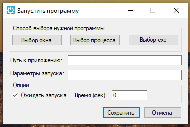
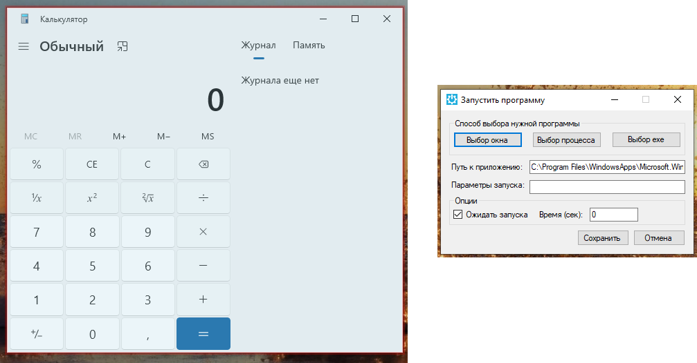
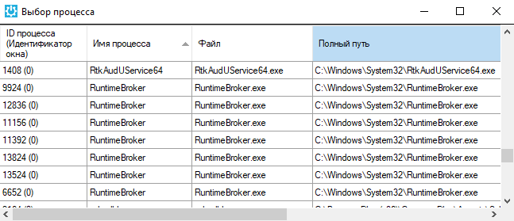
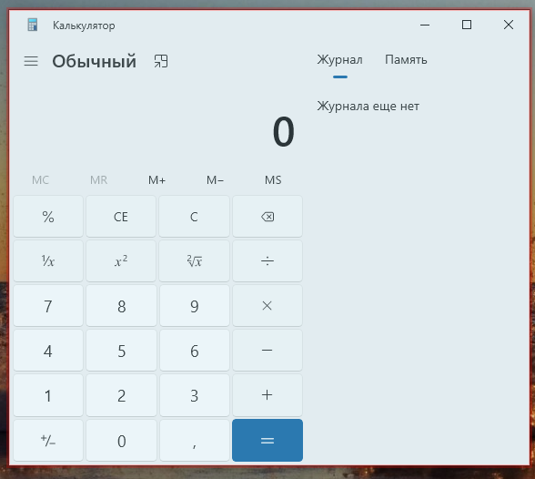

# Пример записи действий при работе с Калькулятором

Допустим, перед работой с Калькулятором нужно, чтобы робот сначала запустил Калькулятор. Нажмите кнопку “Запустить программу” и ознакомьтесь с вариантами.

<figure><figcaption></figcaption></figure>

При нажатии кнопки “Выбор окна” просто подсвечивается окно нужной программы. Нажмите кнопку CTRL.

<figure><figcaption></figcaption></figure>

Робот сам нашёл путь к приложению. При желании можно дописать параметры запуска (параметры командной строки). Можно указать, что робот должен ожидать запуска в течение какого-то времени. При нажатии на кнопку “Сохранить” блок запуска программы добавляется в диаграмму.

При нажатии кнопки “Выбор процесса” можно выбрать процесс из списка запущенных в данный момент процессов.

<figure><figcaption></figcaption></figure>

Третий вариант – мы выбираем нужный exe-файл из проводника.

Выбор окна, как правило, наиболее удобный способ.

В диаграмме появился блок “Запустить приложение”, настроенный на запуск соответствующего приложения.

<figure><figcaption></figcaption></figure>

Обратите внимание, что робот умеет разбирать сложные случаи. Например, калькулятор в Windows10 не является настоящим приложением, запускается через вспомогательный механизм и через командную строку его запустить не получится. Поэтому робот находит правильный путь для этого приложения:

Далее в палитре записи действий:

Можно задерживать курсор над элементом управления в течение какого-то времени, можно делать одинарные и двойные клики, клик по заданному изображению на экране или клик по изображению внутри окна или элемента управления. Здесь работает такая же логика, как при распознавании текста с экрана, только в данном случае просто ищется некий визуальный образ какого-то элемента на экране. Например, нужно найти кнопку калькулятора просто по внешнему виду, а не по её селектору или тексту на ней. Нажимите на инструмент “Клик по заданному изображению внутри окна или элемента управления”. Далее нужно подсветить желаемый элемент управления и нажать CTRL.

Мы просто подсвечиваем окно калькулятора, чтобы робот не искал нужное изображение на всём экране.

<figure><figcaption></figcaption></figure>

Нажмите CTRL и затем выберите образец того изображения, которое вы будете искать.

Далее необходимо указать точку внутри или снаружи найденного изображения, в которой действительно будет производится клик. Т.е. найденную картинку можно использовать как якорь и кликать на другую точку в окне относительно этого якоря. Кликнем в центр. Действие записалось, его можно будет потом запустить.

Когда вы работаете с блоками, которые каким-либо образом записывают изображение, то свойства, в которых сохраняются эти изображения, выглядят как уникальный набор символов (идентификатор):

Под этим именем робот сохраняет картинки с образцами изображений в папке Images внутри вашего проекта (такая папка есть в каждом проекте).

При нажатии на кнопку “Опубликовать”, внутрь единого архива публикуется не только диаграмма, но и все картинки из папки Images. Это значит, что робота со всеми его ресурсами потом можно перенести с виде одного файла с расширением .robot на другой компьютер и там без проблем запустить.

Функция ожидания появления элемента на экране бывает очень полезна. Иногда может быть нужно задержать работу робота, пока мы не дождёмся, чтобы какое-то окно исчезло с экрана или какой-то элемент не появился на экране. Нажимаем на этот инструмент

И как обычно, укажите на нужный элемент управления, относительно которого будет задерживаться работа робота.

Нажатием CTRL запишите действие. Посмотрите свойства добавленного в диаграмму блока.

Можно задать предельное время ожидания в секундах. Робот продолжит выполнять сценарий после этого блока, либо когда указанный элемент управления по селектору появится на экране, либо когда истечёт время ожидания.

Если время ожидания истекло, но элемент ещё не появился, есть возможность подключить справа какой-нибудь блок по коннектору “Если ошибка”, и если он подключен, в случае, если элемент на экране так и не появился, сценарий пойдет дальше не вниз, а вправо. Если коннектор “Если ошибка” не подключен, сценарии в любом случае пойдёт вниз.

Свойство “Прошедшее время” — переменная числового типа, в которую записывается количество секунд, которое на самом деле прошло до момента появления этого элемента. Например, указанное максимально время ожидания 10 минут, а элемент появился через 5 минут, в переменной PassedTime будет записано число 5.

Блок “Подсветить элемент” – полезно при создании интерактивных обучающих руководств. Есть блок, позволяющий захватить и перетаскивать элементы, блоки, позволяющие выполнять какие-то действия в браузерах, например, обновлять страницы, нажимать на кнопку Назад. Есть возможность не только запускать браузер с заданной вкладкой, но и подключаться к браузеру и к его вкладке, которая уже находится на экране.

Напомним, что при клике по элементу управления, который находится за пределами экрана, во всех случаях робот постарается автоматически проскроллить какую-то страницу или список в приложении до указанного элемента, если он находится не на виду.

С кликами мышью в автоматизации браузеров связан ещё один интересный момент: как правило, во всех блоках, которые работают с программами и браузерами, есть свойство “ID процесса”. В нём записана переменная ProcessID, это некая переменная-указатель на ту конкретную программу, с которой мы сейчас работаем. Это важно, т.к. одновременно могут быть открыты два приложения Word, и в каждом из них по два документа. Вы можете переносить что-то из документа в документ. Т.е. когда вы поставили блок для работы с Word или Excel, или какой-то другой программой, вам нужно указать, каким именно приложением, т.е. конкретным экземпляром приложения мы сейчас пользуемся.

Аналогично происходит с браузерами. Можно открыть Chrome или Explorer и в нём несколько вкладок. Возможно, нужно будет переключаться между вкладками. Поэтому переменная ProcessID содержит информацию о том, с каким конкретным экземпляром приложения мы сейчас работаем, а также о том (если это браузер), с какой вкладкой этого браузера мы сейчас работаем.

Откуда берется значение этой переменной? Она появляется в блоке “Запустить приложение”. У блока “Клик мышью” ID процесса – входное свойство, определяющее работу блока. А у блока “Запустить приложение” ID процесса – выходное свойство, т.е. блок запишет в эту переменную нужное значение после запуска приложения.
