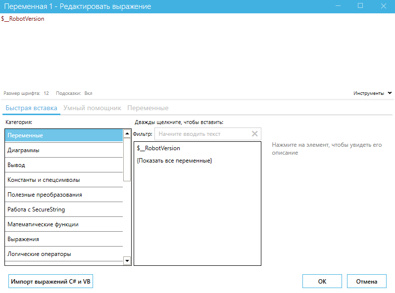
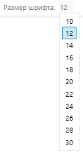
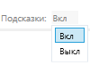
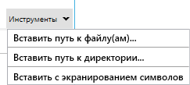
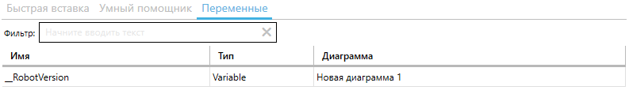

# Панель свойств

При создании нового блока диаграммы необходимо задать определенные свойства блока, которые определяют его поведение. Панель свойств блоков позволяет просматривать и изменять свойства выбранного блока.

На скриншоте приведен пример свойств блока “Распознать по шаблону”.

<figure><figcaption></figcaption></figure>

Свойства блоков в их большинстве относятся к трем категориям:

* **Основные свойства** – предназначены для получения значений, необходимых для работы блока (входные данные);
* **Дополнительные свойства** – предназначены для получения значений, не обязательных для работы блока, но позволяющих дополнительно управлять его настройками;
* **Выход** – предназначены для указания того, куда поместить выходные данных, в таких свойствах нужно указать переменные, в которые будут сохраняться результаты работы блока.

Свойства блоков, определяющие их работу, могут быть заданы:

* **Константами**. Числа записываются как есть, а текстовые значения записываются в двойных кавычках.
* **Переменными**, имена которых должны начинаться со знака $.
* **Выражениями** – константами и переменными, функциями, методами их сочетаниями.

Для того, чтобы изменить свойство необходимо ввести значение в строке справа от названия свойства или использовать более удобный вариант  – окно “Редактировать выражение”. Для вызова окна “Редактировать выражение” необходимо нажать на кнопку с многоточием в правой части строки “Свойства”.

<figure><figcaption></figcaption></figure>

**Окно “Редактировать выражение”** содержит три вкладки:

* Быстрая вставка;
* Умный помощник;
* Переменные.

<figure><figcaption></figcaption></figure>

<table data-header-hidden><thead><tr><th width="52"></th><th width="213"></th><th></th></tr></thead><tbody><tr><td><strong>№ п/п</strong></td><td><strong>Элемент интерфейса</strong></td><td><strong>Описание</strong></td></tr><tr><td>1.</td><td>"Размер шрифта" </td><td>Позволяет выбрать удобный для Вас размер шрифта в окне “Редактировать выражение”.</td></tr><tr><td>2.</td><td>"Подсказки" </td><td>Позволяет включить или выключить подсказки в окне “Редактировать выражение”. Данная функция указывает на ошибки в выражениях, если они есть.</td></tr><tr><td>3.</td><td>"Инструменты" </td><td>Позволяет вставить в строку значения свойства путь к файлу(ам), директории или вставить с экранированием символов (кавычки, знак доллара).</td></tr><tr><td>4.</td><td>"Импорт выражений C# и VB" </td><td>Позволяет импортировать выражения C# и VB. При нажатии на кнопку открывается окно с текстовым полем для вставки выражения, а также с возможностью выбора языка выражения “C#”, “Blue Prism”, “Visual Basic”.</td></tr></tbody></table>

**Вкладка “Быстрая вставка”** позволяет выбрать категорию выражения и само выражение из предложенного перечня. А также, при выборе выражения можно воспользоваться текстовым полем “Фильтр:”.

<figure><figcaption></figcaption></figure>

**Вкладка “Умный помощник”** позволяет описать простыми словами задачу, которую необходимо решить в текстовом поле “Ваш запрос:”, после чего Умный помощник подскажет подходящее для этого выражение.

<figure><figcaption></figcaption></figure>

**Вкладка “Переменные”** позволяет указать необходимую переменную проекта. Для поиска можно воспользоваться текстовым полем “Фильтр:”.&#x20;

В списке переменных указаны колонки: "Имя" переменной проекта, ее "Тип" и "Диаграмма", в которой она используется.

<figure><figcaption></figcaption></figure>

> Не во все свойства блоков можно записать выражения. В те свойства, у которых нет кнопки с многоточием, можно записывать только константные значения, или выбирать их из предложенного списка.
