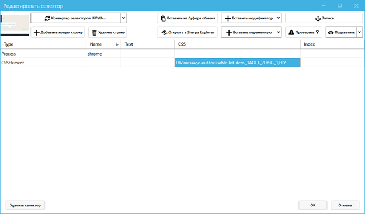

# Руководство по веб-селекторам

В данном разделе мы не рассматриваем базовые способы записи и использования селекторов в Sherpa RPA с помощью кнопки и панели «Запись». Если вы не знакомы с базовыми приемами записи селекторов – обратитесь к «Руководству пользователя Sherpa RPA» и обучающим видео на нашем официальном [YouTube-канале](https://www.youtube.com/@sherparpa). Также, в данном разделе, мы не рассматриваем десктоп-селекторы. Здесь мы рассказываем о способах подбора веб-селекторов в сложных случаях.

Для поиска элементов на веб-странице в блогах из палитры «Автоматизация браузеров» могут использоваться CSS- или XPath-селекторы. В Sherpa RPA инструмент записи действий пользователя (рекордер) по умолчанию записывает CSS-селекторы.

<figure><figcaption></figcaption></figure>

Если Вы хотите вручную использовать XPath-селектор вместо CSS-селектора, допишите к селектору в колонке CSS в окне «Редактировать селектор» префикс «xpath:»

[Использование XPath вместо CSS в селекторах продемонстрировано в видео.](https://sherparpa.ru/ucontent/?GeiZ)

Если Вы задались вопросом, какой тип селекторов лучше – CSS или XPath то, на самом деле, в большинстве случаев нет никакой разницы. Почти любой CSS-селектор может быть преобразован в XPath, и наоборот, это просто два разных способа записи. CSS-селекторы для одних и тех же элементов, как правило, короче чем XPath, и их удобнее читать, поэтому в Sherpa RPA по умолчанию используются именно они. XPath-нотация обладает дополнительным функционалом для работы с текстовым содержимым элементов, однако в Sherpa RPA для этой цели существует отдельная колонка в окне селекторов – Text, которая даёт те же самые возможности CSS селекторам, и более удобным способом.

Перечень возможных префиксов перечислен в выпадающем меню кнопки Вставить модификатор в окне «Редактировать селектор». В частности, доступен префикс «regex:», который позволяет в текстовых колонках селектора (например, в колонке Text) использовать регулярные выражения. Также в текстовых колонках селектора доступны подстановочные символы \* (замена любой последовательности символов) и ? (замена ровно одного символа).
