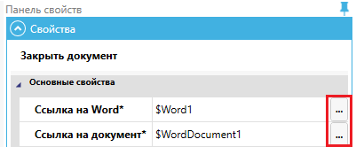

# Работа с выражениями

**Выражения** – важный и мощный инструмент, позволяющий не использовать дополнительные лишние блоки, а прямо в том месте, где возникла такая потребность, производить разные арифметические вычисления, выполнять операции со строками и использовать встроенные функции (и всё это внутри свойства).

## **Редактировать выражения**

Для удобства работы с выражениями используйте окно "Редактировать выражения". Окно вызывается из Панели свойств блока нажатием на многоточие рядом с любым свойством, которое поддерживает использование выражений.

<figure><figcaption></figcaption></figure>

Окно "Редактировать выражение" предназначено для формирования выражений, которые могут быть использованы в качестве условий для проверки, формул для вычисления значений и т.д.  Редактор позволяет создавать и редактировать ранее созданные выражения без привлечения разработчиков системы, силами подготовленного пользователя или администратора. В нижней части данного окна есть справка по функциям. Выберите категорию функций и саму функцию, чтобы увидеть подсказку по ее использованию в выражении. Дважды кликните на функции или примере использования выражения чтобы вставить его в текущее редактируемое выражение.

При клике на данную кнопку открывается окно "Редактировать выражение". Здесь можно задать константу, соответствующую тому типу данных, который ожидает свойство.

<figure><figcaption></figcaption></figure>

## **Структура выражений**

Выражения в системе используются для наложения различных условий на данные при поиске данных, отборе данных для отчетов, проверке правильности ввода данных и т.д.  Выражения могут быть записаны в виде математических функций, даты и произвольных выражений (написанных на языке выражений, который похож на язык PowerShell).  В выражениях могут быть использованы константы, переменные, математические функции или методы.

Когда вы используете выражение в свойстве Блока, то в момент, когда выполнение сценария дошло до этого Блока, вычисляются значения выражений, при этом берутся текущие значений всех используемых в выражении переменных. Результат вычисления выражения используется как значение свойства, в котором это выражение было записано.

Свойства, которые размещены в разделе Output, не допускают использования выражений. В них необходимо записать имя переменной, в которую Блок должен поместить результат своей работы.

Блок Выполнить выражение (InvokeExpression) в свойствах Выражения (Expression) позволяет использовать выражения расширенного формата, которые похожи на выражения на скриптовом языке PowerShell. В них в том числе можно использовать явные присвоения. Выражение записывается $Имяпеременной, затем следует знак равенства (=), а за ним значение, которое вы хотите присвоить. Для указания переменной используйте ключевой символ $. Для присваивания значений переменным использоваться оператор присваивания «=».

[Работа с подсказками IntelliSense в Редакторе выражений продемонстрирована здесь.](https://sherparpa.ru/ucontent/?g8ES)
