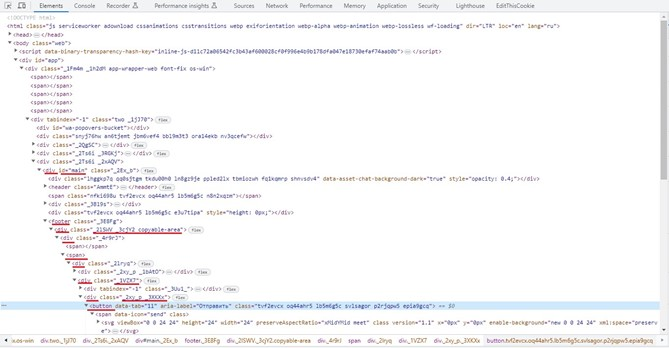

# Нотация CSS-селекторов на примерах

Давайте рассмотрим длинный селектор из WhatsApp, который мы записали выше:

`#main > footer > div._2lSWV._3cjY2.copyable-area > div > span:nth-child(2) > div > div._1VZX7 > div._2xy_p._3XKXx > button`

И сразу же посмотрим на участок кода в самой веб-странице, которая соответствует этому элементу:

<figure><figcaption></figcaption></figure>

Для Вашего удобства, мы подчеркнули красным все участки кода и идентификаторы, которые входят в этот селектор, чтобы вы могли сопоставить их в селекторе и в HTML-коде страницы. Начнем прослеживать селектор с самого начала и спустимся вниз по иерархии вложенных тегов веб-страницы до нужного нам элемента управления. Запись `#main` означает, что нам нужно найти элемент, у которого атрибут id имеет значение main. В отличие от имен классов, которые могут повторяться много раз, id элементов встречаются на странице только по одному разу. В данном случае, эта запись нашла нам тег `
`, при этом сам тег div или его класс никакой роли не играли. Символ > означает, что мы должны спуститься вниз по иерархии, к дочерним элементам найденного тега, и последующую часть селектора искать среди них.

Далее следует название тега footer, здесь мы нашли соответствующий тег просто по его названию, без всяких дополнительных уточнений. Далее видим ещё один символ >, значит спускаемся ещё ниже по иерархии элементов. Следующая запись `div._2lSWV._3cjY2.copyable-area` означает, что мы должны найти тег div, среди классов которого должны быть одновременно `_2lSWV`, .`_3cjY2` и `copyable-area`. Классов у самого искомого элемента может быть и больше, мы указываем только тот необходимый минимум, который нам нужен. Таким образом мы находим тег `
`, который подходит под этот селектор. Обратите внимание, что в селекторе имена классов соединены через точку (которая в данном случае означает логический оператор И), а в тексте атрибута class, в самом теге, эти же имена классов перечислены через пробел – это важное отличие записи имен классов в атрибутах тегов и в селекторах.

Спускаемся ещё ниже, находим следующий элемент просто по названию тега div. Т.к. тегов div на этом уровне иерархии много, будет взят первый попавшийся. Спускаемся ещё ниже, запись `span:nth-child(2)` говорит нам о том, что мы должны найти тег span, и далее перейти во второй по счёту дочерний элемент этого тега. Затем ещё раз находим элемент div просто по имени элемента. Затем находим тег `
` который соответствует селектору `div._1VZX7` – по названию тега и имени класса в этом теге. Затем находим элемент `
` по селектору `div._2xy_p._3XKXx`, ну а в конце находим дочерний тег button просто по названию самого тега. Это была достаточно длинная цепочка, и по этому пути многое может пойти не так, если сайт будет обновляться. Зато на этом примере мы посмотрели, какие разные варианты нотации используются в CSS-селекторах.

Сравните с коротким селектором `button[aria-label="Отправить"]`, который выделяет тот же элемент управления, и который мы предложили как альтернативу. Почему мы вручную составили именно такой селектор? Сначала мы посмотрели на финальный тег, который нам нужен:

`<button data-tab="11" aria-label="Отправить" class="tvf2evcx oq44ahr5 lb5m6g5c svlsagor p2rjqpw5 epia9gcq">`

Имена классов нам сразу не нравятся – их много, и они выглядят как произвольные сочетания букв и цифр, а это означает что в новой версии веб-страницы они почти наверняка изменятся. Название тега button выглядит перспективно. Не так уж много кнопок на этой странице. Но тем не менее само по себе название button может быть неуникальным – на странице могут быть и другие кнопки. Конечно мы можем использовать модификатор вроде `button:nth-child(1)`, который укажет нам на точный порядковый номер однотипного элемента на странице. Или то же самое можно сделать, занеся число 1 в колонку Index справа от колонки CSS в окошке редактора селекторов Sherpa RPA – это даст тот же эффект.

Но кто даст гарантию, что при следующем обновлении страницы порядок или количество кнопок на странице не изменятся? Текст «Отправить» в атрибуте aria-label выглядит достаточно уникальным – это тот текст, которым будет замещен элемент управления в «экранных читалках» и других accessibility-инструментах для лиц с ограниченными возможностями. Очень маловероятно что разработчики сайта будут менять это название в следующих версиях веб-приложения, поэтому его-то мы и возьмем за характерный отличительный атрибут. Чтобы указать, что нам нужен только такой тег button, у которого атрибут aria-label имеет значение «Отправить», используем квадратные скобки - `button[aria-label="Отправить"]`. Мы получили достаточно надежный селектор, который не стыдно использовать в продуктиве нашего робота.
