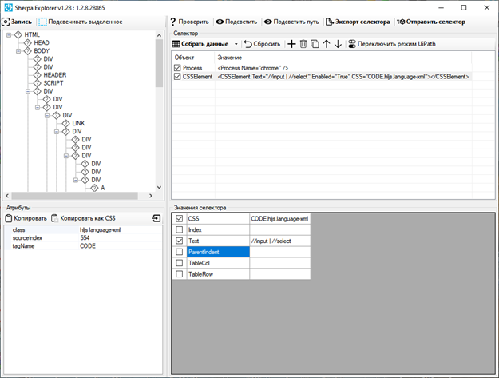

# Ручной поиск CSS-селекторов с помощью Sherpa Explorer

<figure><figcaption></figcaption></figure>

Ещё один мощный инструмент ручного подбора и тестирования селекторов доступен в самом Sherpa Designer и вызывается по кнопке «Sherpa Explorer». В нём, как и в обычном редакторе селекторов, Вы можете записать любой элемент интерактивно, а также исследовать иерархическое дерево любого Desktop и веб-приложения, его доступные атрибуты, подобрать и протестировать нужное сочетание атрибутов. Подобранный и проверенный селектор можно отправить в редактор селекторов самого Дизайнера с помощью нажатия на соответствующую кнопку.
