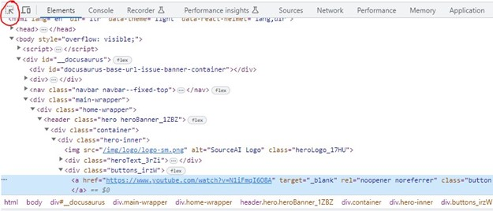

# Ручной поиск CSS-селекторов в браузере

В случае, если инструмент записи действий пользователя (кнопка «Запись») записал не оптимальный селектор, вы можете подобрать альтернативный селектор вручную, ориентируясь на исходный код нужного элемента управления в веб-странице, который можно увидеть с помощью «Инструментов разработчика» вашего браузера. Например, в Google Chrome в основном меню вы можете выбрать More Tools -> Developer Tools или нажать Ctrl+Shift+I. В появившейся панели «Developer Tools» Вы увидите текущий исходный код веб-страницы на вкладке «Elements». Вы также можете быстро открыть этот инструмент и перейти к коду нужного вам элемента управления, если на веб-странице кликните правой кнопкой мыши и выберите пункт контекстного меню «Inspect». Код, соответствующий нужному элементу, будет подсвечен на вкладке «Elements» в «Developer Tools».

Некоторые веб-страницы блокируют отображение стандартного контекстного меню браузера и вместо него по правому клику показывают собственное меню. Также, в некоторых случаях, клик по элементу меняет состояние элемента так, что у элемента пропадает нужный нам атрибут. Например, вы хотите записать селектор непрочитанного сообщения в мессенджере, но когда вы кликаете на него правой кнопкой мыши, сообщение становится прочитанным, и код этого элемента в Inspect меняется. Чтобы увидеть код нужного элемента в этих двух ситуациях – используйте кнопку «Select Element» - в Google Chrome это самая первая кнопка на панели «Elements»:

<figure><figcaption></figcaption></figure>

В других браузерах (Edge, Firefox и т.д.) инструмент «Developer Tools» выглядит и работает похожим образом, но конкретные названия пунктов меню и комбинации клавиш для его вызова могут отличаться.

Важно понимать, что современные веб-страницы являются динамическими структурами, и они часто меняют сами себя (названия и само наличие и отсутствие тех или иных элементов управления, их порядок и иерархию, их внешний вид и атрибуты), уже после того как были загружены с сервера в кэш вашего веб-браузера. Кроме того, страницы часто загружаются по частям, с помощью фреймов или динамического изменения DOM-дерева элементов (DOM расшифровывается как «Document Object Model» – то есть модель веб-страницы, представленная в виде иерархического дерева тегов, именно такое дерево вы видите в Developer Tools браузера), в том числе, с помощью таких технологий как Ajax. Чтобы увидеть исходный HTML-код страницы в том виде, как он был первоначально получен браузером с сервера, нужно выбрать пункт «View page source» в контекстном меню страницы браузера. Однако этот код для целей автоматизации почти бесполезен, так как с момента загрузки страницы браузер, следуя заложенным в страницу скриптам, уже успел много раз её изменить. Developer Tools браузера показывает вам динамический, обновляемый в реальном времени слепок того, как DOM-дерево страницы выглядит прямо сейчас, поэтому для ручного подбора селекторов следует пользоваться именно им.
