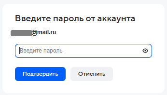

# Отправить письмо

Отправить письмо с использованием протокола SMTP.

**Важно: требует использования специального пароля, предназначенного для взаимодействия с внешними приложениями. Чтобы настроить его, перейдите в настройки своей почты, раздел "Безопасность" → "Пароли приложений". Активируйте опцию "Использовать пароли приложений" и выберите "Почта IMAP, POP3, SMTP". Затем укажите нужное защищенное соединение и введите уникальный пароль — он больше не будет отображаться и обеспечит безопасное взаимодействие с внешними сервисами.**

**Пример для Яндекс Почты:**

1. Войдите в раздел "Настройки" → "Все настройки" → "Безопасность":

<figure><figcaption></figcaption></figure>

2. Нажмите на ссылку "пароли приложений", включите "Использовать пароли приложений":

<figure><figcaption></figcaption></figure>

3. Нажмите на иконку "+" справа от строки "Почта IMAP, POP3, SMTP":

<figure><figcaption></figcaption></figure>

4. Введите название пароля:

<figure><figcaption></figcaption></figure>

5. Скопируйте и сохраните пароль для внешних сервисов:

<figure><figcaption></figcaption></figure>

**Пример для почты Mail:**

1.  Войдите в раздел "Пароль и безопасность":

    
<figure><figcaption></figcaption></figure>

2.  Выберите подраздел "Внешние сервисы":

    <figure><figcaption></figcaption></figure>
3. Включите "Доступ к Почте по IMAP, POP и SMTP":

<figure><figcaption></figcaption></figure>

4. Нажмите кнопку "< Вернуться" и перейдите в подраздел "Пароли для внешних приложений":

<figure><figcaption></figcaption></figure>

5. Нажмите на кнопку "Создать"

<figure><figcaption></figcaption></figure>

6. Введите название пароля:

<figure><figcaption></figcaption></figure>

7. Выберите тип протокола и нажмите на кнопку "Продолжить":

<figure><figcaption></figcaption></figure>

8. Введите пароль для внешних сервисов, сохраните его и нажмите на кнопку "Подтвердить":

<figure><figcaption></figcaption></figure>

<table data-header-hidden><thead><tr><th width="287" valign="top"></th><th width="361.666748046875" valign="top"></th></tr></thead><tbody><tr><td valign="top">Сервер</td><td valign="top">[Текст] Сервер (например, <code>"smtp.mail.ru"</code>).</td></tr><tr><td valign="top">Порт</td><td valign="top">
[Число] Порт. Если значение не указано, то принимается порт по умолчанию: 
<ul><li>обычное соединение - 25, </li><li>защищенное соединение - 587.</li></ul></td></tr><tr><td valign="top">Логин</td><td valign="top">[Текст] Логин, необходимый для авторизации на сервере.</td></tr><tr><td valign="top">Пароль</td><td valign="top">[Текст/SecureString] Пароль, необходимый для авторизации на сервере.</td></tr><tr><td valign="top">SSL</td><td valign="top">Указывает, использовать ли защищенное соединение.</td></tr><tr><td valign="top">Email отправителя</td><td valign="top">[Текст] Указывается E-mail, с которого будет отправлено письмо.</td></tr><tr><td valign="top">Имя отправителя</td><td valign="top">[Текст] Указывается имя отправителя, от которого будет отправлено письмо.</td></tr><tr><td valign="top">Email получателя</td><td valign="top">[Текст] Email-адрес получателя, которому необходимо отправить письмо. Для указания нескольких адресатов запишите их в строке через точку с запятой.</td></tr><tr><td valign="top">Тема письма</td><td valign="top">[Текст] Тема письма.</td></tr><tr><td valign="top">Текст письма</td><td valign="top">[Текст] Содержимое письма.</td></tr><tr><td valign="top">HTML-разметка</td><td valign="top">Если стоит галочка, то содержимое письма будет отправлено как HTML страница и может содержать теги.</td></tr><tr><td valign="top">Вложения</td><td valign="top">[Текст/Список/Словарь] Путь к файлу / Список путей к файлам / Словарь с файлами, которые будут прикреплены к письму (ключ - название, значение - путь к файлу).</td></tr><tr><td valign="top">Время ожидания</td><td valign="top">[Число] Время ожидания ответа от сервера. Значение указывается в секундах.</td></tr><tr><td valign="top">Копия</td><td valign="top">[Текст] Email-адрес получателя для получения копии письма. Для указания нескольких адресатов запишите их в строке через точку с запятой.</td></tr><tr><td valign="top">Скрытая копия</td><td valign="top">[Текст] Email-адрес получателя для получения скрытой копии письма. Для указания нескольких адресатов запишите их в строке через точку с запятой.</td></tr><tr><td valign="top">Отправленное письмо</td><td valign="top">[Объект] Отправленное письмо. Может быть использовано в блоке "Сохранить в отправленных".</td></tr><tr><td valign="top">Уровень обработки</td><td valign="top">
Выбор уровня обработки ошибок. Возможные значения: 
<ul><li>"Default" - по умолчанию; </li><li>"Ignore" - ошибки игнорируются; </li><li>"Handle" - ошибки обрабатываются. </li></ul>
Если выбрано значение "Default", то будет использоваться значение блока "Старт" данной диаграммы.
</td></tr><tr><td valign="top">Уровень сообщений</td><td valign="top">
Выбор уровня сообщений, который будут выводить блоки при работе. Возможные значения: 
<ul><li>"Default" - по умолчанию; </li><li>"Release" - вывод отключен; </li><li>"Debug" - вывод основной информации; </li><li>"Detailed" - вывод подробной информации. </li></ul>
Если выбрано значение "Default", то будет использоваться значение блока "Старт" данной диаграммы.
</td></tr><tr><td valign="top">Текст ошибки</td><td valign="top">[Текст] Возвращает подробную информацию об ошибке в случае некорректного выполнения работы блока.</td></tr></tbody></table>
