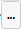

# Цикл Пока

Цикл позволяет повторить цепочку действий (блоков) несколько раз, пока выполняется условие, заданное в виде выражения. При каждом входе в блок проверяется выражение, указанное в свойстве "Условие", и если оно истинно, то выполнение сценария продолжится в сторону выхода "Условие" данного блока (в так называемое "тело цикла").&#x20;

<figure><figcaption></figcaption></figure>

Как только при очередном проходе через данный блок "Условие" перестало выполняться, сценарий продолжится в сторону нижнего выхода блока. Не забудьте соединить выход последнего блока в теле цикла со входом данного блока или какого-либо из предшествующих блоков.

<table data-header-hidden><thead><tr><th width="249" valign="top"></th><th width="322" valign="top"></th></tr></thead><tbody><tr><td valign="top">Условие</td><td valign="top">
[Любой тип] Пока указанное выражение имеет истинное значение, цикл продолжит выполняться. 

Значение выражения, эквивалентное <code>0</code> (нулю) или <code>$False</code> считается ложным, а любые другие значения - истинными. Например, если в переменную <code>$a</code> было ранее записано значение <code>5</code>, то условие <code>$a>2</code> является истинным, а условие <code>$a == 6</code> является ложным. 

Условие может содержать математические и логические операции, константы, функции, другие переменные и т.д. Примеры выражений, которые можно использовать в условиях, доступны по нажатию на кнопку  рядом со свойством Условие.
</td></tr><tr><td valign="top">Уровень обработки</td><td valign="top">
Выбор уровня обработки ошибок. Возможные значения: 
<ul><li>"Default" - по умолчанию; </li><li>"Ignore" - ошибки игнорируются; </li><li>"Handle" - ошибки обрабатываются. </li></ul>
Если выбрано значение "Default", то будет использоваться значение блока "Старт" данной диаграммы.
</td></tr><tr><td valign="top">Направление выхода</td><td valign="top">
Выбор направления выхода из блока при возникновении ошибки. Возможные значения: 
<ul><li>"Default" - по умолчанию; </li><li>"Right" - направо; </li><li>"Bottom" - вниз. </li></ul>
Данное свойство позволяет определить направление выхода при возникновении ошибок для блоков не содержащих коннектора "Если ошибка" (например, блок "Условие"). 

Если выбрано значение "Default", то будет использоваться значение блока "Старт" данной диаграммы.
</td></tr><tr><td valign="top">Уровень сообщений</td><td valign="top">
Выбор уровня сообщений, который будут выводить блоки при работе. Возможные значения: 
<ul><li>"Default" - по умолчанию; </li><li>"Release" - вывод отключен; </li><li>"Debug" - вывод основной информации; </li><li>"Detailed" - вывод подробной информации. </li></ul>
Если выбрано значение "Default", то будет использоваться значение блока "Старт" данной диаграммы.
</td></tr><tr><td valign="top">Текст ошибки</td><td valign="top">[Текст] Возвращает подробную информацию об ошибке в случае некорректного выполнения работы блока.</td></tr></tbody></table>
