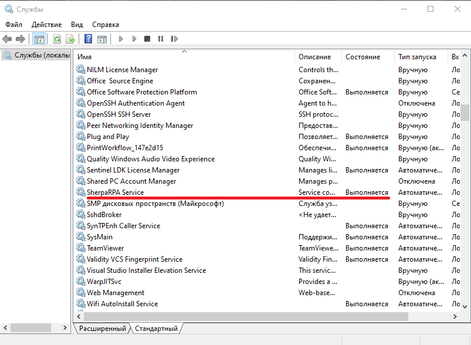

# Первоначальная установка и настройка компонентов платформы (на примере Sherpa Orchestrator)

### Шаг 1

На экране Robots (Роботы) в Orchestrator создать новую запись Робота, установить Роль "Координатор".&#x20;

<figure><figcaption></figcaption></figure>

После этого войти в редактирование записи, скопировать GUID данного робота-координатора.

<figure><figcaption></figcaption></figure>

### Шаг 2

Из-под учетной записи администратора терминального сервера установить SherpaRPACoordinator.exe.

<figure><figcaption></figcaption></figure>

При установке Координатора необходимо ввести домен сервера Оркестратора и идентификатор (GUID) Координатора.

<figure><figcaption></figcaption></figure>

ID Координатора в окне "Робот":

<figure><figcaption></figcaption></figure>

Далее необходимо проверить подключение, нажав на кнопку "Проверить подключение". Также при необходимости можно настроить параметры подключения через прокси-сервер нажатием на кнопку "Настройки прокси". При успешном подключении производится запуск установки нажатием на кнопку "Далее". После завершения установки Координатора запускается служба Sherpa RPA Service.

При проверке наличия службы Sherpa RPA Service в реестре служб, видно что она установлена и находится в состоянии "Выполняется":

<figure><figcaption></figcaption></figure>

### Шаг 3

Для каждой учетной записи на терминальном сервере, которая должна выполнять Python-роботов, необходимо завести соответствующего Unattended-робота в Оркестратор. Для этого на экране Robots (Роботы) в Orchestrator создать новую запись Робота, установить роль «Unattended»:

<figure><figcaption></figcaption></figure>

Необходимо выбрать ранее созданный робот-координатор, ввести IP или доменное имя машины с Unattended-роботами, логин (с доменом, если есть) и пароль от учетной записи Пользователя, под которой должен заходить Робот. Если используется Active Directory, то логин учетной записи должен указываться через доменное имя в поле "Логин учетной записи".

В выпадающем списке необходимо выбрать тот Координатор, через которого будет осуществляться запуск Unattended-робота:

<figure><figcaption></figcaption></figure>

Также необходимо указать лицензионные ключи в поле "Лицензионный ключ", которые ранее были добавлены на экране Лицензии. Необходимо выбрать Unattended-лицензию. Лицензия должна быть заранее заведена в Оркестратор и активирована (дата окончания Лицензии должна быть больше текущего дня).

После сохранения созданной записи необходимо снова войти в её редактирование и скопировать GUID данного Unattended-робота.

### Шаг 4

Далее войти в учетную запись Пользователя терминального сервера, от имени которого должен запускаться данный Python-робот и вставить значение скопированного на предыдущем шаге GUID данного Робота в значение соответствующей переменной RobotGUID в локальном скрипте Python-фреймворка.

Затем войти в локальный планировщик Windows и создать новую запись для текущего Пользователя.&#x20;

В качестве Триггера указать: "При удаленном подключении к пользовательскому сеансу".

В настройках Триггера указать:&#x20;

* "Любой пользователь" и "Подключение с удаленного компьютера" (при отдельно стоящих виртуальных машинах на каждого Робота)&#x20;
* "Подключение с локального компьютера" (для роботов размещенных на том же терминальном сервере что и Оркестратор).

В качестве Действия указать: "Запуск программы". В пути для запуска прописать путь к интерпретатору Python, в параметрах запуска прописать путь к конкретному скрипту Python-фреймворка в данной учетной записи.

<figure><figcaption></figcaption></figure>

### Шаг 5

Выйти из учетной записи текущего Пользователя с помощью Log off (не через закрытие RDP-окна).&#x20;

Повторить шаг 3 и шаг 4 для каждого из Python-роботов на данном терминальном сервере.

## Механизмы аутентификации

Аутентификация Sherpa Coordinator и Python-скрипта фреймворка в Orchestrator осуществляется с помощью Bearer Token, передаваемого в заголовке HTTP RESTful запросов. Bearer Token сопоставляется с уникальным GUID каждого экземпляра Python-робота и Sherpa Coordinator.
