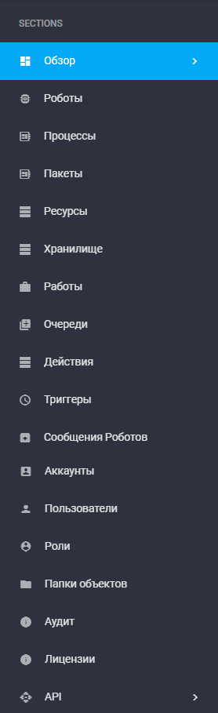

# Экраны

Экран – часть интерфейса Оркестратора. Каждый экран в рамках Оркестратора представляет собой набор настроек для организации работы Роботов.

<figure><figcaption></figcaption></figure>

Описания экранов представлены в следующей таблице:

<table data-header-hidden><thead><tr><th width="53"></th><th width="130"></th><th></th></tr></thead><tbody><tr><td><strong>№ п/п</strong></td><td><strong>Экран</strong></td><td><strong>Описание экрана</strong></td></tr><tr><td>1.</td><td>Обзор</td><td>Дашборд с набором виджетов, отображающих основные параметры и срезы данных по работе программных Роботов и Оркестратора. Здесь отображается базовая статистика дашборда (количество Роботов, Процессов и т.д.).</td></tr><tr><td>2.</td><td>Роботы</td><td>Отображает таблицы “Роботы” и “Группы роботов”. Позволяет совершать различные операции (создание, редактирование, группирование и т.д.) со всеми доступными Роботами в Оркестраторе.</td></tr><tr><td>3.</td><td>Процессы</td><td>Отображает сценарии роботизации, которые выполняются Роботами, и их версиями.</td></tr><tr><td>4.</td><td>Пакеты</td><td>Отображает пакеты и их имеющиеся версии.</td></tr><tr><td>5.</td><td>Ресурсы</td><td>Отображает список объектов, доступный всем Роботам, Группам роботов или конкретному Роботу. Поддерживаемые типы ресурсов: текст (текстовая строка), реквизиты (пара логин-пароль), календарь.</td></tr><tr><td>6.</td><td>Хранилище</td><td>Отображает список Файлов и Папок.</td></tr><tr><td>7.</td><td>Работы</td><td>Отображает совокупность Процесса и Робота, которому данный Процесс назначен на выполнение.</td></tr><tr><td>8.</td><td>Очереди</td><td>Позволяет группировать однотипные задачи, создавать потоки задач и добавлять задачи в Очереди.</td></tr><tr><td>9.</td><td>Действия</td><td>Позволяет создавать отдельные рабочие места внутри Оркестратора, созданные с помощью экрана Действия. Также в рамках данного экрана можно создавать действия для задач в Очереди, а также форму для выполнения задачи.</td></tr><tr><td>10.</td><td>Триггеры</td><td>Описывает условия, наступление которых позволяет автоматически создавать Работы, запускающие далее Роботов.</td></tr><tr><td>11.</td><td>Сообщения роботов</td><td>Содержит информацию о сообщениях, которые Роботы отправляют в Оркестратор по мере выполнения Работ.</td></tr><tr><td>12.</td><td>Аккаунты</td><td>Позволяет создавать новые Аккаунты, а также редактировать существующие.</td></tr><tr><td>13.</td><td>Пользователи</td><td>Позволяет создавать новых Пользователей, а также редактировать существующих.</td></tr><tr><td>14.</td><td>Роли</td><td>Позволяет определять набор прав доступа к тем или иными экранам Оркестратора и функциями в рамках этих экранов.</td></tr><tr><td>15.</td><td>Папки объектов</td><td>Позволяет создавать и редактировать папки доступа, которые предоставляют возможность более детально разграничить доступ к объектам Оркестратора для разных ролей Пользователей.</td></tr><tr><td>16.</td><td>Аудит</td><td>Показывает собственные события Оркестратора.</td></tr><tr><td>17.</td><td>Лицензии</td><td>Отображает все Лицензии Оркестратора, а также набор инструментов по созданию, активации и управлению ими.</td></tr><tr><td>18.</td><td>API</td><td>Содержит набор инструментов для обмена данными через API (справочник по существующим API-методам, инструменты получения токена для работы с API).</td></tr></tbody></table>
