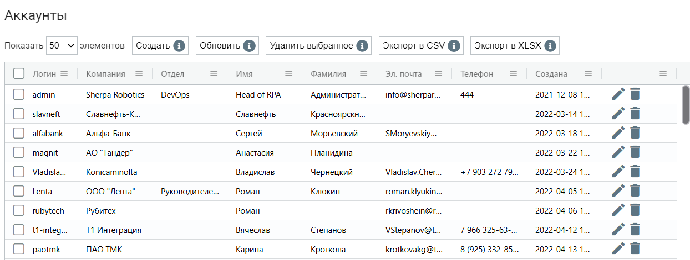
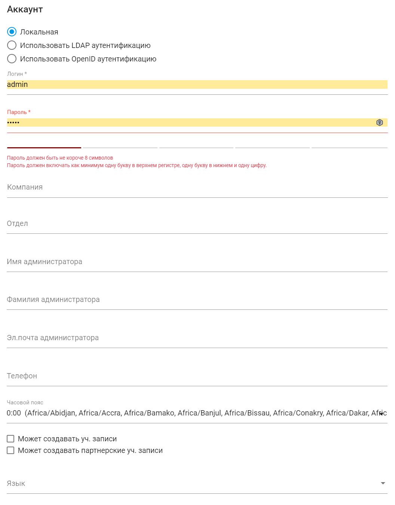
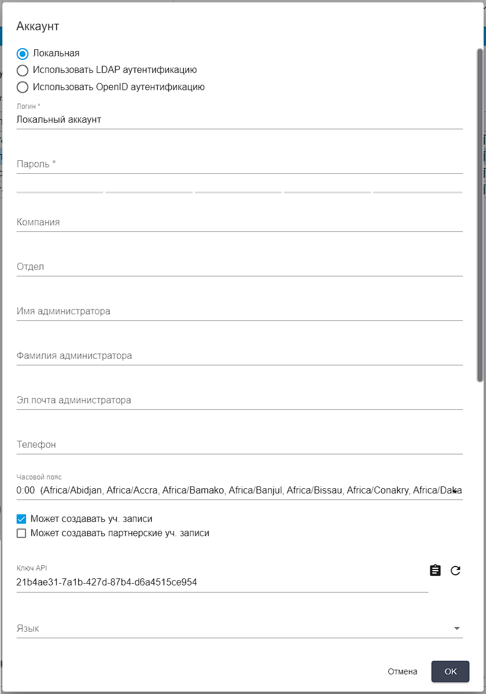

# Аккаунты

**Аккаунты** – это отдельные пространства внутри Оркестратора, каждое из которых обладает собственным набором Работ, Процессов, Ресурсов, Роботов, Очередей и Пользователей. Аккаунты абсолютно изолированы друг от друга: по Роботам, Процессам и прочим объектам.

С помощью Аккаунтов Оркестратор может быть поделен на несколько логических, не связанных друг с другом, областей (например, по департаментам), и для каждой из них вести отдельный учет и раздельное использование всех объектов.

Аккаунты представляют собой изолированные друг от друга пространства для хранения сущностей Оркестратора, доступ к которым осуществляется по логину и паролю Пользователя.

<table data-header-hidden><thead><tr><th width="54"></th><th></th></tr></thead><tbody><tr><td></td><td>Аккаунты внутри Оркестратора не являются Пользователями. Для определения прав Пользователей предусмотрен отдельный экран “Пользователи”.</td></tr></tbody></table>

Часто используется два Аккаунта, чтобы поделить Оркестратор и управляемых им Роботов на используемые в тестовых целях (test road) и занятые реальными бизнес-задачами. При небольшом количестве Роботов для выполнения текущих Задач одного аккаунта вполне достаточно.

Экран “Аккаунты” содержит таблицу “Аккаунты”:

<figure><figcaption></figcaption></figure>

## **Создание нового Аккаунта**

Для создания нового Аккаунта необходимо нажать на кнопку “Создать” в таблице “Аккаунты” и заполнить открывшуюся форму:

<figure><figcaption></figcaption></figure>

Форма создания нового Аккаунта предлагает три варианта аутентификации, из которых можно выбрать нужную с помощью установки флага:&#x20;

* Локальная аутентификация;
* LDAP аутентификация;
* OpenID аутентификация.

<table data-header-hidden><thead><tr><th width="53"></th><th width="204"></th><th width="275"></th></tr></thead><tbody><tr><td><strong>№ п/п</strong></td><td><strong>Элемент интерфейса</strong></td><td><strong>Описание</strong> </td></tr><tr><td>1. </td><td>флаг “Локальная”</td><td>Позволяет установить вариант локальной аутентификации Аккаунта.</td></tr><tr><td>1.1</td><td>текстовое поле “Логин”</td><td>Логин Аккаунта. Обязательное для заполнения поле.</td></tr><tr><td>1.2.</td><td>текстовое поле “Пароль”</td><td>Пароль Аккаунта. Обязательное для заполнения поле.</td></tr><tr><td>2.</td><td>флаг “Использовать LDAP аутентификацию”</td><td>Позволяет установить вариант аутентификации Аккаунта через LDAP.</td></tr><tr><td>2.1</td><td>поле “Пользователи LDAP”</td><td>
Позволяет указать Пользователя LDAP с помощью выпадающего списка. Данный вариант аутентификации доступен, если в конфиге Оркестратора прописаны данные для подключения к LDAP-серверу. 

Данное поле доступно при LDAP аутентификации.
</td></tr><tr><td>3.</td><td>флаг “Использовать OpenID аутентификацию”</td><td>Позволяет установить вариант аутентификации Аккаунта через OpenID .</td></tr><tr><td>3.1</td><td>текстовое поле “oAuth id”</td><td>Идентификатор oAuth. Обязательное для заполнения поле. Данное поле доступно при OpenID аутентификации.</td></tr><tr><td>4.</td><td>текстовое поле “Компания”</td><td>Название компании, в которой будет создан Аккаунт.</td></tr><tr><td>5.</td><td>текстовое поле “Отдел”</td><td>Название отдела/департамента, места работы или расположения Аккаунта.</td></tr><tr><td>6.</td><td>текстовое поле “Имя администратора”</td><td>Имя администратора Аккаунта.</td></tr><tr><td>7.</td><td>текстовое поле “Фамилия администратора”</td><td>Фамилия администратора Аккаунта.</td></tr><tr><td>8.</td><td>текстовое поле “Эл.почта администратора”</td><td>Электронная почта администратора Аккаунта.</td></tr><tr><td>9.</td><td>текстовое поле “Телефон”</td><td>Телефон администратора Аккаунта.</td></tr><tr><td>10.</td><td>флаг “Может создавать уч. записи”</td><td>Позволяет дать Аккаунту право создавать другие Аккаунты.</td></tr><tr><td>11.</td><td>флаг “Может создавать партнерские уч. записи”</td><td>Позволяет дать Аккаунту право создавать партнерские Аккаунты.</td></tr><tr><td>12.</td><td>поле "Часовой пояс"</td><td>Позволяет выбрать часовой пояс для Аккаунта.</td></tr><tr><td>13.</td><td>поле “Язык”</td><td>
Позволяет выбрать язык для Аккаунта. Возможные варианты:
<ul><li>Русский;</li><li>English.</li></ul></td></tr></tbody></table>

## **Редактирование ранее созданного Аккаунта**

Для просмотра и редактирования свойств конкретного Аккаунта необходимо выбрать его в списке и нажать на иконку .png>). После этого откроется форма с настройками Аккаунта, в которую можно внести необходимые изменения. Помимо полей заполняемых при создании нового Аккаунта в форме редактирования есть дополнительное поле “Ключ API” (уникальный код, используемый для аутентификации при работе с API Оркестратора). Данное поле нельзя отредактировать.&#x20;

<figure><figcaption></figcaption></figure>
