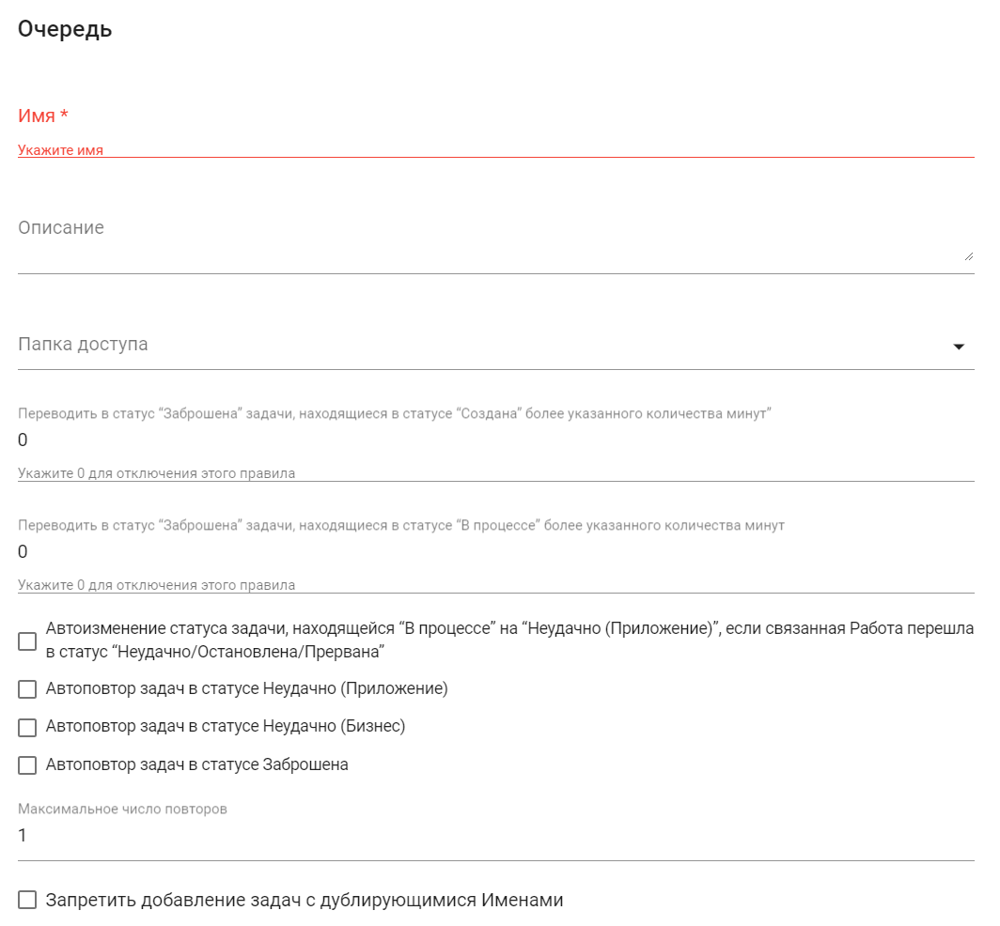
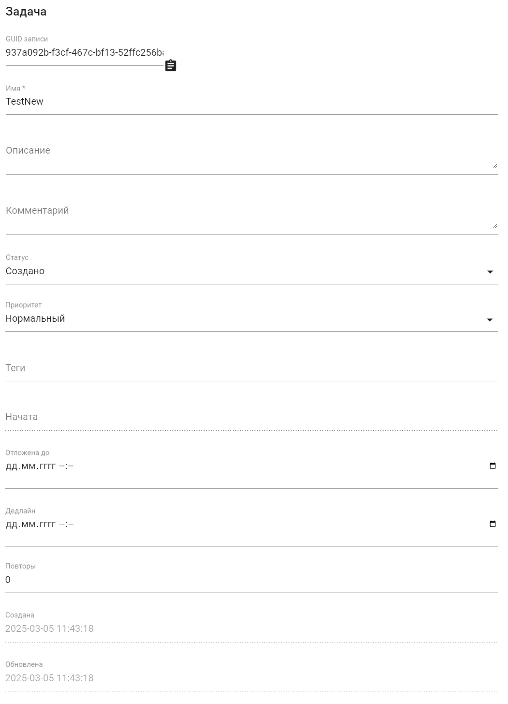

# Очереди

**Очереди** – это способ группировать однотипные Задачи, а также создавать потоки Задач.

Очереди можно рассматривать как способ «хранения списка данных», которые требуется обработать. Подобные группировки используются для того, чтобы внешняя система (или Роботы) добавляли Задачи в Очередь, а другие Роботы выполняли пункты Очереди Задач, то есть извлекали Задачи из определенной Очереди и выполняли Работы. Таким образом, длительный и сложный\
бизнес-процесс может быть разбит на набор простых процессов, каждый из которых будет исполняться определенным Роботом или Группой роботов.

Задачи добавляются в Очередь тремя способами:

* вручную Пользователем с помощью Оркестратора;
* Роботом с помощью блока “Добавить Задачу в Очередь”;
* с помощью вызовов API.

Экран “Очереди” содержит две таблицы: “Очереди” и “Задачи”.&#x20;

<figure><figcaption></figcaption></figure>

Для работы с Очередями на экране есть следующие кнопки:

<figure><figcaption></figcaption></figure>

<table><thead><tr><th width="161"></th><th width="384"></th></tr></thead><tbody><tr><td><strong>Название кнопки</strong></td><td><strong>Описание</strong></td></tr><tr><td>Создать</td><td>Позволяет Пользователю создать новую Очередь. При нажатии открывается форма для ввода необходимых данных и настройки параметров новой Очереди.</td></tr><tr><td>Обновить</td><td>Позволяет обновить информацию о выбранной Очереди.</td></tr><tr><td>Удалить выбранное</td><td>Позволяет удалить одну или несколько выбранных Очередей.</td></tr><tr><td>Импорт из CSV</td><td>Позволяет Пользователю загружать данные об Очередях из файла формата CSV. При выборе этой опции открывается диалоговое окно для загрузки файла с необходимыми данными.</td></tr><tr><td>Экспорт в CSV</td><td>Позволяет сохранить информацию об Очередях в файл в формате CSV.</td></tr><tr><td>Экспорт в XLSX</td><td>Позволяет экспортировать данные об Очередях в файл в формате XLSX.</td></tr></tbody></table>

Для работы с Задачами на экране есть следующие кнопки:

<figure><figcaption></figcaption></figure>

<table data-header-hidden><thead><tr><th width="164"></th><th width="382"></th></tr></thead><tbody><tr><td><strong>Название кнопки</strong></td><td><strong>Описание</strong></td></tr><tr><td>Создать</td><td>Позволяет Пользователю создать новую Задачу. При нажатии открывается форма для ввода необходимых данных и настройки параметров новой Задачи.</td></tr><tr><td>Обновить</td><td>Позволяет обновить информацию о выбранной Задаче.</td></tr><tr><td>Изменить статус</td><td>
Позволяет изменить статус одной или нескольких выбранных Задач. Возможные варианты:
<ul><li>Создано;</li><li>В процессе;</li><li>Успешно;</li><li>Неудачно;</li><li>Отложена до;</li><li>Заброшена.</li></ul></td></tr><tr><td>Клонировать задачу</td><td>Позволяет создать копию выбранной Задачи с автоматическим переносом всех ее свойств и параметров.</td></tr><tr><td>Удалить выбранное</td><td>Позволяет удалить одну или несколько выбранных Задач.</td></tr><tr><td>Импорт из CSV</td><td>Позволяет Пользователю загружать данные о Задачах из файла формата CSV. При выборе этой опции открывается диалоговое окно для загрузки файла с необходимыми данными.</td></tr><tr><td>Экспорт в CSV</td><td>Позволяет сохранить информацию о Задачах в файл в формате CSV.</td></tr><tr><td>Экспорт в XLSX</td><td>Позволяет экспортировать данные о Задачах в файл в формате XLSX.</td></tr><tr><td>Показать диаграмму</td><td>Позволяет визуализировать данные о Задачах в виде диаграммы для анализа статусов Задач.</td></tr></tbody></table>

## **Создание новой Очереди**

Для создания новой Очереди необходимо нажать на кнопку “Создать” в таблице “Очереди” и заполнить открывшуюся форму:

<figure><figcaption></figcaption></figure>

<table data-header-hidden><thead><tr><th width="57"></th><th width="201"></th><th width="283"></th></tr></thead><tbody><tr><td><strong>№ п/п</strong></td><td><strong>Элемент интерфейса</strong></td><td><strong>Описание</strong> </td></tr><tr><td>1.</td><td>текстовое поле “Имя”</td><td>Имя Очереди. Обязательное для заполнения поле.</td></tr><tr><td>2.</td><td>текстовое поле “Описание”</td><td>Описание Очереди.</td></tr><tr><td>3.</td><td>текстовое поле “Папка доступа”</td><td>Позволяет указать Папку доступа для создаваемой Очереди.</td></tr><tr><td>4.</td><td>текстовое поле “Переводить в статус “Заброшена” задачи, находящиеся в статусе “Создана” более указанного количества минут”</td><td>Позволяет указать количество минут через которое Задача, находящаяся в статусе “Создана”, будет переведена в статус “Заброшена”.</td></tr><tr><td>5.</td><td>текстовое поле “Переводить в статус “Заброшена”, задачи, находящиеся в статусе “В процессе” более указанного количества минут”</td><td>Позволяет указать количество минут через которое Задача, находящаяся в статусе “В процессе”, будет переведена в статус “Заброшена”.</td></tr><tr><td>6.</td><td>флаг “Автоизменение статуса задачи, находящейся  “В процессе” на “Неудачно (Приложение)”, если связанная Работа перешла в статус “Неудачно/Остановлена/Прервана” </td><td>Позволяет включить функцию автоизменения статуса Задачи из <strong>В процессе</strong> на <strong>Неудачно</strong> <strong>(Приложение)</strong>, если связанная Работа перешла в статус Неудачно/Остановлена/Прервана.</td></tr><tr><td>7.</td><td>флаг “Автоповтор задач в статусе Неудачно (Приложение)”</td><td>Позволяет включить функцию автоповтора Задач, находящихся в статусе Неудачно (Приложение).</td></tr><tr><td>8.</td><td>флаг “Автоповтор задач в статусе Неудачно (Бизнес)”</td><td>Позволяет включить функцию автоповтора Задач, находящихся в статусе Неудачно (Бизнес).</td></tr><tr><td>9.</td><td>флаг “Автоповтор задач в статусе Заброшена”</td><td>Позволяет включить функцию автоповтора Задач, находящихся в статусе Заброшена.</td></tr><tr><td>10.</td><td>текстовое поле “Максимальное число повторов”</td><td>Позволяет указать максимальное число повторов Задач.</td></tr><tr><td>11.</td><td>флаг “Запретить добавление задач с дублирующимися Именами”</td><td>Позволяет включить функцию запрета добавления в Очередь Задач с дублирующимися именами.</td></tr></tbody></table>

## **Редактирование ранее созданной Очереди**

Для просмотра и редактирования свойств конкретной Очереди необходимо выбрать ее в списке и нажать на иконку .png>). После этого откроется форма с настройками Очереди, в которую можно внести необходимые изменения:

<figure><figcaption></figcaption></figure>

Помимо полей, заполняемых при создании Очереди, при редактировании в форме указан **GUID** (уникальный идентификатор, присвоенный Очереди после ее создания). Данное поле нельзя отредактировать.

## **Создание новой Задачи**

Для создания новой Задачи необходимо нажать на кнопку “Создать” в таблице “Задачи” и заполнить открывшуюся форму:

<figure><figcaption></figcaption></figure>

<table data-header-hidden><thead><tr><th width="52"></th><th width="470"></th></tr></thead><tbody><tr><td></td><td>Для того, чтобы в таблице “Задачи” появился список Задач, необходимо установить флаг у одной из Очередей.</td></tr></tbody></table>

Форма содержит следующие элементы:

<table data-header-hidden><thead><tr><th width="56"></th><th width="195"></th><th></th></tr></thead><tbody><tr><td><strong>№ п/п</strong></td><td><strong>Элемент интерфейса</strong></td><td><strong>Описание</strong> </td></tr><tr><td>1.</td><td>текстовое поле “Имя”</td><td>Имя Задачи. Обязательное для заполнения поле.</td></tr><tr><td>2.</td><td>текстовое поле “Описание”</td><td>Описание Задачи.</td></tr><tr><td>3.</td><td>текстовое поле “Комментарий”</td><td>Комментарий к Задаче.</td></tr><tr><td>4.</td><td>поле “Приоритет”</td><td>
Приоритет выполнения Задачи. Возможные варианты:
<ul><li>Низкий;</li><li>Нормальный;</li><li>Высокий;</li><li>Дедлайн.</li></ul></td></tr><tr><td>5.</td><td>текстовое поле “Теги”</td><td>Теги Задачи.</td></tr><tr><td>6.</td><td>текстовое поле “Повторы”</td><td>Количество повторов выполнения Задачи.</td></tr></tbody></table>

## **Редактирование ранее созданной Задачи**

Для просмотра и редактирования свойств конкретной Задачи необходимо выбрать ее в списке и нажать на иконку .png>). После этого откроется форма с настройками Задачи, в которую можно внести необходимые изменения:

<figure><figcaption></figcaption></figure>

<table data-header-hidden><thead><tr><th width="55"></th><th width="208"></th><th width="276"></th></tr></thead><tbody><tr><td><strong>№ п/п</strong></td><td><strong>Элемент интерфейса</strong></td><td><strong>Описание</strong> </td></tr><tr><td>1.</td><td>текстовое поле “GUID”</td><td>Уникальный идентификатор, присвоенный Задаче после ее создания. Данное поле нельзя отредактировать. </td></tr><tr><td>2.</td><td>текстовое поле “Статус”</td><td>
Статус Задачи. Возможные варианты:
<ul><li>Создано;</li><li>В процессе;</li><li>Успешно;</li><li>Неудачно (Приложение);</li><li>Неудачно (Бизнес);</li><li>Отложена до;</li><li>Заброшена.</li></ul></td></tr><tr><td>3.</td><td>поле “Отложена до” </td><td>Дата и время, до которого отложена Задача в формате: ДД.ММ.ГГГГ часы:минуты.</td></tr><tr><td>4.</td><td>поле “Дедлайн”</td><td>Дата и время дедлайна для выполнения данной Задачи.</td></tr><tr><td>5.</td><td>поле “Создана”</td><td>Дата и время, когда была создана Задача. Данное поле нельзя отредактировать. </td></tr><tr><td>6.</td><td>поле “Обновлена”</td><td>Дата и время, когда была обновлена Задача. Данное поле нельзя отредактировать.</td></tr></tbody></table>

## **Параметры Задачи**

Для уже созданных Задач доступны “Параметры задачи”. Чтобы открыть форму параметров необходимо нажать на иконку .png>). Для указания параметров Задачи доступны три типа данных:

* Текст;
* Таблица;
* Хэш-таблица.

Тип данных “Текст” позволяет сохранить необходимый текст в качестве параметра Задачи в предназначенном для этого текстовом поле:

<figure><figcaption></figcaption></figure>

Тип данных “Таблица” позволяет создать и сохранить таблицу в качестве параметра Задачи в предназначенном для этого редакторе таблицы:

<figure><figcaption></figcaption></figure>

Тип данных “Хэш-таблица” позволяет создать и сохранить хэш-таблицу (указать пары ключ-значение) в качестве параметра Задачи в предназначенных для этого полях, где параметр – это ключ:

<figure><figcaption></figcaption></figure>

[Работа с Задачами в Sherpa Designer описана здес&#x44C;_._](../nachalo-raboty-v-sherpa-orchestrator/sozdanie-zadachi-v-orkestratore/rabota-s-zadachami-v-sherpa-designer.md)
