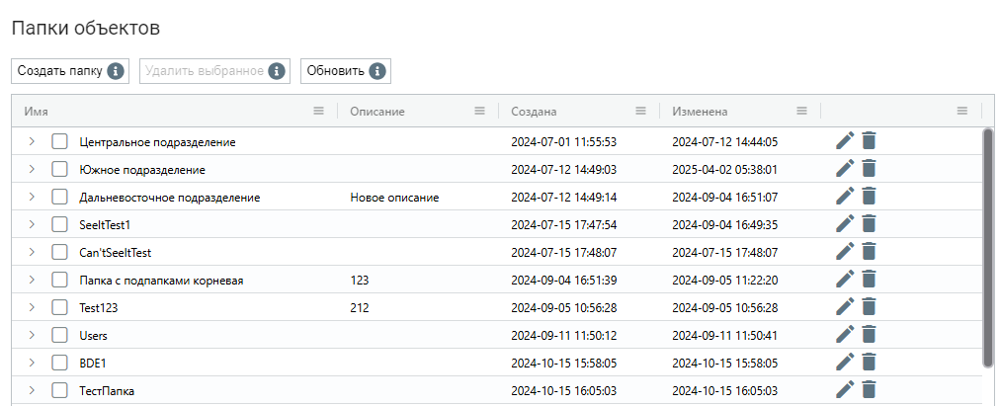

# Папки объектов

Экран “Папки объектов” позволяет создавать и редактировать Папки доступа, которые предоставляют возможность более детально разграничить доступ к объектам Оркестратора для разных Ролей Пользователей. В верхней панели Оркестратора находится фильтр “Папки доступа”, позволяющий показывать на экранах только объекты, находящиеся в выбранной Папке и объекты, которым не присвоены никакие Папки:

<figure><figcaption></figcaption></figure>

С помощью [экрана "Роли"](roli.md) можно задать права доступа Роли к конкретным Папкам доступа, после чего, при создании и редактировании объектов Оркестратора ([Роботов](roboty.md), [Процессов](processy.md), [Пакетов](pakety.md), [Ресурсов](resursy.md), [Хранилища](khranilishe.md), [Очередей](ocheredi.md), [Действий ](deistviya/)и [Триггеров](triggery.md)) на соответствующих экранах можно задать конкретную “Папку доступа” для выбранного объекта.

Экран “Папки объектов” содержит таблицу “Папки объектов”.

<figure><figcaption></figcaption></figure>

## **Создание новой Папки объектов**

Для создания новой Папки объектов необходимо нажать на кнопку “Создать” в таблице “Папки объектов” и заполнить открывшуюся форму.&#x20;

<figure><figcaption></figcaption></figure>

## **Редактирование ранее созданной Папки объектов**

Для просмотра и редактирования свойств конкретной Папки объектов необходимо выбрать ее в списке и нажать на иконку . После этого откроется форма с настройками Папки объектов, в которую можно внести необходимые изменения. Помимо полей, заполняемых при создании Папки объектов, при редактировании в форме указан GUID (уникальный идентификатор, присвоенный папке после ее создания). Данное поле нельзя отредактировать.

<figure><figcaption></figcaption></figure>
