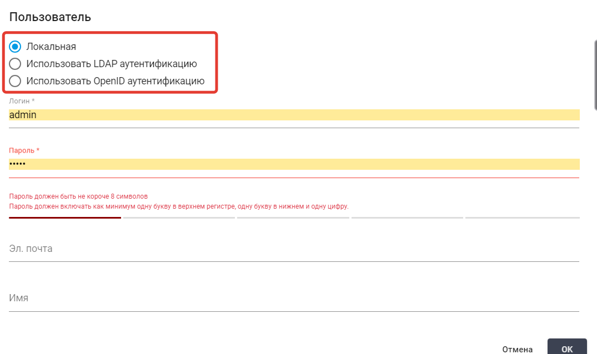

# Авторизация Пользователей

## **Локальная авторизация**

Для создания Пользователя с локальной авторизацией\
необходимо установить флаг **“Локальная”** в форме:

<figure><figcaption></figcaption></figure>

Затем в соответствующих полях указать логин Аккаунта\
и пароль к нему.&#x20;

## **LDAP-аутентификация**

Для создания Пользователя с методом входа в систему\
&#xNAN;**“LDAP-аутентификация”** необходимо установить флаг:\
&#xNAN;**“Использовать LDAP аутентификацию”**.

<figure><figcaption></figcaption></figure>

Затем заполнить поле **“Пользователи LDAP”**.&#x20;

Для использования LDAP-аутентификации необходимо\
в файле `config.ini`, расположенном по пути: \
`/opt/SherpaOrchestrator/backend/config/config.ini`,\
заполнить соответствующие параметры:

* l**dap\_serve**
* **ldap\_port**
* **ldap\_encryption**
* **ldap\_base\_dn**
* **ldap\_group**

Затем перезапустить контейнер для установки через Docker\
(при локальной установке по необходимости перезагрузить\
сервер).

## **OpenID-аутентификация**

Для создания Пользователя с методом входа в систему\
&#xNAN;**“OpenID-аутентификация”** необходимо установить флаг:\
&#xNAN;**“Использовать LDAP-аутентификацию”**, а затем\
заполнить поле **“oAuth id”:**

<figure><figcaption></figcaption></figure>

Для подключения OpenID аутентификации необходимо\
в файле `config.ini` , расположенном по пути:\
`/opt/SherpaOrchestrator/backend/config/config.ini`,\
заполнить соответствующие параметры:

* **oAuthClientId="clientId"**
* **oAuthClientSecret="clientSecret"**
* **oAuthAuthUri="https://OpenID.url/authorize"**
* **oAuthTokenUri="https://OpenID.url/token"**
* **oAuthUserInfoUri="https://OpenID.url/info"**

При запросе токена Оркестратор передает параметр\
`‘redirect_uri’`.

Если необходимо указать Callback URL вручную,\
то добавьте в:\
`yourDomainURL/api/gui/system/oAuthHook` .

В настройках Аккаунта или Пользователя выберите: \
`"Use OpenID authentication"` .

Укажите идентификатор Пользователя в системе OpenID.

В некоторых случаях (кроме настроек в Keycloak), \
необходимо добавить в файл `setup.ini` настройку: `oAuthUserLinkField="preferred_username"` .
