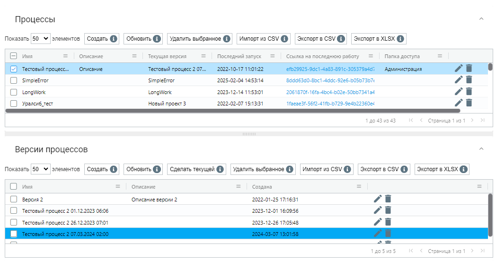

# Процессы

**Процессы** — это сценарии роботизации, которые выполняются Роботами. Для каждого процесса может быть сохранено несколько его версий. При этом, только одна версия процесса является на данный момент текущей, то есть именно эта версия процесса используется при назначении роботу новой работы, вручную, с помощью расписаний или с помощью API.

Экран “Процессы” содержит две таблицы: “Процессы” и “Версии процессов”.

Для того, чтобы в таблице “Версии процессов” появился список версий процесса, выберите нужный процесс в списке “Процессы”. По умолчанию одна из версий является текущей, она отображается в колонке “Текущая версия” таблицы “Процессы”. В таблице “Версии процессов” текущая версия подсвечивается синим цветом при выборе процесса в таблице “Процессы”.

<figure><figcaption></figcaption></figure>

Таблица “Процессы” включает следующую информацию:

<table data-header-hidden><thead><tr><th width="177"></th><th></th></tr></thead><tbody><tr><td><strong>Название колонки</strong></td><td><strong>Описание</strong></td></tr><tr><td>Имя</td><td>Содержит название для Процесса.</td></tr><tr><td>Описание</td><td>Может включать в себя информацию о Процессе, дающую представление о его назначении и функциональности.</td></tr><tr><td>Текущая версия</td><td>Указывает на актуальную версию Процесса, установленную в системе.</td></tr><tr><td>Последний запуск</td><td>Дата и время последнего выполнения Процесса.</td></tr><tr><td>Ссылка на последнюю работу</td><td>Гиперссылка, ведущая к результатам или логам последнего выполнения данного Процесса. Позволяет Пользователям быстро получить доступ к информации о последнем выполнении и результатах Процесса.</td></tr><tr><td>Папка доступа</td><td>Указывает на Папку Доступа, к которой относится Процесс. Папка Доступа служит средством разграничения доступа, позволяя взаимодействовать с Процессами только тем Пользователям, чьи Роли обеспечивают доступ к ним. </td></tr></tbody></table>

Таблица “Версии процессов” включает следующую информацию:

<table data-header-hidden><thead><tr><th width="173"></th><th></th></tr></thead><tbody><tr><td><strong>Название</strong></td><td><strong>Описание</strong></td></tr><tr><td>Имя</td><td>Содержит название каждой версии Процесса.</td></tr><tr><td>Описание</td><td>Содержит дополнительную информацию о версии Процесса.</td></tr><tr><td>Создана</td><td>Дата и время создания Процесса.</td></tr></tbody></table>

Каждую колонку можно закрепить, изменить размер или настроить фильтрацию по нажатию на иконку .

Также можно отсортировать строки таблицы по возрастанию/убыванию значений в выбранной колонке, если нажать на свободную область соответствующего заголовка. Это позволяет быстро и удобно организовывать данные в необходимом порядке.

## **Создание нового процесса**

Для создания нового процесса в таблице “Процессы” необходимо нажать на кнопку “Создать” и заполнить открывшуюся форму.

<table data-header-hidden><thead><tr><th width="58"></th><th width="210"></th><th></th></tr></thead><tbody><tr><td><strong>№ п/п</strong></td><td><strong>Элемент интерфейса</strong></td><td><strong>Описание</strong> </td></tr><tr><td>1.</td><td>текстовое поле “Имя”</td><td>Имя процесса. Обязательное для заполнения поле.</td></tr><tr><td>2.</td><td>текстовое поле “Запускать на версии Sherpa RPA Runtime не ниже чем”</td><td>Позволяет указать номер версии Sherpa RPA Runtime, ниже которой процесс не будет запускаться</td></tr><tr><td>3.</td><td>текстовое поле “Описание”</td><td>Описание процесса.</td></tr><tr><td>4.</td><td>текстовое поле "Папка доступа"</td><td>Позволяет указать папку доступа для создаваемого процесса.</td></tr><tr><td>4.</td><td>флаг “Доступен через Sherpa Assistant”</td><td>Позволяет сделать создаваемый процесс доступным в списке сценариев  в Sherpa Assistant.</td></tr></tbody></table>

\

<figure><figcaption></figcaption></figure>

Для сохранения созданного процесса, после заполнения формы необходимо нажать кнопку “ОК”. В списке появится вновь созданный элемент – Процесс. У вновь созданного процесса нет версий.

## **Создание новой версии процесса**

Для создания новой версии процесса необходимо в таблице “Процессы” выбрать тот процесс, для которого будет создана новая версия. Если процесс не отмечен, то Оркестратор покажет сообщение с предупреждением.

&#x20;&#x20;

<figure><figcaption></figcaption></figure>

В таблице “Версии процессов” нужно нажать на кнопку “Создать” и заполнить поля в открывшейся форме, также выбрав файл процесса и нажать “ОК”.

<table data-header-hidden><thead><tr><th width="58"></th><th width="206"></th><th></th></tr></thead><tbody><tr><td><strong>№ п/п</strong></td><td><strong>Элемент интерфейса</strong></td><td><strong>Описание</strong> </td></tr><tr><td>1.</td><td>текстовое поле “Имя”</td><td>
Имя процесса. Обязательное для заполнения поле.

Примечание: По умолчанию, в поле “Имя” проставляется наименование процесса, текущая дата и время создания версии. Их можно изменить на актуальное название.
</td></tr><tr><td>2.</td><td>текстовое поле “Описание”</td><td>Описание версии процесса. В данном поле можно указать, например, изменения в новой версии).</td></tr><tr><td>3.</td><td>кнопка “Выберите файл процесса”</td><td>Выбор файла процесса. (файл с расширением .robot). Без файла версия не будет сохранена.</td></tr></tbody></table>

<figure><figcaption></figcaption></figure>

При нажатии на кнопку “Выберите файл процесса” на Вашем компьютере откроется окно для выбора файла процесса. Для каждого процесса можно создавать несколько его версий.

<figure><figcaption></figcaption></figure>

## Редактирование ранее созданного процесса

Для просмотра и редактирования свойств конкретного процесса необходимо выбрать его в списке и нажать на кнопку . После этого откроется форма с настройками выбранного процесса, в которую можно внести необходимые изменения. Помимо полей, заполняемых при создании процесса, при редактировании в форме указан GUID (уникальный идентификатор, присвоенный процессу после его создания). Данное поле нельзя отредактировать.

<figure><figcaption></figcaption></figure>

## **Редактирование ранее созданной версии процесса**

Для просмотра и редактирования свойств конкретной версии процесса необходимо выбрать его в списке и нажать на кнопку .png>). После этого откроется форма с настройками выбранной версии процесса, в которую можно внести необходимые изменения. Помимо полей, заполняемых при создании версии процесса, при редактировании в форме указан GUID (уникальный идентификатор, присвоенный версии процесса после её создания). Данное поле нельзя отредактировать.

<figure><figcaption></figcaption></figure>

[Создание новой версии процесса можно проводить из Дизайнера, это описано здес&#x44C;_._](../nachalo-raboty-v-sherpa-orchestrator/sozdanie-novogo-processa-scenariya-v-orkestratore/sozdanie-novoi-versii-processa-v-sherpa-designer.md)
