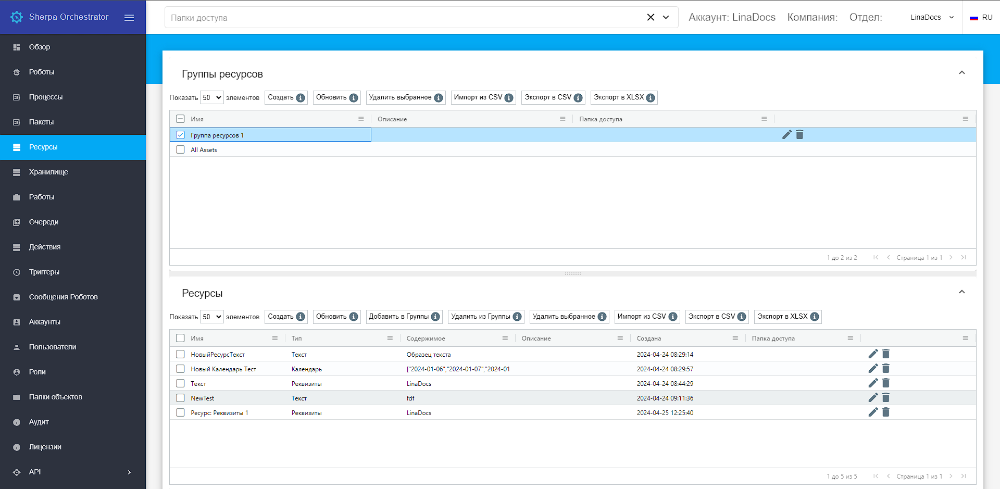

# Ресурсы

Экран “Ресурсы” представляет собой таблицы «Группа ресурсов» и «Ресурсы» со списком объектов, доступным всем роботам, группе роботов или конкретному роботу. Здесь можно создавать ресурсы, которые будут использоваться роботами.

<figure><figcaption></figcaption></figure>

Робот или роботы, имеющие доступ к ресурсу, могут запросить или установить значение соответствующего ресурса через соответствующие блоки или через API. Поддерживаемые типы ресурсов:

* Реквизиты (содержат  логин и пароль);
* Текст (текстовое поле. Заполняется в произвольной форме);
* Календарь (табло производственного календаря. Позволяет указать рабочие/нерабочие дни).

Пароли хранятся в базе в зашифрованном виде (используется алгоритм шифрования AES256).

К ресурсам Оркестратора можно обращаться из робота, получать и устанавливать значения глобальных переменных, а также получать или устанавливать реквизиты (пара Логин/Пароль).

Со стороны робота можно воспользоваться ресурсами с помощью блоков из палитры “Оркестратор” в Sherpa Designer.

## **Создание нового ресурса**

**Важно!** _Перед созданием ресурса в таблице “Ресурсы” необходимо выбрать группу ресурсов, в которой он будет создаваться, с помощью установки флага в таблице “Группы ресурсов”._

### **Тип и содержимое ресурса: Реквизиты**

Реквизиты включают в себя Логин и Пароль. Пароль будет храниться в базе данных Оркестратора в зашифрованном виде, передаваться Пароль будет также в зашифрованном виде (тип шифрования AES 256). Здесь можно настроить срок действия пароля, указав дату окончания действия (после этого пароль необходимо заменить). Записи с истекшим сроком действия пароля будут выделены цветом.

Для создания нового ресурса с типом “Реквизиты” в таблице “Ресурсы” необходимо нажать на кнопку “Создать”, в открывшейся форме поставить флаг “Реквизиты” (если он не стоит, обычно он стоит по умолчанию) и заполнить остальные поля формы.

<table data-header-hidden><thead><tr><th width="108"></th><th></th><th></th></tr></thead><tbody><tr><td><strong>№ п/п</strong></td><td><strong>Элемент интерфейса</strong></td><td><strong>Описание</strong></td></tr><tr><td>1.</td><td>текстовое поле “Имя”</td><td>Имя ресурса. Обязательное для заполнения поле.</td></tr><tr><td>2.</td><td>текстовое поле "Описание"</td><td>Описание ресурса.</td></tr><tr><td>3.</td><td>текстовое поле "Папка доступа"</td><td>Папка доступа для создаваемого ресурса.</td></tr><tr><td>4. </td><td>Тип и содержимое ресурса: Реквизиты</td><td></td></tr><tr><td>4.1.</td><td>текстовое поле “Логин”</td><td>Логин.</td></tr><tr><td>4.2.</td><td>текстовое поле “Пароль”</td><td>Пароль.</td></tr><tr><td>4.3.</td><td>текстовое поле “Срок действия пароля”</td><td>Срок действия пароля. Указывается дата окончания действия пароля в формате ДД.ММ.ГГГГ.</td></tr><tr><td>5.</td><td>поле “Ресурс доступен”</td><td>
Позволяет назначить робота или группу роботов, для которых будет доступен создаваемый ресурс:
<ul><li>Все роботы;</li><li>Только определенный робот;</li><li>Только определенная группа роботов.</li></ul></td></tr></tbody></table>

<figure><figcaption></figcaption></figure>

### **Доступ к ресурсам типа “Реквизиты” на стороне Дизайнера**

Для доступа к ресурсам типа “Реквизиты” (пара Логин/Пароль) на стороне Дизайнера в палитре Оркестратора используется блок “Получить учетные данные”.

<figure><figcaption></figcaption></figure>

Для редактирования учетных данных используется блок “Установить учетные данные”.

<figure><figcaption></figcaption></figure>

Данный функционал доступен для Роботов любого типа, как Attended, так и Unattended.

### **Тип и содержимое ресурса: Текст**

Ресурс “Текст” представляет собой любую произвольную строку. Позволяет хранить текст, числа и другие типы ресурсов. Ограничение на количество символов при выборе данного типа ресурсов составляет 10 000 символов.

Для создания нового ресурса с типом “Текст” в таблице “Ресурсы” необходимо нажать на кнопку “Создать”, в открывшейся форме поставить флаг “Текст” и заполнить остальные поля формы.

<table data-header-hidden><thead><tr><th width="83"></th><th></th><th></th></tr></thead><tbody><tr><td><strong>№ п/п</strong></td><td><strong>Элемент интерфейса</strong></td><td><strong>Описание</strong></td></tr><tr><td>1.</td><td>текстовое поле “Имя”</td><td>Имя ресурса. Обязательное для заполнения поле.</td></tr><tr><td>2.</td><td>текстовое поле "Описание"</td><td>Описание ресурса.</td></tr><tr><td>3.</td><td>текстовое поле "Папка доступа"</td><td>Папка доступа для создаваемого ресурса.</td></tr><tr><td>4. </td><td>Тип и содержимое ресурса: Текст</td><td></td></tr><tr><td>4.1.</td><td>текстовое поле “Текст”</td><td>Любой необходимый текст в произвольной форме.</td></tr><tr><td>5.</td><td>поле “Ресурс доступен”</td><td>
Позволяет назначить робота или группу роботов, для которых будет доступен создаваемый ресурс:
<ul><li>Все роботы;</li><li>Только определенный робот;</li><li>Только определенная группа роботов.</li></ul></td></tr></tbody></table>

<figure><figcaption></figcaption></figure>

### **Доступ к ресурсам типа “Текст” на стороне Дизайнера**

Для доступа к ресурсам типа “Текст” на стороне Дизайнера в палитре Оркестратора используются блоки “Получить значение” и “Установить значение”.

<figure><figcaption></figcaption></figure>

Из Оркестратора необходимо скопировать GUID ресурса доступный при редактировании ранее\
созданного ресурса по кнопке . Далее в Дизайнере в поле “GUID/Имя Ресурса” на панели\
свойств необходимо вставить GUID ресурса.&#x20;

<figure><figcaption></figcaption></figure>

После выполнения выбранного блока в переменную “Результат” на стороне Дизайнера будет\
передаваться значение, указанное в Оркестраторе в поле “Текст”.

### **Тип и содержимое ресурса: Календарь**

Ресурс содержит информацию о количестве рабочих, выходных и праздничных дней. Они используются в нескольких местах:

* в настройке триггеров (можно указать, например, чтобы робот не запускался в выходные дни);
* в палитре даты и время в блоках (например, подсчитать рабочие дни и т.п.) Дизайнера.
* в блоке “Получить календарь” Дизайнера.

Ресурс “Календарь” позволяет настраивать запуск Робота, например, только в рабочие дни, исключая выходные и праздники.

Для создания нового ресурса с типом “Календарь” в таблице “Ресурсы” необходимо нажать на кнопку “Создать”, в открывшейся форме поставить флаг “Календарь” и заполнить остальные поля формы.

<table data-header-hidden><thead><tr><th width="102"></th><th width="231"></th><th></th></tr></thead><tbody><tr><td><strong>№ п/п</strong></td><td><strong>Элемент интерфейса</strong></td><td><strong>Описание</strong></td></tr><tr><td>1.</td><td>текстовое поле “Имя”</td><td>Имя ресурса. Обязательное для заполнения поле.</td></tr><tr><td>2.</td><td>текстовое поле "Описание"</td><td>Описание ресурса.</td></tr><tr><td>3.</td><td>текстовое поле "Папка доступа"</td><td>Папка доступа для создаваемого ресурса.</td></tr><tr><td>4. </td><td>Тип и содержимое ресурса: Календарь</td><td></td></tr><tr><td>4.1.</td><td>кнопка “Редактировать календарь…”</td><td>Позволяет редактировать календарь. При нажатии на кнопку открывается календарь на месяц, где можно выбрать необходимые даты.</td></tr><tr><td>4.2. </td><td>кнопка “Экспортировать календарь…”</td><td>Позволяет  экспортировать календарь в файл формата .json.</td></tr><tr><td>4.3.</td><td>кнопка “Импортировать календарь…”</td><td>Позволяет импортировать календарь из файла в формате .json</td></tr><tr><td>5.</td><td>область “Ресурс доступен”</td><td>
Позволяет назначить робота или группу роботов, для которых будет доступен создаваемый ресурс:
<ul><li>Все роботы;</li><li>Только определенный робот;</li><li>Только определенная группа роботов.</li></ul></td></tr></tbody></table>

<figure><figcaption></figcaption></figure>

### **Доступ к ресурсам типа “Календарь” на стороне Дизайнера**

Ресурс “Календарь” позволяет настраивать запуск робота, например, только в рабочие дни, исключая выходные и праздники.

Для доступа к ресурсам типа “Календарь” на стороне Дизайнера в палитре Оркестратора используется блок “Получить календарь”. Обязательно требуется ввести GUID (Имя) Календаря, который требуется получить.

<figure><figcaption></figcaption></figure>

Также в палитре “Дата и время” есть блоки, которые могут воспользоваться полученным из Оркестратора Календарем для проведения различных проверок и вычислений.

<figure><figcaption></figcaption></figure>

* Подсчитать рабочие дни – считает количество рабочих дней между двумя заданными датами.
* Следующий рабочий день – возвращает следующий рабочий день, начиная с указанной даты.
* Рабочий день – проверяет указанную дату на рабочий день.
* Выходной день – проверяет указанную дату на выходной день.
* Получить рабочие дни – получает рабочие дни между двумя заданными датами.
* Получить выходные дни – получает рабочие дни между двумя заданными датами.

### **Поле “Ресурс доступен:”**

Для ресурсов можно задать область видимости. Она может быть настроена в поле “Ресурс доступен:”

* Все роботы – ресурс доступен для всех роботов в Оркестраторе;
* Только определенный робот – ресурс доступен для робота, выбранного из выпадающего списка доступных робота;
* Только определенная группа роботов – ресурс доступен для роботов,  выбранной из выпадающего списка группы роботов.&#x20;

<figure><figcaption></figcaption></figure>

<figure><figcaption></figcaption></figure>

## **Редактирование ранее созданного ресурса**

Для просмотра и редактирования ранее созданного ресурса необходимо выбрать его в списке и нажать на кнопку . После этого откроется форма с параметрами выбранного ресурса, в которую можно внести необходимые изменения. Помимо полей, заполняемых при создании ресурса, при редактировании в форме указан GUID (уникальный идентификатор, присвоенный ресурсу после его создания). Данное поле нельзя отредактировать.&#x20;

<figure><figcaption></figcaption></figure>

<figure><figcaption></figcaption></figure>

<figure><figcaption></figcaption></figure>

## **Создание новой группы ресурсов**

Для создания новой группы ресурсов необходимо нажать на кнопку “Создать” в таблице “Группы ресурсов” и заполнить открывшуюся форму: указать имя группы ресурсов (обязательно), описание группы ресурсов и папку доступа группы ресурсов. Для сохранения созданной группы ресурсов, после заполнения формы необходимо нажать кнопку “ОК”. Группа ресурсов будет создана.

<figure><figcaption></figcaption></figure>

## **Редактирование ранее созданной группы ресурсов**

Для просмотра и редактирования свойств конкретной группы ресурсов необходимо выбрать ее в списке и нажать на кнопку . После этого откроется форма с настройками выбранной группы ресурсов, в которую можно внести необходимые изменения. Помимо полей, заполняемых при создании группы ресурсов, при редактировании в форме указан GUID (уникальный идентификатор, присвоенный группе ресурсов после ее создания). Данное поле нельзя отредактировать.&#x20;

<figure><figcaption></figcaption></figure>
