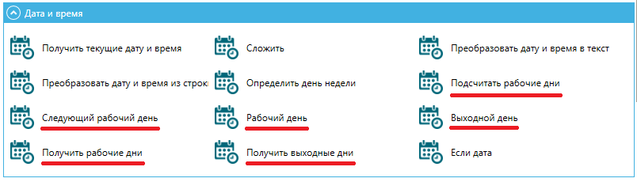

# Ресурсы

На экране “Ресурсы” представлены таблицы «Группа ресурсов» и «Ресурсы» со списком объектов, доступным всем Роботам, Группам роботов или конкретному Роботу:

<figure><figcaption></figcaption></figure>

Здесь можно создавать Ресурсы, которые будут использоваться Роботами.

Робот или Роботы, имеющие доступ к Ресурсу, могут запросить или установить значение соответствующего Ресурса через соответствующие блоки или через API. Поддерживаемые типы Ресурсов:

<figure><figcaption></figcaption></figure>

* Реквизиты (логин и пароль);
* Текст (текстовое поле);
* Календарь (рабочие/нерабочие дни).

Пароли хранятся в базе в зашифрованном виде (используется алгоритм шифрования AES256).

К Ресурсам Оркестратора можно обращаться из Робота, получать и устанавливать значения глобальных переменных, а также получать или устанавливать реквизиты.

Со стороны Робота можно воспользоваться Ресурсами с помощью блоков из палитры Оркестратор в Sherpa Designer.

## **Создание нового ресурса**

<table data-header-hidden><thead><tr><th width="49"></th><th></th></tr></thead><tbody><tr><td></td><td>Перед созданием Ресурса в таблице “Ресурсы” необходимо выбрать Группу ресурсов, в которой он будет создаваться, с помощью установки флага в таблице “Группы ресурсов”.</td></tr></tbody></table>

### **Реквизиты**

Реквизиты включают в себя логин и пароль. Пароль будет храниться в базе данных Оркестратора в зашифрованном виде, передаваться пароль будет также в зашифрованном виде (тип шифрования AES 256). Здесь можно настроить срок действия пароля, указав дату окончания действия (после этого пароль необходимо заменить). Записи с истекшим сроком действия пароля будут выделены цветом.

Для создания нового Ресурса с типом Реквизиты в таблице “Ресурсы” необходимо нажать на кнопку “Создать”, в открывшейся форме поставить флаг “Реквизиты” (если он не стоит, обычно он стоит по умолчанию) и заполнить остальные поля формы:

<figure><figcaption></figcaption></figure>

<table data-header-hidden><thead><tr><th width="52"></th><th width="163"></th><th width="293"></th></tr></thead><tbody><tr><td><strong>№ п/п</strong></td><td><strong>Элемент интерфейса</strong></td><td><strong>Описание</strong></td></tr><tr><td>1.</td><td>текстовое поле “Имя”</td><td>Имя Ресурса. Обязательное для заполнения поле.</td></tr><tr><td>2.</td><td>текстовое поле "Описание"</td><td>Описание Ресурса.</td></tr><tr><td>3.</td><td>текстовое поле "Папка доступа"</td><td>Папка доступа для создаваемого Ресурса.</td></tr><tr><td>4. </td><td>Тип и содержимое Ресурса: Реквизиты</td><td></td></tr><tr><td>4.1.</td><td>текстовое поле “Логин”</td><td>Логин</td></tr><tr><td>4.2.</td><td>текстовое поле “Пароль”</td><td>Пароль</td></tr><tr><td>4.3.</td><td>текстовое поле “Срок действия пароля”</td><td>Срок действия пароля. Указывается дата окончания действия пароля в формате ДД.ММ.ГГГГ.</td></tr><tr><td>5.</td><td>поле “Ресурс доступен”</td><td>
Позволяет назначить Робота или Группу роботов, для которых будет доступен создаваемый Ресурс:
<ul><li>Все Роботы;</li><li>Только определенный Робот;</li><li>Только определенная Группа роботов.</li></ul></td></tr></tbody></table>

### **Доступ к Ресурсам типа “Реквизиты” на стороне Дизайнера**

* Для доступа к Ресурсам типа “Реквизиты” на стороне Дизайнера в палитре Оркестратора используется блок “Получить учетные данные”.
* Для редактирования учетных данных используется блок “Установить учетные данные”.

Данный функционал доступен для Роботов любого типа, как Attended, так и Unattended.

### **Текст**

Ресурс “Текст” представляет собой любую произвольную строку. Позволяет хранить текст, числа и другие типы Ресурсов. Ограничение на количество символов при выборе данного типа Ресурсов составляет 10 000 символов.

Для создания нового Ресурса с типом “Текст” в таблице “Ресурсы” необходимо нажать на кнопку “Создать”, в открывшейся форме поставить флаг “Текст” и заполнить остальные поля формы:

<figure><figcaption></figcaption></figure>

<table data-header-hidden><thead><tr><th width="54"></th><th width="184"></th><th width="294"></th></tr></thead><tbody><tr><td><strong>№ п/п</strong></td><td><strong>Элемент интерфейса</strong></td><td><strong>Описание</strong></td></tr><tr><td>1.</td><td>текстовое поле “Имя”</td><td>Имя Ресурса. Обязательное для заполнения поле.</td></tr><tr><td>2.</td><td>текстовое поле "Описание"</td><td>Описание Ресурса.</td></tr><tr><td>3.</td><td>текстовое поле "Папка доступа"</td><td>Папка доступа для создаваемого Ресурса.</td></tr><tr><td>4. </td><td>Тип и содержимое Ресурса: Текст</td><td></td></tr><tr><td>4.1.</td><td>текстовое поле “Текст”</td><td>Любой необходимый текст в произвольной форме.</td></tr><tr><td>5.</td><td>поле “Ресурс доступен”</td><td>
Позволяет назначить Робота или Группу роботов, для которых будет доступен создаваемый Ресурс:
<ul><li>Все Роботы;</li><li>Только определенный Робот;</li><li>Только определенная Группа роботов.</li></ul></td></tr></tbody></table>

### **Доступ к Ресурсам типа “Текст” на стороне Дизайнера**

* Для доступа к Ресурсам типа “Текст” на стороне Дизайнера в палитре Оркестратора используются блоки “Получить значение” и “Установить значение”. Из Оркестратора необходимо скопировать GUID Ресурса доступный при редактировании ранее созданного Ресурса. Далее в Дизайнере в поле “GUID/Имя Ресурса” на панели свойств необходимо вставить GUID Ресурса.&#x20;

После выполнения выбранного блока в переменную “Результат” на стороне Дизайнера будет передаваться значение, указанное в Оркестраторе в поле “Текст”.

### **Календарь**

Ресурс содержит информацию о количестве рабочих, выходных и праздничных дней. Они используются в нескольких местах:

* в настройке Триггеров (можно указать, например, чтобы Робот не запускался в выходные дни);
* в палитре даты и времени в блоках Дизайнера (например, подсчитать рабочие дни и т.п.);
* в блоке “Получить календарь” Дизайнера.

Ресурс “Календарь” позволяет настраивать запуск Робота, например, только в рабочие дни, исключая выходные и праздники.

Для создания нового Ресурса с типом “Календарь” в таблице “Ресурсы” необходимо нажать на кнопку “Создать”, в открывшейся форме поставить флаг “Календарь” и заполнить остальные поля формы:

<figure><figcaption></figcaption></figure>

<table data-header-hidden><thead><tr><th width="52"></th><th width="180"></th><th width="277"></th></tr></thead><tbody><tr><td><strong>№ п/п</strong></td><td><strong>Элемент интерфейса</strong></td><td><strong>Описание</strong></td></tr><tr><td>1.</td><td>текстовое поле “Имя”</td><td>Имя Ресурса. Обязательное для заполнения поле.</td></tr><tr><td>2.</td><td>текстовое поле "Описание"</td><td>Описание Ресурса.</td></tr><tr><td>3.</td><td>текстовое поле "Папка доступа"</td><td>Папка доступа для создаваемого Ресурса.</td></tr><tr><td>4. </td><td>Тип и содержимое Ресурса: Календарь</td><td></td></tr><tr><td>4.1.</td><td>кнопка “Редактировать календарь…”</td><td>Позволяет редактировать календарь. При нажатии на кнопку открывается календарь на месяц, где можно выбрать необходимые даты.</td></tr><tr><td>4.2. </td><td>кнопка “Экспортировать календарь…”</td><td>Позволяет экспортировать календарь в файл формата .json.</td></tr><tr><td>4.3.</td><td>кнопка “Импортировать календарь…”</td><td>Позволяет импортировать календарь из файла в формате .json.</td></tr><tr><td>5.</td><td>область “Ресурс доступен”</td><td>
Позволяет назначить Робота или Группу роботов, для которых будет доступен создаваемый Ресурс:
<ul><li>Все Роботы;</li><li>Только определенный Робот;</li><li>Только определенная Группа роботов.</li></ul></td></tr></tbody></table>

### **Доступ к Ресурсам типа “Календарь” на стороне Дизайнера**

Ресурс “Календарь” позволяет настраивать запуск Робота, например, только в рабочие дни, исключая выходные и праздники.

Для доступа к ресурсам типа “Календарь” на стороне Дизайнера в палитре Оркестратора используется блок “Получить календарь”:

<figure><figcaption></figcaption></figure>

Обязательно требуется ввести GUID/Имя Календаря, который требуется получить:

<figure><figcaption></figcaption></figure>

Также в палитре “Дата и время” есть блоки, которые могут воспользоваться полученным из Оркестратора Календарем для проведения различных проверок и вычислений:

<figure><figcaption></figcaption></figure>

* **Подсчитать рабочие дни** – считает количество рабочих дней между двумя заданными датами.
* **Следующий рабочий день** – возвращает следующий рабочий день, начиная с указанной даты.
* **Рабочий день** – проверяет указанную дату на рабочий день.
* **Выходной день** – проверяет указанную дату на выходной день.
* **Получить рабочие дни** – получает рабочие дни между двумя заданными датами.
* **Получить выходные дни** – получает рабочие дни между двумя заданными датами.

### **Ресурс доступен**

Для Ресурсов можно задать область видимости. Она может быть настроена в поле “Ресурс доступен:”

<figure><figcaption></figcaption></figure>

* **Все Роботы** – Ресурс доступен для всех Роботов в Оркестраторе;
* **Только определенный Робот** – Ресурс доступен для Робота, выбранного из выпадающего списка доступных Роботов;
* **Только определенная Группа роботов** – Ресурс доступен для Роботов,  выбранной из выпадающего списка Группы роботов.&#x20;

## **Редактирование ранее созданного Ресурса**

Для просмотра и редактирования ранее созданного Ресурса необходимо выбрать его в списке и нажать на иконку . После этого откроется форма с параметрами выбранного Ресурса, в которую можно внести необходимые изменения. Помимо полей, заполняемых при создании Ресурса, при редактировании в форме указан GUID (уникальный идентификатор, присвоенный Ресурсу после его создания):

<figure><figcaption></figcaption></figure>

Данное поле нельзя отредактировать.&#x20;

## **Создание новой Группы ресурсов**

Для создания новой Группы ресурсов необходимо нажать на кнопку “Создать” над таблицей “Группы ресурсов” и заполнить открывшуюся форму: указать имя Группы ресурсов (обязательно), описание Группы ресурсов и Папку доступа Группы ресурсов. Для сохранения созданной Группы ресурсов, после заполнения формы необходимо нажать на кнопку “ОК”. Группа ресурсов будет создана.

<figure><figcaption></figcaption></figure>

## **Редактирование ранее созданной Группы ресурсов**

Для просмотра и редактирования свойств конкретной Группы ресурсов необходимо выбрать ее в списке и нажать на иконку  (1).png>). После этого откроется форма с настройками выбранной Группы ресурсов, в которую можно внести необходимые изменения:

<figure><figcaption></figcaption></figure>

Помимо полей, заполняемых при создании Группы ресурсов, при редактировании в форме указан GUID (уникальный идентификатор, присвоенный Группе ресурсов после ее создания). Данное поле нельзя отредактировать.
